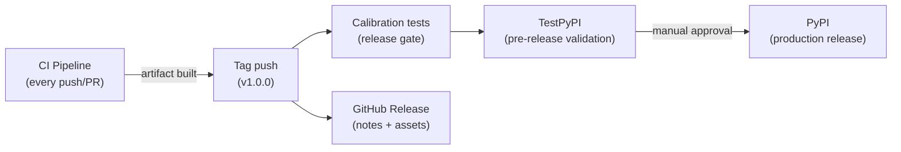

# CD Plan

> [!info] Purpose
> Continuous delivery strategy for TinyQuant using GitHub Actions. Defines
> how validated artifacts are promoted from CI through release to PyPI
> publication.

## Reading order

1. [[CD-plan/release-workflow|Release Workflow]] — tag-triggered release pipeline
2. [[CD-plan/artifact-management|Artifact Management]] — build once, promote the immutable artifact
3. [[CD-plan/versioning-and-changelog|Versioning and Changelog]] — semantic versioning, release notes
4. [[CD-plan/v1.1.0-release-postmortem|v1.1.0 Release Postmortem]] — every failure class encountered in the first end-to-end exercise of the publish pipeline, plus a pre-release checklist

## Delivery model

TinyQuant is a **Python library** published to PyPI. The CD model is:

1. CI builds and validates on every push/PR
2. A version tag (`v1.0.0`) triggers the release workflow
3. Calibration tests run as a release gate
4. The artifact publishes to TestPyPI for pre-release validation
5. After manual approval, the same artifact publishes to PyPI
6. A GitHub Release is created with notes and the wheel/sdist

## Principles

| Principle | Application to TinyQuant |
|-----------|------------------------|
| **Build once, promote** | The CI-built wheel is the exact artifact that reaches PyPI |
| **Immutable artifacts** | Wheel tagged with version + commit hash; never rebuilt |
| **Manual gate for production** | PyPI publish requires manual approval via GitHub Environment |
| **Trusted publishing** | PyPI uses OIDC — no static API tokens stored in secrets |
| **Semantic versioning** | `MAJOR.MINOR.PATCH` aligned with public API changes |

## Environments

| Environment | Purpose | Protection rules |
|-------------|---------|-----------------|
| `testpypi` | Pre-release validation | Auto-deploy on tag |
| `pypi` | Production release | Manual approval required |

## See also

- [[CD-plan/release-workflow|Release Workflow]]
- [[CD-plan/artifact-management|Artifact Management]]
- [[CD-plan/versioning-and-changelog|Versioning and Changelog]]
- [[CI-plan/README|CI Plan]]
- [[qa/validation-plan/README|Validation Plan]]
