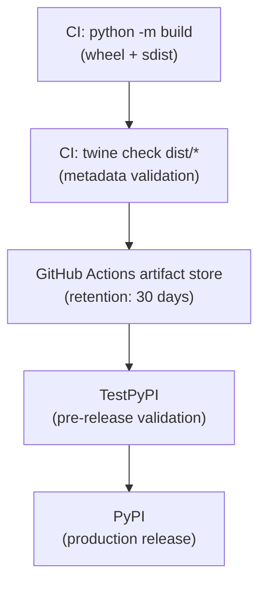

# Artifact Management

> [!info] Purpose
> How TinyQuant builds, tags, verifies, and promotes artifacts through the
> delivery pipeline. The core rule: **build once, promote the same artifact**.

## Artifact types

| Artifact | Format | Registry | Produced by |
|----------|--------|----------|-------------|
| Wheel | `.whl` | PyPI / TestPyPI | `python -m build` |
| Source dist | `.tar.gz` | PyPI / TestPyPI | `python -m build` |
| Coverage report | `coverage.xml` | GitHub Actions artifacts | `pytest-cov` |

## Artifact lifecycle

## Tagging convention

| Component | Format | Example |
|-----------|--------|---------|
| Git tag | `v{MAJOR}.{MINOR}.{PATCH}` | `v1.0.0` |
| Pre-release tag | `v{MAJOR}.{MINOR}.{PATCH}-{label}.{n}` | `v1.0.0-beta.1` |
| Wheel filename | `tinyquant-{version}-py3-none-any.whl` | `tinyquant-1.0.0-py3-none-any.whl` |
| pyproject.toml version | `{MAJOR}.{MINOR}.{PATCH}` | `1.0.0` |

**Invariant:** the git tag and `pyproject.toml` version must match. The
release workflow enforces this in the `verify-tag` job.

## Immutability rules

1. **Never rebuild for a different environment.** The wheel built in CI is the
   same wheel that reaches PyPI.
2. **Never reuse a version number.** Once `v1.0.0` is published, it cannot be
   replaced. Fix forward with `v1.0.1`.
3. **Never use mutable tags.** No `latest` tag on PyPI; always pin to a specific
   version.

## Verification steps

| Step | Tool | When |
|------|------|------|
| Metadata validation | `twine check dist/*` | Every CI run |
| Install from TestPyPI | `pip install --index-url test.pypi.org` | Release workflow |
| Import and version check | `python -c "import tinyquant"` | Release workflow |
| Signature verification | Future: Sigstore/cosign | Post-1.0 |

## Retention policy

| Artifact | Retention | Reason |
|----------|-----------|--------|
| CI build artifacts | 30 days | Debugging failed releases |
| Coverage reports | 14 days | Trend analysis |
| PyPI releases | Permanent | Published packages are immutable |
| TestPyPI releases | Indefinite | May be cleaned up manually |
| GitHub Releases | Permanent | Release notes and download links |

## Future considerations

- **SBOM generation:** generate a Software Bill of Materials with each release
  for supply chain transparency
- **Artifact signing:** sign wheels with Sigstore after the project reaches 1.0
- **Multi-platform wheels:** if compiled extensions are added, build
  platform-specific wheels using `cibuildwheel`

## See also

- [[CD-plan/README|CD Plan]]
- [[CD-plan/release-workflow|Release Workflow]]
- [[CD-plan/versioning-and-changelog|Versioning and Changelog]]
- [[CI-plan/workflow-definition|Workflow Definition]]
