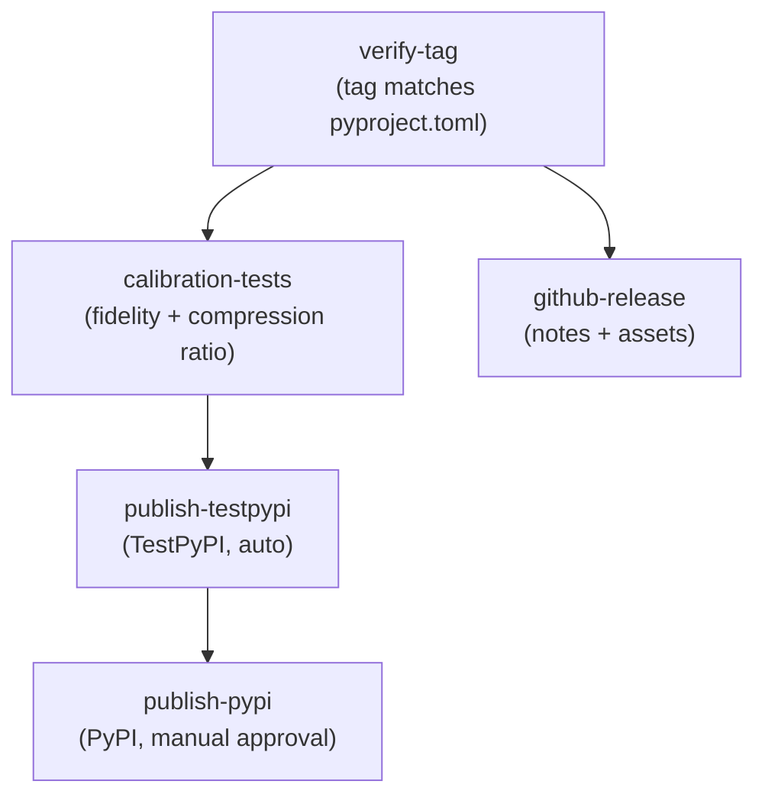

# Release Workflow

> [!info] Purpose
> Specification for `.github/workflows/release.yml` — the tag-triggered
> release pipeline that publishes TinyQuant to PyPI.

## Workflow file

```text
.github/workflows/release.yml
```

## Triggers

```yaml
name: Release

on:
  push:
    tags:
      - 'v*'

  workflow_dispatch:
    inputs:
      tag:
        description: 'Release tag (e.g., v1.0.0)'
        required: true
```

- **Tag push:** automated trigger when a semver tag is pushed
- **Manual dispatch:** fallback for re-running a failed release

## Job graph



## Job specifications

### `verify-tag`

```yaml
  verify-tag:
    name: Verify Tag
    runs-on: ubuntu-latest
    timeout-minutes: 5
    outputs:
      version: ${{ steps.check.outputs.version }}
    steps:
      - uses: actions/checkout@v4

      - name: Extract and verify version
        id: check
        run: |
          TAG_VERSION="${GITHUB_REF_NAME#v}"
          PKG_VERSION=$(python -c "
          import tomllib
          with open('pyproject.toml', 'rb') as f:
              print(tomllib.load(f)['project']['version'])
          ")
          if [[ "$TAG_VERSION" != "$PKG_VERSION" ]]; then
            echo "::error::Tag v$TAG_VERSION does not match pyproject.toml version $PKG_VERSION"
            exit 1
          fi
          echo "version=$TAG_VERSION" >> "$GITHUB_OUTPUT"
```

### `calibration-tests`

```yaml
  calibration-tests:
    name: Calibration Tests
    runs-on: ubuntu-latest
    needs: [verify-tag]
    timeout-minutes: 30
    steps:
      - uses: actions/checkout@v4

      - uses: actions/setup-python@v5
        with:
          python-version: "3.12"

      - name: Install dependencies
        run: pip install -e ".[dev]"

      - name: Score fidelity calibration
        run: pytest tests/calibration/test_score_fidelity.py -x --tb=long

      - name: Compression ratio calibration
        run: pytest tests/calibration/test_compression_ratio.py -x --tb=long

      - name: Determinism calibration
        run: pytest tests/calibration/test_determinism.py -x --tb=long

      - name: Research alignment
        run: pytest tests/calibration/test_research_alignment.py -x --tb=long
```

### `publish-testpypi`

```yaml
  publish-testpypi:
    name: Publish to TestPyPI
    runs-on: ubuntu-latest
    needs: [calibration-tests]
    environment: testpypi
    permissions:
      id-token: write
      contents: read
    steps:
      - uses: actions/checkout@v4

      - uses: actions/setup-python@v5
        with:
          python-version: "3.12"

      - name: Build distributions
        run: |
          pip install build
          python -m build

      - name: Verify distributions
        run: |
          pip install twine
          twine check dist/*

      - name: Publish to TestPyPI
        uses: pypa/gh-action-pypi-publish@release/v1
        with:
          repository-url: https://test.pypi.org/legacy/

      - name: Verify installation from TestPyPI
        run: |
          pip install --index-url https://test.pypi.org/simple/ \
            --extra-index-url https://pypi.org/simple/ \
            tinyquant==${{ needs.verify-tag.outputs.version }}
          python -c "import tinyquant; print(tinyquant.__version__)"
```

### `publish-pypi`

```yaml
  publish-pypi:
    name: Publish to PyPI
    runs-on: ubuntu-latest
    needs: [publish-testpypi]
    environment: pypi
    permissions:
      id-token: write
      contents: read
    steps:
      - uses: actions/checkout@v4

      - uses: actions/setup-python@v5
        with:
          python-version: "3.12"

      - name: Build distributions
        run: |
          pip install build
          python -m build

      - name: Publish to PyPI
        uses: pypa/gh-action-pypi-publish@release/v1
```

> [!warning] Manual approval required
> The `pypi` environment has a protection rule requiring manual approval.
> A maintainer must approve in the GitHub UI before this job runs.

### `github-release`

```yaml
  github-release:
    name: Create GitHub Release
    runs-on: ubuntu-latest
    needs: [verify-tag]
    permissions:
      contents: write
    steps:
      - uses: actions/checkout@v4
        with:
          fetch-depth: 0

      - name: Generate release notes
        id: notes
        run: |
          PREV_TAG=$(git describe --tags --abbrev=0 HEAD^ 2>/dev/null || echo "")
          if [[ -n "$PREV_TAG" ]]; then
            NOTES=$(git log --pretty=format:"- %s (%h)" "$PREV_TAG..HEAD")
          else
            NOTES=$(git log --pretty=format:"- %s (%h)")
          fi
          echo "notes<<EOF" >> "$GITHUB_OUTPUT"
          echo "$NOTES" >> "$GITHUB_OUTPUT"
          echo "EOF" >> "$GITHUB_OUTPUT"

      - uses: actions/setup-python@v5
        with:
          python-version: "3.12"

      - name: Build distributions
        run: |
          pip install build
          python -m build

      - name: Create release
        uses: softprops/action-gh-release@v2
        with:
          files: dist/*
          body: |
            ## Changes

            ${{ steps.notes.outputs.notes }}

            ## Installation

            ```bash
            pip install tinyquant==${{ needs.verify-tag.outputs.version }}
            ```
          draft: false
          prerelease: ${{ contains(github.ref_name, '-') }}
```

## Trusted publishing (OIDC)

TinyQuant uses PyPI trusted publishing — no static API tokens:

1. Configure trusted publisher on PyPI:
   - Repository: `<owner>/TinyQuant`
   - Workflow: `release.yml`
   - Environment: `pypi` (or `testpypi`)
2. The workflow requests `id-token: write` permission
3. `pypa/gh-action-pypi-publish` exchanges the GitHub OIDC token for PyPI upload credentials
4. No `PYPI_API_TOKEN` secret needed

## See also

- [[CD-plan/README|CD Plan]]
- [[CD-plan/artifact-management|Artifact Management]]
- [[CD-plan/versioning-and-changelog|Versioning and Changelog]]
- [[qa/validation-plan/README|Validation Plan]]
