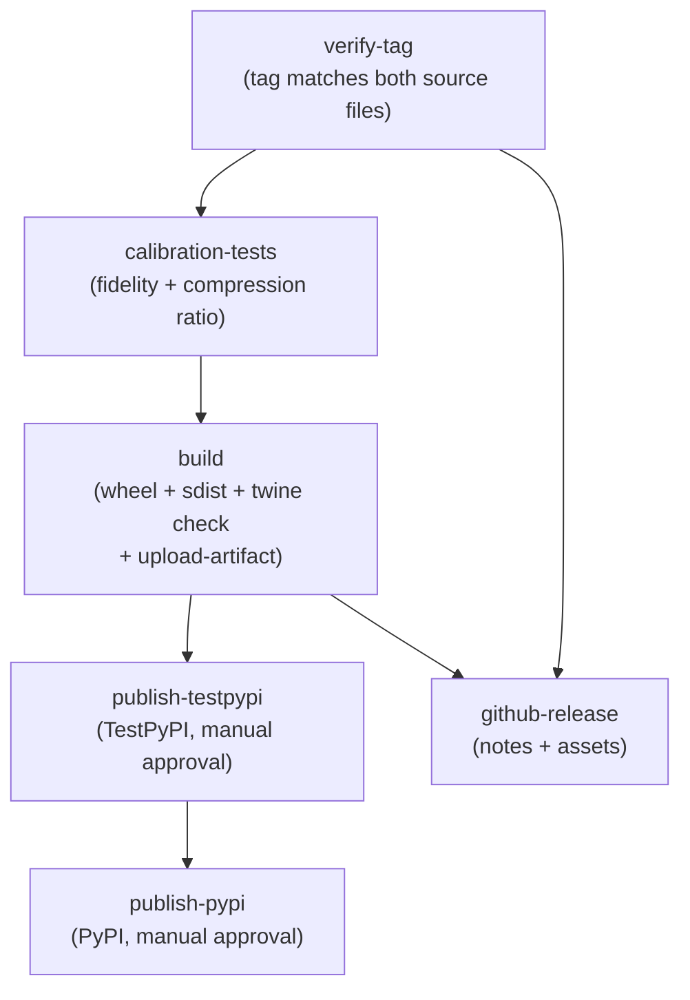

# Release Workflow

> [!info] Purpose
> Specification for `.github/workflows/release.yml` — the tag-triggered
> release pipeline that publishes `tinyquant-cpu` to PyPI via OIDC trusted
> publishing, with TestPyPI as a staging stop.

> [!warning] No Phase 23 release
> Phase 23 ([[plans/rust/phase-23-python-reference-demotion|plan]]) is
> a **pure refactor**. It does not cut a tag, does not invoke this
> workflow, and publishes nothing. The version string in
> `pyproject.toml` stays at `0.1.1` (the published PyPI artifact of
> record). The pure-Python reference is demoted to a test-only oracle
> under `tests/reference/tinyquant_py_reference/`; the wheel that
> would be shipped under the `tinyquant-cpu` name is intentionally
> not producible from the post-Phase-23 tree (hatchling emits an
> empty metadata-only wheel with `bypass-selection = true`; the
> `build-package-does-not-leak-reference` CI guard catches any wheel
> that gets through and contains reference paths). The next tag this
> workflow will see is the Phase 24 `v0.2.0-rc.1` for the Rust-backed
> fat wheel.

## Workflow file

```text
.github/workflows/release.yml
```

## Triggers and top-level config

```yaml
name: Release

on:
  push:
    tags:
      - 'v*'

permissions:
  contents: read

concurrency:
  group: release-${{ github.ref }}
  cancel-in-progress: false
```

- **Trigger:** tag push matching `v*`. Manual re-runs are done by deleting
  and re-pushing the tag, not via `workflow_dispatch` — see the
  "Re-running a failed release" section below.
- **Top-level least-privilege:** the workflow defaults to `contents: read`.
  Jobs that need elevated permissions (`id-token: write` for OIDC, or
  `contents: write` for GitHub Releases) declare them locally.
- **Concurrency:** the `release-${{ github.ref }}` group prevents two
  quickly-pushed tags from racing on the publish steps. `cancel-in-progress`
  is `false` — if a publish is already in flight, queue rather than abort.

## Job graph



> [!note] Build-once-upload-many
> The `build` job produces the wheel and sdist exactly once and uploads
> them as a workflow artifact. `publish-testpypi`, `publish-pypi`, and
> `github-release` all download the **same artifact** instead of rebuilding
> locally. This guarantees byte-for-byte equivalence: a successful TestPyPI
> smoke is a real signal about what gets published to PyPI, and the GitHub
> Release attaches the same files. Recommended by PyPA's official guide.

## Job specifications

### `verify-tag`

```yaml
  verify-tag:
    name: Verify Tag
    runs-on: ubuntu-latest
    timeout-minutes: 5
    steps:
      - uses: actions/checkout@v5

      - name: Extract and verify version
        run: |
          set -exo pipefail
          TAG_VERSION="${GITHUB_REF_NAME#v}"
          PKG_VERSION=$(sed -n 's/^version = "\([^"]*\)".*/\1/p' pyproject.toml | head -n1)
          INIT_VERSION=$(sed -n 's/^__version__ = "\([^"]*\)".*/\1/p' src/tinyquant_cpu/__init__.py | head -n1)
          echo "Resolved: tag=[$TAG_VERSION] pkg=[$PKG_VERSION] init=[$INIT_VERSION]"
          test -n "$TAG_VERSION" || { echo "::error::empty TAG_VERSION"; exit 1; }
          test "$TAG_VERSION" = "$PKG_VERSION" || { echo "::error::Tag v$TAG_VERSION != pyproject $PKG_VERSION"; exit 1; }
          test "$TAG_VERSION" = "$INIT_VERSION" || { echo "::error::Tag v$TAG_VERSION != __init__ $INIT_VERSION"; exit 1; }
```

> [!note] Validation gate, not a value source
> `verify-tag` is purely a validation gate — it exits 0 if the tag matches
> both `pyproject.toml` `[project].version` and
> `src/tinyquant_cpu/__init__.py` `__version__`, otherwise non-zero. It does
> not declare `outputs:` and does not write to `$GITHUB_OUTPUT`. Downstream
> jobs that need the version compute it themselves from `${GITHUB_REF_NAME#v}`
> in their own shell blocks. See "Why version isn't passed via job outputs"
> below for the history.

### `calibration-tests`

```yaml
  calibration-tests:
    name: Calibration Tests
    runs-on: ubuntu-latest
    needs: [verify-tag]
    timeout-minutes: 30
    steps:
      - uses: actions/checkout@v5

      - uses: actions/setup-python@v6
        with:
          python-version: "3.12"

      - name: Install dependencies
        run: pip install -e ".[dev]"

      - name: Score fidelity calibration
        run: pytest tests/calibration/test_score_fidelity.py -x --tb=long

      - name: Compression ratio calibration
        run: pytest tests/calibration/test_compression_ratio.py -x --tb=long

      - name: Determinism calibration
        run: pytest tests/calibration/test_determinism.py -x --tb=long

      - name: Research alignment
        run: pytest tests/calibration/test_research_alignment.py -x --tb=long
```

### `build`

```yaml
  build:
    name: Build Distributions
    runs-on: ubuntu-latest
    needs: [calibration-tests]
    timeout-minutes: 5
    steps:
      - uses: actions/checkout@v5

      - uses: actions/setup-python@v6
        with:
          python-version: "3.12"

      - name: Build wheel and sdist
        run: |
          pip install build
          python -m build

      - name: Verify distributions
        run: |
          pip install twine
          twine check dist/*

      - name: Upload dist artifact
        uses: actions/upload-artifact@v5
        with:
          name: dist
          path: dist/
          retention-days: 7
          if-no-files-found: error
```

The artifact name `dist` is consumed verbatim by the three downstream
jobs that need the built distributions. Hatchling auto-discovers the
package from `src/tinyquant_cpu/` and produces PEP 625 normalized
filenames (`tinyquant_cpu-{version}-py3-none-any.whl` and
`tinyquant_cpu-{version}.tar.gz`).

### `publish-testpypi`

```yaml
  publish-testpypi:
    name: Publish to TestPyPI
    runs-on: ubuntu-latest
    needs: [build]
    environment: testpypi
    permissions:
      id-token: write
      contents: read
    steps:
      - name: Download dist artifact
        uses: actions/download-artifact@v5
        with:
          name: dist
          path: dist/

      - name: Publish to TestPyPI
        uses: pypa/gh-action-pypi-publish@release/v1
        with:
          repository-url: https://test.pypi.org/legacy/
          skip-existing: true

      - uses: actions/setup-python@v6
        with:
          python-version: "3.12"

      - name: Verify installation from TestPyPI (with retry)
        run: |
          VERSION="${GITHUB_REF_NAME#v}"
          echo "Verifying installation of tinyquant-cpu==$VERSION"
          for i in 1 2 3 4 5; do
            if pip install \
                --index-url https://test.pypi.org/simple/ \
                --extra-index-url https://pypi.org/simple/ \
                "tinyquant-cpu==$VERSION"; then
              break
            fi
            echo "TestPyPI index not ready yet, retry $i/5..."
            sleep 15
          done
          python -c "import tinyquant_cpu; print(tinyquant_cpu.__version__)"
```

Notes:

- `skip-existing: true` lets the publish step succeed cleanly when a
  previous attempt at the same version already uploaded to TestPyPI.
  Recommended by PyPA for staging environments — TestPyPI is meant to be
  re-uploadable after partial failures, unlike the real PyPI.
- `--extra-index-url https://pypi.org/simple/` is required so `pip` can
  resolve `numpy` (which only lives on real PyPI, not TestPyPI).
- The 5-attempt retry loop with `sleep 15` absorbs TestPyPI index
  propagation lag — the upload typically becomes resolvable within 1–2
  retries.

### `publish-pypi`

```yaml
  publish-pypi:
    name: Publish to PyPI
    runs-on: ubuntu-latest
    needs: [publish-testpypi]
    environment: pypi
    permissions:
      id-token: write
      contents: read
    steps:
      - name: Download dist artifact
        uses: actions/download-artifact@v5
        with:
          name: dist
          path: dist/

      - name: Publish to PyPI
        uses: pypa/gh-action-pypi-publish@release/v1
```

The PyPI publish step deliberately omits `skip-existing` — a duplicate
upload to real PyPI should fail loudly because version numbers are
immutable there.

> [!warning] Manual approval required
> The `pypi` GitHub Environment has a protection rule requiring manual
> approval. A maintainer must approve in the GitHub UI before this job
> runs. Same rule is recommended for `testpypi` but optional.

### `github-release`

```yaml
  github-release:
    name: Create GitHub Release
    runs-on: ubuntu-latest
    needs: [verify-tag, build]
    permissions:
      contents: write
    steps:
      - uses: actions/checkout@v5
        with:
          fetch-depth: 0

      - name: Generate release notes file
        run: |
          set -eo pipefail
          VERSION="${GITHUB_REF_NAME#v}"
          PREV_TAG=$(git describe --tags --abbrev=0 HEAD^ 2>/dev/null || echo "")
          if [[ -n "$PREV_TAG" ]]; then
            NOTES=$(git log --pretty=format:"- %s (%h)" "$PREV_TAG..HEAD")
          else
            NOTES=$(git log --pretty=format:"- %s (%h)")
          fi
          {
            echo "## Changes"
            echo
            echo "$NOTES"
            echo
            echo "## Installation"
            echo
            echo '```bash'
            echo "pip install tinyquant-cpu==$VERSION"
            echo '```'
          } > release-notes.md
          echo "---release-notes.md---"
          cat release-notes.md

      - name: Download dist artifact
        uses: actions/download-artifact@v5
        with:
          name: dist
          path: dist/

      - name: Create release
        env:
          GH_TOKEN: ${{ secrets.GITHUB_TOKEN }}
        run: |
          # Collect distribution files; fail loudly if the download step left
          # dist/ empty so we don't pass a literal "dist/*" to gh.
          shopt -s nullglob
          dist_files=(dist/*)
          shopt -u nullglob
          if (( ${#dist_files[@]} == 0 )); then
            echo "::error::No distribution files found in dist/"
            exit 1
          fi

          args=(
            "${GITHUB_REF_NAME}"
            --title "${GITHUB_REF_NAME}"
            --notes-file release-notes.md
          )
          if [[ "${GITHUB_REF_NAME}" == *-* ]]; then
            args+=(--prerelease)
          fi
          args+=("${dist_files[@]}")

          gh release create "${args[@]}"
```

The release notes are generated entirely in shell and written to a
`release-notes.md` file by the preceding step, which is then passed to
the `gh release create` call via `--notes-file`. The `gh` CLI is
pre-installed on `ubuntu-latest` and authenticates through the
`GH_TOKEN` env var populated from the job's default `GITHUB_TOKEN`
(already scoped `contents: write`).

> [!info] Why `gh release create` instead of `softprops/action-gh-release`
> `softprops/action-gh-release@v2` still runs on Node.js 20 as of
> 2026-04 and has no Node 24 release tagged
> ([softprops/action-gh-release#742](https://github.com/softprops/action-gh-release/issues/742);
> PRs #670 and #774 are still open). GitHub forces JavaScript actions
> to Node 24 starting 2026-06-02, so we replaced the step with an
> inline `gh` CLI call to remove the blocking third-party dependency.
> The nullglob guard protects against a silent "literal `dist/*`"
> failure if the download step ever produces an empty directory.
> Prerelease detection via `[[ "${GITHUB_REF_NAME}" == *-* ]]`
> preserves the prior `contains(github.ref_name, '-')` behavior for
> SemVer pre-release tags like `v1.2.3-rc1`.

This step also avoids any dependency on `$GITHUB_OUTPUT` heredocs (see
"Why version isn't passed via job outputs" below) — the release notes
file is the single coordination point between the two steps.

## Trusted publishing (OIDC)

TinyQuant uses PyPI trusted publishing — no static API tokens are read
by the workflow:

1. **Pending publishers** registered on both pypi.org and test.pypi.org
   for project `tinyquant-cpu` with:
   - Owner: `better-with-models`
   - Repository: `TinyQuant`
   - Workflow: `release.yml`
   - Environment: `pypi` and `testpypi` respectively
2. The publishing jobs request `permissions: id-token: write`. This is
   the GitHub-side half of the OIDC handshake — without it, no token
   is minted and `pypa/gh-action-pypi-publish` cannot exchange for PyPI
   upload credentials.
3. `pypa/gh-action-pypi-publish` exchanges the GitHub OIDC token for a
   short-lived PyPI upload token at runtime. No long-lived secret is
   ever stored or referenced.

> [!info] About `PYPI_TOKEN` in the `pypi` environment
> A `PYPI_TOKEN` GitHub Environment secret exists in the `pypi`
> environment as a dormant break-glass credential. It is **not**
> referenced by any step in `release.yml` — the publish steps do not
> declare a `password:` input, so OIDC is the only auth path used.
> The secret can be deleted at any time without affecting the workflow.

## Design notes

### Why version isn't passed via job outputs

Earlier iterations of this workflow used a `version` job output on
`verify-tag`, populated by writing `version=$TAG_VERSION` to
`$GITHUB_OUTPUT`. Downstream jobs referenced it as
`${{ needs.verify-tag.outputs.version }}`.

That mechanism produced an empty string on this runner despite the
script writing the file correctly. With `set -x` tracing it was
verified that:

- The script ran every command successfully
- `printf 'version=0.1.0\n' | tee -a "$GITHUB_OUTPUT"` printed the
  expected line and the file was on the path the runner reported
- `Set output 'version'` fired in the Complete-job phase, but the value
  arriving downstream was empty

It is currently unclear whether this is a transient runner bug, an
interaction with `set -e` semantics inside the runner's wrapper
shell, or something else. Three iterations of fixing the script
(grep+sed, simplified `test`/`||` logic, `tee -a`, etc.) all reproduced
the same empty-output failure on the runner while passing locally.

The current design **sidesteps the issue** by computing
`VERSION="${GITHUB_REF_NAME#v}"` directly in each consuming step's
shell block. `GITHUB_REF_NAME` is an env var set by the runner on tag
push events and has always worked reliably. Cost of the sidestep is
trivial: each consumer recomputes a one-line variable.

`verify-tag` remains useful as a validation gate that fails the whole
release if the tag and the two source-of-truth files (`pyproject.toml`,
`src/tinyquant_cpu/__init__.py`) drift out of sync.

### Why TestPyPI uses `skip-existing` and PyPI doesn't

`pypa/gh-action-pypi-publish` accepts `skip-existing: true`, which
turns "version already uploaded" into a no-op success rather than a
hard failure. We set it on the TestPyPI step but not the PyPI step.

- **TestPyPI** is a staging environment expected to absorb partial
  failures. If a release attempt successfully uploaded to TestPyPI but
  then failed at install-verify, the next retry of the same version
  must not fail at re-upload time. PyPA's official guide recommends
  `skip-existing: true` for staging publishes.
- **PyPI** version numbers are immutable. A duplicate upload to PyPI
  is almost always a bug — accidentally re-running a release without
  bumping. The PyPI publish step deliberately fails loudly so the
  mistake is visible immediately.

## Re-running a failed release

`workflow_dispatch` was deliberately removed because the previous
manual-dispatch input was never wired through to the jobs (they read
`GITHUB_REF_NAME`, which on a manual run from `main` would be `main`,
not the requested tag).

To re-run a failed release of the same version:

1. **Inspect** the failed run to confirm the failure is recoverable
   (TestPyPI flake, network blip, etc.) and not a real bug requiring
   a code change.
2. **Delete** the GitHub Release if one was created:
   `gh release delete v$VERSION --yes`
3. **Delete** the git tag on origin and locally:
   `git push origin :refs/tags/v$VERSION && git tag -d v$VERSION`
4. **Re-tag and push** at the desired commit:
   `git tag -a v$VERSION -m "Release v$VERSION" && git push origin v$VERSION`

The new tag push triggers a fresh workflow run on the same version.
TestPyPI's `skip-existing: true` lets the publish step no-op past
the previous upload. PyPI publishes fresh (because we never got there
before).

If the failure requires a code change, push a fix to `main` first,
then re-tag at the new `main` HEAD.

## See also

- [[CD-plan/README|CD Plan]]
- [[CD-plan/artifact-management|Artifact Management]]
- [[CD-plan/versioning-and-changelog|Versioning and Changelog]]
- [[qa/validation-plan/README|Validation Plan]]
