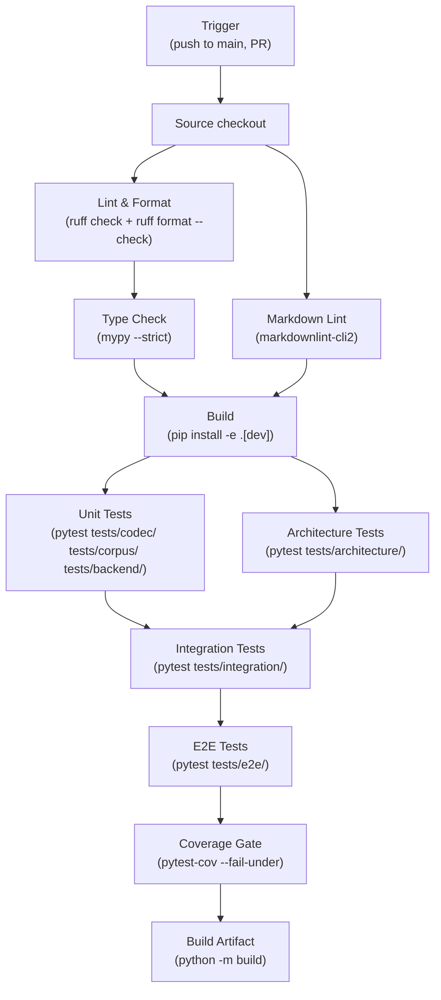

# Pipeline Stages

> [!info] Purpose
> Defines the fail-fast ordering of CI stages and the job dependency graph
> for TinyQuant's GitHub Actions pipeline.

## Stage order



## Stage details

### Stage 1: Lint & Format (parallel)

| Job | Command | Duration | Blocks |
|-----|---------|----------|--------|
| `lint` | `ruff check . && ruff format --check .` | ~10s | Everything downstream |
| `markdown-lint` | `markdownlint-cli2 "**/*.md" --ignore docs/` | ~5s | Build |

**Rationale:** cheapest checks first. Catches formatting, import order, naming
violations, and complexity limit breaches before spending time on type checking
or tests.

### Stage 2: Type Check

| Job | Command | Duration | Blocks |
|-----|---------|----------|--------|
| `typecheck` | `mypy --strict .` | ~30s | Build |

**Rationale:** type errors indicate contract violations that would cause test
failures. Catch them before running tests.

### Stage 3: Build

| Job | Command | Duration | Blocks |
|-----|---------|----------|--------|
| `build` | `pip install -e ".[dev]"` | ~30s | All tests |

**Rationale:** verify the package installs cleanly with all dependencies.
Uses editable install for test access.

### Stage 4: Tests (sequential with parallelism within)

| Job | Command | Duration | Blocks |
|-----|---------|----------|--------|
| `unit-tests` | `pytest tests/codec/ tests/corpus/ tests/backend/ -x` | ~30s | Integration |
| `architecture-tests` | `pytest tests/architecture/ -x` | ~5s | Integration |
| `integration-tests` | `pytest tests/integration/ -x` | ~60s | E2E |
| `e2e-tests` | `pytest tests/e2e/ -x` | ~120s | Coverage |

**Rationale:** unit and architecture tests run in parallel (independent).
Integration depends on both passing. E2E depends on integration. The `-x`
flag stops on first failure (fail fast).

### Stage 5: Coverage Gate

| Job | Command | Duration | Blocks |
|-----|---------|----------|--------|
| `coverage` | `pytest --cov=tinyquant_cpu --cov-fail-under=90` | Combined with tests | Artifact |

**Rationale:** coverage gate runs as part of the test stage but reported
separately. Enforces the floors from
[[design/architecture/linting-and-tooling|Linting and Tooling]].

### Stage 6: Build Artifact

| Job | Command | Duration | Blocks |
|-----|---------|----------|--------|
| `artifact` | `python -m build` | ~10s | CD pipeline |

**Rationale:** build the wheel and sdist once. The CD pipeline promotes this
exact artifact — no rebuild per environment.

## Conditional execution

| Condition | Behavior |
|-----------|----------|
| Only `docs/` changed | Skip tests; run only markdown lint |
| Only `tests/` changed | Skip artifact build |
| `scripts/` changed | Run full pipeline (verification scripts affect CI) |

```yaml
# Path filter example
- uses: dorny/paths-filter@v3
  id: changes
  with:
    filters: |
      src:
        - 'src/**'
        - 'tests/**'
        - 'pyproject.toml'
      docs:
        - 'docs/**'
```

## Caching

| Cache | Key | Restore key | Saves |
|-------|-----|-------------|-------|
| pip packages | `pip-${{ hashFiles('pyproject.toml') }}` | `pip-` | ~30s per run |
| mypy cache | `mypy-${{ hashFiles('pyproject.toml') }}-${{ github.sha }}` | `mypy-${{ hashFiles('pyproject.toml') }}` | ~10s per run |

## Target durations

| Phase | Target | Gate |
|-------|--------|------|
| Lint + type check | < 1 minute | Hard |
| Unit + architecture tests | < 1 minute | Hard |
| Integration tests | < 2 minutes | Hard |
| E2E tests | < 3 minutes | Hard |
| Full pipeline | < 8 minutes | Monitoring |

## Matrix strategy

| Axis | Values | Rationale |
|------|--------|-----------|
| Python version | `3.12`, `3.13` | Support current + next |
| OS | `ubuntu-latest` | Primary target; add `windows-latest` and `macos-latest` for determinism validation |

## See also

- [[CI-plan/README|CI Plan]]
- [[CI-plan/workflow-definition|Workflow Definition]]
- [[CI-plan/quality-gates|Quality Gates]]
- [[qa/verification-plan/README|Verification Plan]]
