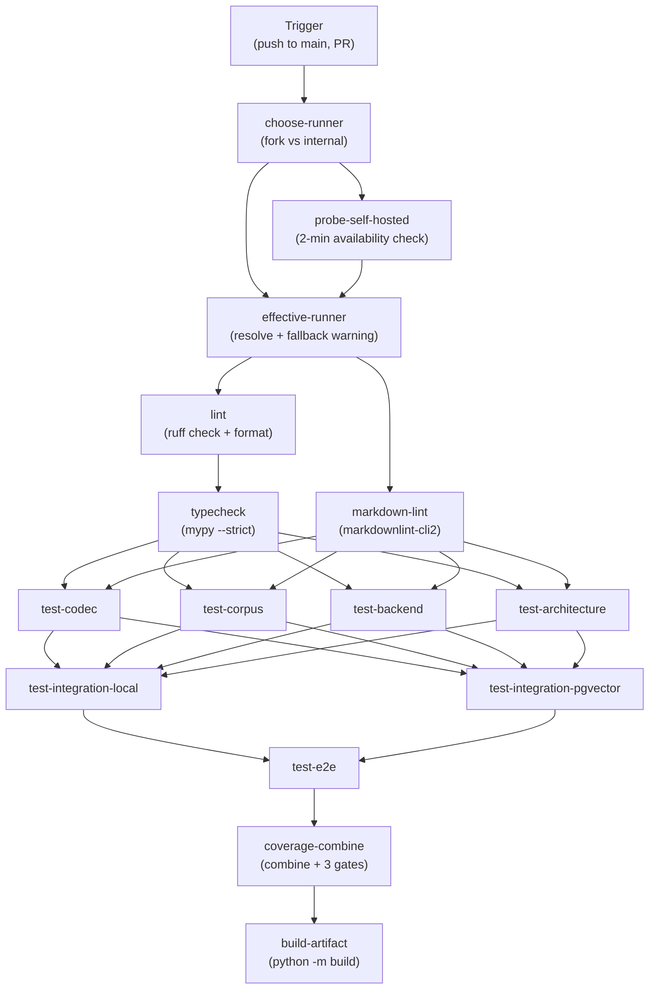

# Pipeline Stages

> [!info] Purpose
> Defines the fail-fast ordering of CI stages and the job dependency graph
> for TinyQuant's GitHub Actions pipeline.

## Stage order

## Stage details

### Stage 1: Pre-flight (parallel)

|Job|Command|Duration|Blocks|
|-|-|-|-|
|`choose-runner`|Select runner label (fork → ubuntu-latest, internal → self-hosted)|~5s|Probe, effective-runner|
|`probe-self-hosted`|2-minute availability probe for self-hosted runner (skipped for fork PRs)|~120s|effective-runner|
|`effective-runner`|Consolidate probe result; write fallback warning if unavailable|~5s|Static checks|

**Rationale:** determine runner availability early. Fallback to ubuntu-latest
if self-hosted is unavailable. Probe runs in parallel with other pre-flight
work.

### Stage 2: Static checks (parallel, after effective-runner)

|Job|Command|Duration|Blocks|
|-|-|-|-|
|`lint`|`ruff check . && ruff format --check .`|~10s|Type check|
|`markdown-lint`|`markdownlint-cli2 "**/*.md"`|~5s|Type check|

**Rationale:** cheapest checks first. Catches formatting, import order, naming
violations, and complexity limit breaches before spending time on type checking.

### Stage 3: Type check (after lint)

|Job|Command|Duration|Blocks|
|-|-|-|-|
|`typecheck`|`mypy --strict .`|~30s|Tier-1 unit tests|

**Rationale:** type errors indicate contract violations that would cause test
failures. Catch them before running tests.

### Stage 4: Tier-1 unit tests (parallel, after typecheck + markdown-lint)

|Job|Command|Duration|Blocks|
|-|-|-|-|
|`test-codec`|`pytest tests/codec/` (2× Python matrix)|~15s|Tier-2 integration|
|`test-corpus`|`pytest tests/corpus/` (2× Python matrix)|~15s|Tier-2 integration|
|`test-backend`|`pytest tests/backend/ tests/test_smoke.py` (2× Python matrix)|~15s|Tier-2 integration|
|`test-architecture`|`pytest tests/architecture/` (2× Python matrix)|~5s|Tier-2 integration|

Each uploads a `coverage-raw-<chunk>-<pyver>` artifact.

**Rationale:** parallel unit test chunks organized by test directory. Each
test matrix produces coverage artifacts for later aggregation.

### Stage 5: Tier-2 integration tests (parallel with each other, after all Tier-1)

|Job|Command|Duration|Blocks|
|-|-|-|-|
|`test-integration-local`|`pytest tests/integration/ --ignore=test_pgvector.py` (2× Python matrix)|~30s|E2E|
|`test-integration-pgvector`|`pytest tests/integration/test_pgvector.py` (2× Python matrix, postgres service)|~30s|E2E|

Each uploads a `coverage-raw-<chunk>-<pyver>` artifact.

**Rationale:** integration tests run in parallel. The pgvector job requires
a postgres service; local integration skips those tests.

### Stage 6: E2E tests (after both Tier-2)

|Job|Command|Duration|Blocks|
|-|-|-|-|
|`test-e2e`|`pytest tests/e2e/` (2× Python matrix)|~60s|Coverage combine|

Uploads `coverage-raw-e2e-<pyver>` artifact.

**Rationale:** end-to-end tests run after all integration tests pass. Full
coverage aggregation happens after E2E completes.

### Stage 7: Coverage combine (after e2e)

|Job|Command|Duration|Blocks|
|-|-|-|-|
|`coverage-combine`|Download all `coverage-raw-*` artifacts, run `coverage combine`, enforce gates|~30s|Build artifact|

Gates: global ≥ 90%, codec ≥ 94%, corpus ≥ 90%. Uploads `coverage-report` artifact.

**Rationale:** combine coverage from all test chunks. Three-gate enforcement
from [[design/architecture/linting-and-tooling|Linting and Tooling]].

### Stage 8: Build artifact (after coverage-combine)

|Job|Command|Duration|Blocks|
|-|-|-|-|
|`build-artifact`|`python -m build && twine check`|~10s|CD pipeline|

**Rationale:** build the wheel and sdist once, after all tests pass. The CD
pipeline promotes this exact artifact — no rebuild per environment.

## Caching

| Cache | Key | Restore key | Saves |
|-------|-----|-------------|-------|
| pip packages | `pip-${{ hashFiles('pyproject.toml') }}` | `pip-` | ~30s per run |
| mypy cache | `mypy-${{ hashFiles('pyproject.toml') }}-${{ github.sha }}` | `mypy-${{ hashFiles('pyproject.toml') }}` | ~10s per run |

## Target durations

| Phase | Target | Gate |
|-------|--------|------|
| Pre-flight (choose + probe + effective) | < 2 minutes | Hard |
| Lint + type check | < 1 minute | Hard |
| Tier-1 unit chunks (parallel) | < 1 minute | Hard |
| Tier-2 integration chunks (parallel) | < 2 minutes | Hard |
| E2E tests | < 3 minutes | Hard |
| Coverage combine | < 1 minute | Hard |
| Full pipeline (wall-clock) | < 8 minutes | Monitoring |

## Matrix strategy

| Axis | Values | Rationale |
|------|--------|-----------|
| Python version | `3.12`, `3.13` | Support current + next |
| OS | `ubuntu-latest` | Primary target; add `windows-latest` and `macos-latest` for determinism validation |

## See also

- [[CI-plan/README|CI Plan]]
- [[CI-plan/workflow-definition|Workflow Definition]]
- [[CI-plan/quality-gates|Quality Gates]]
- [[qa/verification-plan/README|Verification Plan]]
