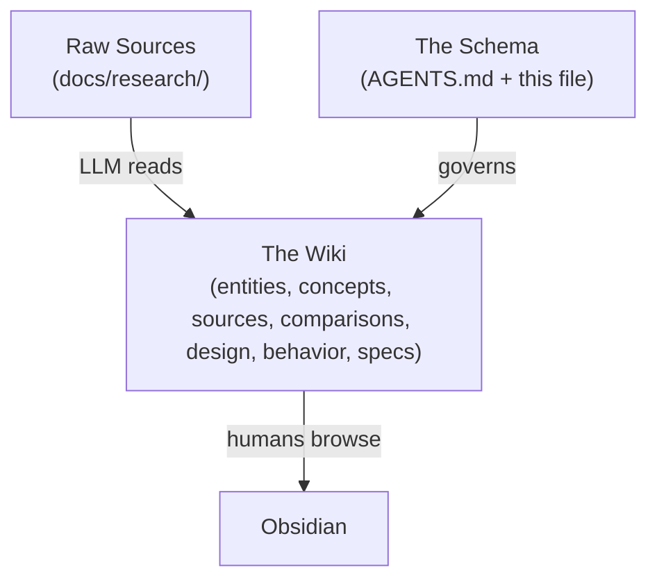

# TinyQuant Docs

> [!info] This directory is an Obsidian vault
> Open `docs/` directly in Obsidian for wikilinks, graph view, callouts, and
> Dataview-style metadata workflows.

## What this is

This is an LLM-maintained documentation system for TinyQuant. It follows the
same vault and schema pattern used in TurboSwede, but starts with TinyQuant-
specific placeholder content and an empty knowledge base.

### Three layers



| Layer | Location | Who writes it |
|-------|----------|--------------|
| Raw sources | `research/` | Humans |
| Wiki pages | Other `docs/` folders | LLM and humans |
| Schema | Root `AGENTS.md` + this file | Human + LLM |

## Directory structure

| Folder | Contents |
|--------|----------|
| `research/` | Immutable raw source documents awaiting or supporting ingestion |
| `entities/` | Pages for concrete systems, strategies, tools, datasets, services |
| `concepts/` | Pages for abstract ideas, methods, and patterns |
| `sources/` | One-page summaries of ingested raw sources |
| `comparisons/` | Side-by-side analyses and decision notes |
| `behavior/` | Acceptance criteria and behavior specifications |
| `design/` | Architecture and domain analysis |
| `specs/` | Plans, specs, and implementation-facing documentation |
| `assets/` | Images and binary attachments |

## Obsidian-flavored markdown rules

> [!warning] All wiki pages outside `research/` must follow these conventions.

- Use wikilinks for internal references
- Add YAML frontmatter with at least `title`, `tags`, and `date-created`
- Use callouts for notes, warnings, questions, and examples
- Prefer Dataview-friendly metadata such as `status`, `category`, and
  `source-count`
- Store attachments in `assets/`
- Keep `research/` files immutable after placement

## Operations

### Ingest a new source

1. Place the source in `research/`
2. Ask the LLM to ingest it
3. The LLM creates or updates summaries, wiki pages, [[index]], and [[log]]

### Query the wiki

1. Start from [[index]]
2. Follow relevant wiki pages
3. File durable answers back into the vault when useful

### Lint the wiki

Two complementary layers of linting run against this vault:

1. **Automated** — `markdownlint-obsidian` gates `docs/**/*.md` (except
   `research/`) as both a pre-commit hook (`.pre-commit-config.yaml`) and
   a CI job (`.github/workflows/docs-lint.yml`). Configuration lives at
   `.obsidian-linter.jsonc` at the repo root. The linter understands
   wikilinks, embeds, callouts, and block references, so conventional
   `markdownlint-cli2` rules that conflict with Obsidian syntax are
   pre-wired off.
2. **Editorial** — a periodic LLM-driven check for orphan pages, missing
   cross-links, stale claims, contradictions, and gaps worth filling.
   This complements the mechanical lint; it is not automated.

> [!tip] To run the Obsidian lint locally
>
> ```bash
> npm install -g markdownlint-obsidian-cli@1.0.6
> markdownlint-obsidian
> ```
>
> The config file at the repo root supplies globs and ignore patterns.

## See also

- [[index]]
- [[log]]
- Root `../AGENTS.md`
