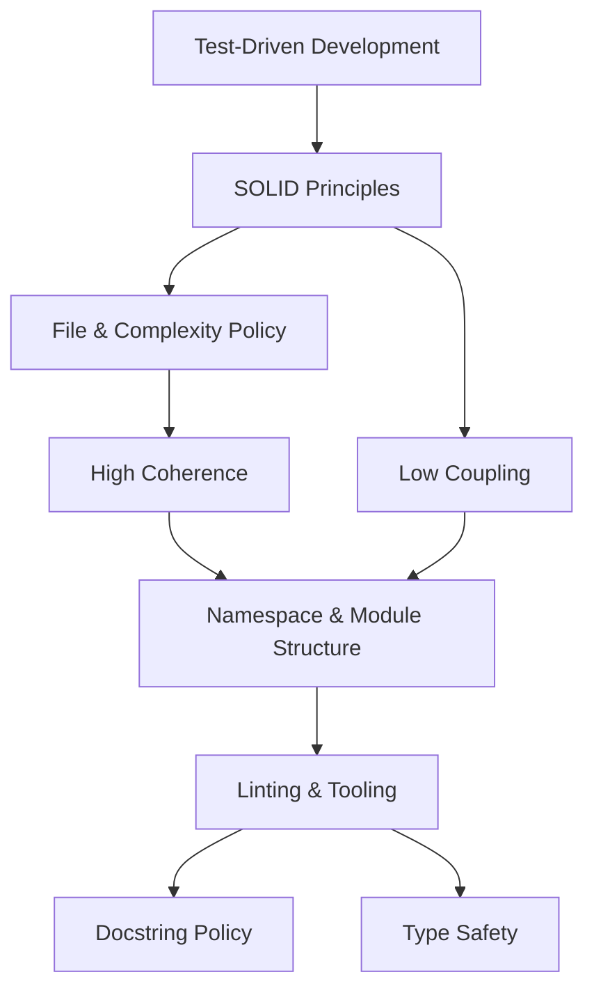

# Architecture Design Considerations

> [!info] Purpose
> Binding design policies for TinyQuant's implementation. These are not
> aspirational goals — they are enforced constraints that shape every module,
> class, test, and CI check.

## Reading order

1. [[architecture/test-driven-development|Test-Driven Development]] — code enters through failing tests
2. [[architecture/solid-principles|SOLID Principles]] — structural heuristics for change safety
3. [[architecture/file-and-complexity-policy|File and Complexity Policy]] — one class per file, low cyclomatic complexity
4. [[architecture/high-coherence|High Coherence]] — namespaces and modules organized by domain concept
5. [[architecture/low-coupling|Low Coupling]] — narrow, explicit, stable dependencies
6. [[architecture/linting-and-tooling|Linting and Tooling]] — strict linting, warnings as errors
7. [[architecture/docstring-policy|Docstring Policy]] — rich PEP 257 docstrings on all public API
8. [[architecture/type-safety|Type Safety]] — mypy strict mode, hard typing at all boundaries
9. [[architecture/namespace-and-module-structure|Namespace and Module Structure]] — package layout that enforces coherence

## How these relate

TDD drives design decisions into existence. SOLID provides the structural
heuristics. File policy and complexity limits keep units small enough to
reason about. Coherence and coupling shape the module graph. Linting, typing,
and docstrings enforce the result mechanically.

## Enforcement posture

> [!warning] These are gates, not guidelines
> Every policy listed here should be enforced in CI. Code that violates a
> policy should not merge. When a policy conflicts with practical reality,
> update the policy document — do not silently bypass the check.

## See also

- [[domain-layer/README|Domain Layer]]
- [[behavior-layer/README|Behavior Layer]]
- [[storage-codec-architecture]]
- [[TinyQuant]]
