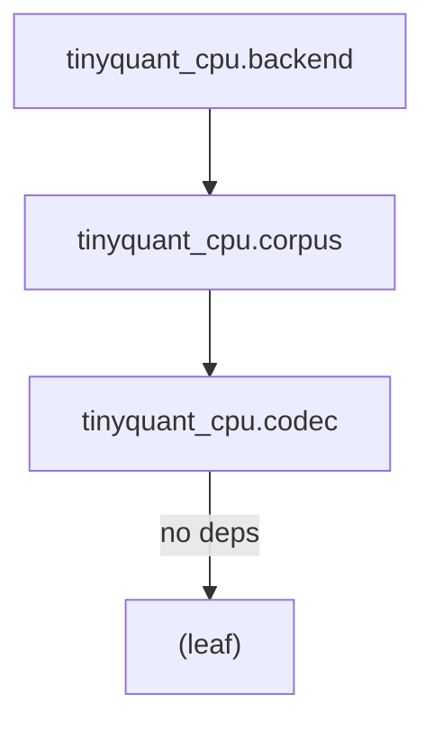

# Namespace and Module Structure

> [!info] Policy
> TinyQuant uses Python packages as coherence boundaries. Each package maps
> to one bounded context. Each module within a package owns one domain concept.
> This structure is the physical enforcement of
> [[architecture/high-coherence|high coherence]] and
> [[architecture/low-coupling|low coupling]].

## Package layout

```text
src/
└── tinyquant_cpu/
    ├── __init__.py              # Public API re-exports (explicit)
    ├── py.typed                 # PEP 561 marker for mypy consumers
    │
    ├── codec/                   # Bounded context: Codec
    │   ├── __init__.py          # Public: CodecConfig, Codebook,
    │   │                        #   RotationMatrix, CompressedVector,
    │   │                        #   Codec, compress, decompress
    │   ├── codec_config.py      # CodecConfig value object
    │   ├── rotation_matrix.py   # RotationMatrix value object + builder
    │   ├── codebook.py          # Codebook value object + training
    │   ├── compressed_vector.py # CompressedVector value object
    │   ├── codec.py             # Codec domain service (compress/decompress)
    │   └── _quantize.py         # Private: low-level quantization helpers
    │
    ├── corpus/                  # Bounded context: Corpus
    │   ├── __init__.py          # Public: Corpus, CompressionPolicy,
    │   │                        #   VectorEntry
    │   ├── corpus.py            # Corpus aggregate root
    │   ├── vector_entry.py      # VectorEntry entity
    │   ├── compression_policy.py # CompressionPolicy value object (enum)
    │   └── events.py            # Domain events: CorpusCreated,
    │                            #   VectorsInserted, CorpusDecompressed,
    │                            #   CompressionPolicyViolationDetected
    │
    ├── backend/                 # Bounded context: Backend Protocol
    │   ├── __init__.py          # Public: SearchBackend, SearchResult
    │   ├── protocol.py          # SearchBackend Protocol + SearchResult
    │   ├── brute_force.py       # Reference brute-force implementation
    │   └── adapters/            # Backend-specific adapters
    │       ├── __init__.py
    │       └── pgvector.py      # pgvector wire-format adapter
    │
    └── _types.py                # Shared type aliases (e.g. VectorId)

tests/
├── conftest.py                  # Shared fixtures: configs, codebooks,
│                                #   sample vectors
├── codec/
│   ├── test_codec_config.py
│   ├── test_rotation_matrix.py
│   ├── test_codebook.py
│   ├── test_compressed_vector.py
│   └── test_codec.py
├── corpus/
│   ├── test_corpus.py
│   ├── test_vector_entry.py
│   ├── test_compression_policy.py
│   └── test_events.py
├── backend/
│   ├── test_brute_force.py
│   └── test_pgvector_adapter.py
└── calibration/
    ├── test_score_fidelity.py
    └── test_rank_preservation.py
```

## Design rules enforced by this layout

### One bounded context per package

| Package | Context | Owner of |
|---------|---------|----------|
| `tinyquant_cpu.codec` | Codec | Compression math, value objects, stateless service |
| `tinyquant_cpu.corpus` | Corpus | Aggregate root, vector lifecycle, events, policies |
| `tinyquant_cpu.backend` | Backend Protocol | Protocol definition, reference implementation, adapters |

### One public class per module

See [[architecture/file-and-complexity-policy|File and Complexity Policy]].
The file name is the `snake_case` form of the class name. This makes
navigation trivial:

```text
Need CodecConfig? → tinyquant_cpu/codec/codec_config.py
Need Corpus?      → tinyquant_cpu/corpus/corpus.py
Need SearchBackend? → tinyquant_cpu/backend/protocol.py
```

### Explicit public API via `__init__.py`

Each package's `__init__.py` explicitly re-exports its public symbols using
`__all__`:

```python
# tinyquant_cpu/codec/__init__.py
"""TinyQuant codec: compression and decompression primitives."""

from tinyquant_cpu.codec.codec import Codec, compress, decompress
from tinyquant_cpu.codec.codec_config import CodecConfig
from tinyquant_cpu.codec.codebook import Codebook
from tinyquant_cpu.codec.compressed_vector import CompressedVector
from tinyquant_cpu.codec.rotation_matrix import RotationMatrix

__all__ = [
    "Codec",
    "CodecConfig",
    "Codebook",
    "CompressedVector",
    "RotationMatrix",
    "compress",
    "decompress",
]
```

Consumers import from the package, not from internal modules:

```python
# Good
from tinyquant_cpu.codec import CodecConfig, compress

# Bad — couples to internal file structure
from tinyquant_cpu.codec.codec_config import CodecConfig
```

The `no_implicit_reexport` mypy flag enforces this: if a symbol is not in
`__all__`, mypy treats it as private.

### Private modules prefixed with underscore

Internal helpers that are not part of the public API use a leading underscore:
`_quantize.py`, `_types.py`. These may be restructured or removed without a
breaking change.

### Acyclic dependency direction



**Enforced by:** an architecture test that imports each package and asserts no
disallowed reverse imports exist. Example:

```python
def test_codec_does_not_import_corpus() -> None:
    """Codec is a leaf package with no internal dependencies."""
    import tinyquant_cpu.codec
    imported = {m for m in sys.modules if m.startswith("tinyquant_cpu.")}
    assert not any(m.startswith("tinyquant_cpu.corpus") for m in imported)
    assert not any(m.startswith("tinyquant_cpu.backend") for m in imported)
```

### Test mirror

The test directory mirrors the source layout. Each test file maps to one
source module. Calibration tests (score fidelity, rank preservation) live
in their own directory because they cross multiple packages and run slower.

## Why this structure increases coherence

| Property | How the layout delivers it |
|----------|--------------------------|
| **Conceptual coherence** | Package names match bounded contexts from the [[domain-layer/context-map\|Context Map]] |
| **Module coherence** | One class per file ensures each module has one reason to change |
| **Architectural coherence** | Acyclic package dependencies are structurally visible and testable |
| **Runtime coherence** | Explicit `__init__.py` exports prevent hidden internal coupling |

## See also

- [[architecture/high-coherence|High Coherence]]
- [[architecture/low-coupling|Low Coupling]]
- [[architecture/file-and-complexity-policy|File and Complexity Policy]]
- [[architecture/type-safety|Type Safety]]
- [[domain-layer/context-map|Context Map]]
