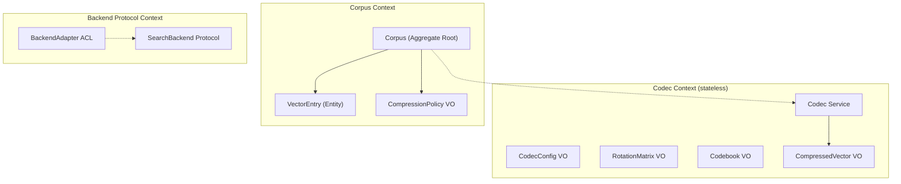

# Aggregates and Entities

> [!info] Purpose
> Defines the consistency boundaries, entities, value objects, and domain
> services that make up TinyQuant's tactical domain model.

## Codec Context

### CodecConfig (Value Object)

An immutable configuration snapshot that fully determines codec behavior.

| Field | Type | Invariant |
|-------|------|-----------|
| `bit_width` | int | Must be a supported width (e.g. 2, 4, 8) |
| `seed` | int | Non-negative; controls rotation matrix generation |
| `residual_enabled` | bool | Whether stage-2 residual correction is active |
| `dimension` | int | Expected input vector dimensionality; positive |

**Why a value object:** CodecConfig has no identity or lifecycle. Two configs
with the same fields are interchangeable. Immutability prevents accidental
mid-batch configuration drift.

### RotationMatrix (Value Object)

A deterministically generated orthogonal matrix derived from `seed` and
`dimension`.

| Invariant |
|-----------|
| Orthogonality: `R @ R.T == I` within floating-point tolerance |
| Determinism: same seed + dimension always produces the same matrix |

### Codebook (Value Object)

A mapping from quantized indices to representative FP32 values, derived from
the training data and bit width.

| Invariant |
|-----------|
| Number of entries equals `2^bit_width` |
| Entries are ordered and non-duplicated |

### CompressedVector (Value Object)

The output of a full codec pass: quantized indices plus optional residual data.

| Field | Type | Notes |
|-------|------|-------|
| `indices` | int array | One index per dimension, each in `[0, 2^bit_width)` |
| `residual` | bytes or None | Present only when `residual_enabled` is true |
| `config_hash` | str | Fingerprint of the CodecConfig used to produce this vector |

| Invariant |
|-----------|
| `len(indices) == dimension` from the originating CodecConfig |
| `config_hash` matches the CodecConfig that created this vector |

**Why a value object:** compressed vectors are immutable data products. They
have no lifecycle of their own; they are created by the codec and consumed by
the corpus or decompression path.

### Codec (Domain Service)

Stateless service that performs compression and decompression.

| Operation | Input | Output | Invariants enforced |
|-----------|-------|--------|-------------------|
| `compress` | FP32 vector + CodecConfig + Codebook | CompressedVector | Round-trip determinism; dimension match; index range |
| `decompress` | CompressedVector + CodecConfig + Codebook | FP32 vector | Config hash match; codebook compatibility |
| `build_codebook` | training vectors + CodecConfig | Codebook | Entry count matches `2^bit_width` |
| `build_rotation` | CodecConfig | RotationMatrix | Orthogonality; determinism from seed |

**Why a domain service, not an entity:** the codec holds no mutable state. It
is a pure function boundary parameterized by a config and codebook.

---

## Corpus Context

### Corpus (Aggregate Root)

The primary consistency boundary for stored compressed vectors.

| Field | Type | Notes |
|-------|------|-------|
| `corpus_id` | str | Unique identity |
| `codec_config` | CodecConfig | Frozen at corpus creation |
| `codebook` | Codebook | Frozen at corpus creation (or after calibration) |
| `vectors` | dict[str, CompressedVector] | Keyed by vector ID |
| `metadata` | dict[str, any] | Per-corpus metadata |
| `compression_policy` | CompressionPolicy | Governs write-path behavior |

| Invariant | Why |
|-----------|-----|
| All vectors share the same `codec_config` | Prevents mixed-configuration corruption; simplifies batch decompression |
| `compression_policy` is immutable after first vector insertion | Policy change on a populated corpus would silently invalidate existing data |
| Every vector's `config_hash` matches the corpus's config | Guards against accidental cross-corpus vector insertion |

**Aggregate sizing rationale:** the corpus is the natural transaction boundary
because compression configuration consistency is the hardest invariant to
protect. Vectors cannot be independently valid without knowing which config
produced them.

### CompressionPolicy (Value Object)

| Variant | Behavior |
|---------|----------|
| `compress` | Full codec pipeline (rotation, quantization, residual) |
| `passthrough` | Store FP32 vectors without compression |
| `fp16` | Downcast to FP16 without codec quantization |

### VectorEntry (Entity inside Corpus)

| Field | Type | Notes |
|-------|------|-------|
| `vector_id` | str | Identity within the corpus |
| `compressed` | CompressedVector | The stored representation |
| `inserted_at` | datetime | Insertion timestamp |
| `metadata` | dict | Per-vector metadata (optional) |

**Why an entity:** vector entries have identity (vector_id) and a lifecycle
within the corpus. But they cannot exist outside a corpus — the corpus is the
aggregate root.

---

## Backend Protocol Context

### SearchBackend (Domain Service / Protocol)

A protocol definition, not a concrete implementation.

| Operation | Input | Output |
|-----------|-------|--------|
| `search` | query FP32 vector + top-k | ranked result list |
| `ingest` | collection of FP32 vectors + IDs | acknowledgment |

| Invariant |
|-----------|
| Backends only receive FP32 vectors, never compressed representations |

**Why a protocol, not an aggregate:** the Backend Protocol Context does not own
persistent state inside TinyQuant. It defines the contract that external
backends must satisfy.

### BackendAdapter (Anti-Corruption Layer)

Thin translation layer between TinyQuant's vector format and a specific
backend's wire protocol. One adapter per supported backend.

---

## Aggregate boundary summary

## See also

- [[domain-layer/ubiquitous-language|Ubiquitous Language]]
- [[domain-layer/context-map|Context Map]]
- [[domain-layer/domain-events|Domain Events]]
- [[storage-codec-architecture]]
- [[two-stage-quantization-and-residual-correction]]
- [[random-preconditioning-without-normalization-overhead]]
