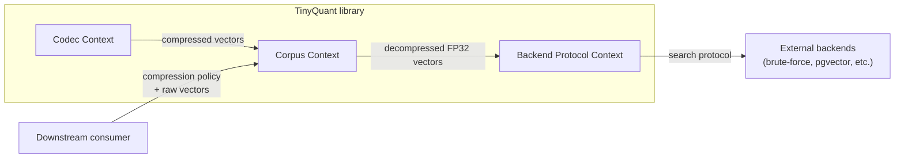

# Context Map

> [!info] Purpose
> Identifies the bounded contexts inside TinyQuant and describes how they
> relate to each other and to external systems.

## Subdomains

| Subdomain | Type | Rationale |
|-----------|------|-----------|
| **Vector codec** | Core | Differentiating capability: the two-stage quantization pipeline with random preconditioning is TinyQuant's reason to exist |
| **Corpus management** | Supporting | Important container abstraction, but not the source of algorithmic differentiation |
| **Search backend integration** | Generic | A thin protocol boundary; the actual search logic belongs to external systems |

## Bounded contexts

### Codec Context

**Owns:** rotation matrix generation, stage-1 scalar quantization, stage-2
residual correction, codebook management, serialization/deserialization of
compressed vectors.

**Language:** vector, compressed vector, codebook, rotation matrix, residual,
seed, bit width, decompression.

**Key invariant:** a compress-then-decompress round trip must be deterministic
given the same seed and bit width. Two calls with identical inputs and
configuration must produce identical outputs.

**Integration style:** published language. The Corpus Context consumes
compressed vectors through a stable internal API that the Codec Context owns
and publishes.

### Corpus Context

**Owns:** batch compression/decompression workflows, persistent storage of
compressed vector collections, metadata association, compression policy
enforcement.

**Language:** corpus, collection, compression policy (`compress` /
`passthrough` / `fp16`), batch operation.

**Key invariant:** every vector in a corpus was compressed under the same codec
configuration (seed, bit width, codebook). Mixing configurations within a
single corpus is not permitted.

**Integration style:** customer-supplier with the Codec Context (Corpus is the
customer; Codec supplies the compression primitives). Published language toward
the Backend Protocol Context for decompressed vector handoff.

### Backend Protocol Context

**Owns:** the protocol definition for handing decompressed FP32 vectors to
external search systems. Does **not** own search logic, ranking, or indexing.

**Language:** backend, search protocol, decompressed vector, query, result set.

**Key invariant:** backends always receive FP32 vectors. The protocol never
exposes compressed representations to search consumers.

**Integration style:** open host / published language toward external backends.
Anti-corruption layer where needed to translate between TinyQuant's vector
format and backend-specific expectations (e.g., pgvector array format).

## Context relationships

| Upstream | Downstream | Style | Notes |
|----------|-----------|-------|-------|
| Codec | Corpus | Customer-supplier | Corpus calls Codec primitives; Codec does not know about Corpus |
| Corpus | Backend Protocol | Published language | Backend Protocol receives decompressed FP32 vectors through a defined interface |
| Backend Protocol | External backends | Open host + ACL | Thin adapters translate to backend-specific wire formats |
| Downstream consumer | Corpus | Conformist | Consumers conform to TinyQuant's compression policy vocabulary and corpus API |

## What is explicitly outside TinyQuant

- ANN index construction and maintenance
- Similarity scoring and ranking algorithms
- Embedding model selection or training
- Vector database schema management

These belong to the external backends or to downstream consumers. TinyQuant's
scope ends at decompressed FP32 vector handoff.

## See also

- [[domain-layer/ubiquitous-language|Ubiquitous Language]]
- [[domain-layer/aggregates-and-entities|Aggregates and Entities]]
- [[storage-codec-architecture]]
- [[storage-codec-vs-search-backend-separation]]
- [[per-collection-compression-policy]]
