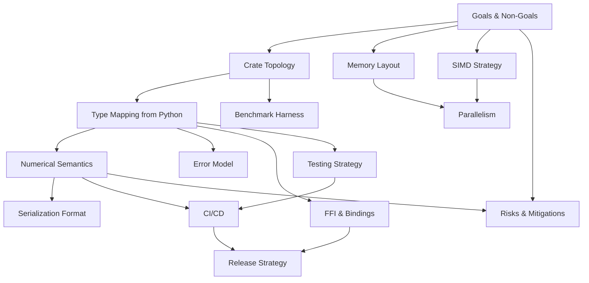

# Rust Port — Design Overview

> [!info] Purpose
> Authoritative design entry point for the ultra-high-performance Rust
> reimplementation of TinyQuant. The Python package
> (`tinyquant_cpu`, v0.1.1) is the **behavioral gold standard**; the Rust
> port must match its public interface boundaries and numerical semantics
> exactly while delivering an order-of-magnitude speedup on the same CPU.

> [!warning] Authority boundary
> These documents describe the *design* of the Rust port. The binding
> architectural constraints (TDD, SOLID, file-and-complexity policy,
> coverage floors, one-class-per-file, layered dependencies, narrow
> protocols, value objects at boundaries) are inherited from
> [[design/architecture/README|Architecture Design Considerations]] and
> [[design/domain-layer/README|Domain Layer]]. Where this port document
> appears to relax any of those rules, the architecture document wins.
> Where the Python implementation and this design disagree on observable
> behavior, the Python implementation wins — until a behavior drift is
> *explicitly* ratified in [[design/behavior-layer/README|Behavior Layer]].

## Reading order

1. [[design/rust/goals-and-non-goals|Goals and Non-Goals]] — what "ultra-high performance" means and where we deliberately stop
2. [[design/rust/crate-topology|Crate Topology and Module Structure]] — Cargo workspace, crate graph, per-file responsibilities
3. [[design/rust/type-mapping|Type Mapping from Python]] — one-to-one mapping of every public Python symbol to its Rust counterpart
4. [[design/rust/numerical-semantics|Numerical Semantics and Determinism]] — rotation matrix, quantization, residual, fp16 — bit-for-bit parity plan
5. [[design/rust/memory-layout|Memory Layout and Allocation Strategy]] — SoA vs AoS, alignment, owned vs borrowed buffers, arenas
6. [[design/rust/simd-strategy|SIMD Strategy]] — portable SIMD, runtime dispatch, x86 AVX2/AVX-512, aarch64 NEON
7. [[design/rust/parallelism|Parallelism and Concurrency]] — rayon, thread pools, send/sync contracts
8. [[design/rust/error-model|Error Model]] — `thiserror`, error taxonomy, panic discipline
9. [[design/rust/serialization-format|Serialization Format]] — wire format parity with Python, endian, versioning, zero-copy reads
10. [[design/rust/ffi-and-bindings|FFI and Bindings]] — C ABI, pyo3 bindings for drop-in replacement, WASM feature
11. [[design/rust/benchmark-harness|Benchmark Harness and Performance Budgets]] — criterion, flamegraph, regression gates
12. [[design/rust/testing-strategy|Testing Strategy]] — unit, property, snapshot, cross-language parity, fuzz
13. [[design/rust/ci-cd|CI/CD for the Rust Crate]] — GitHub Actions matrix, clippy, miri, cargo-deny, OIDC release
14. [[design/rust/feature-flags|Feature Flags and Optional Dependencies]] — `default`, `pgvector`, `pyo3`, `simd`, `std`
15. [[design/rust/release-strategy|Release and Versioning]] — crates.io, PyPI via maturin, MSRV policy
16. [[design/rust/risks-and-mitigations|Risks and Mitigations]] — LAPACK determinism, QR sign conventions, fp16 round-trips
17. [[design/rust/phase-13-implementation-notes|Phase 13 Implementation Notes]] — execution-log view of the Phase 13 landing (rotation matrix and numerics): deviations from the plan, gotchas, and locked-in invariants
18. [[design/rust/phase-14-implementation-notes|Phase 14 Implementation Notes]] — execution-log view of the Phase 14 landing (`Codebook` + scalar quantize kernels): bit-width sweep, `rand_chacha` substitute for `proptest`, `fs::read` fixture pattern, and the `#[allow(clippy::cast_*)]` locality that made the quantile math lint-clean
19. [[design/rust/phase-15-implementation-notes|Phase 15 Implementation Notes]] — execution-log view of the Phase 15 landing (`Codec` service, `compute_residual`, `CompressedVector`): Rust-canonical fixture strategy due to RNG divergence, clippy constraint patterns, and fidelity gate numbers
20. [[design/rust/phase-17-implementation-notes|Phase 17 Implementation Notes]] — execution-log view of the Phase 17 landing (`tinyquant-io` zero-copy views, Level-2 TQCV corpus file container, mmap-based reader): TQCV magic-byte layout, `mmap-lock` feature flag design, and `MmapView` lifetime safety model
21. [[design/rust/phase-18-implementation-notes|Phase 18 Implementation Notes]] — execution-log view of the Phase 18 landing (`Corpus` aggregate root, vector insertion, batch atomicity, three-policy decompression, domain events, insertion-ordered vector map)

## How the design layers relate

## Quick context for anyone reading this from another subdomain

- **What TinyQuant does**: compresses high-dimensional FP32 embedding
  vectors via random orthogonal preconditioning plus two-stage scalar
  quantization, optionally adding an FP16 residual correction, to hit
  ~8× compression at 4 bits with Pearson ρ ≈ 0.998 and top-5 recall
  ≈ 95% on real OpenAI embeddings.
- **What the Rust port adds**: zero-copy reads, SIMD-accelerated
  quantization, data-parallel batch compression, a stable C ABI for
  non-Python consumers (pgvector, better-router, nordic-mcp), and a
  pyo3 binding that can drop into the existing `tinyquant_cpu`
  distribution with identical Python semantics.
- **What it does not add**: search indexing, clustering, ANN
  structures, model training, or anything outside the codec/corpus
  boundary. The layered architecture stays the same.

## Scope of this port

| In scope | Out of scope |
|---|---|
| Codec layer: `CodecConfig`, `RotationMatrix`, `Codebook`, `CompressedVector`, `Codec` service | ANN indexes, HNSW, IVF |
| Corpus layer: `Corpus`, `VectorEntry`, `CompressionPolicy`, domain events | Persistent on-disk corpus formats beyond mmapped byte blobs |
| Backend layer: `SearchBackend` trait, `BruteForceBackend`, `PgvectorAdapter` | Running an actual pgvector server |
| Serialization: exact binary parity with Python `CompressedVector.to_bytes` | Schema evolution beyond format version `0x02` introduced here |
| FFI: pyo3 Python bindings, C ABI crate (`cdylib` + `staticlib`) | JS/Python async runtimes |
| **Standalone `tinyquant` CLI binary** cross-compiled to Linux x86_64/aarch64 (glibc and musl), macOS x86_64/aarch64, Windows x86_64/i686, and FreeBSD x86_64, plus a multi-arch GHCR container image | iOS/Android binaries |
| Cargo library crates on crates.io, Python wheel on PyPI, binary archives on GitHub Releases — all produced from one tag in one workflow | — |
| Benchmarks: criterion + flamegraphs + regression gates | Research-grade novel algorithms |

## Relationship to the Python codebase

The Python package stays. The Rust port is **additive**:

1. It ships as a separate Cargo workspace under `rust/` at the TinyQuant
   repo root. The Python source under `src/tinyquant_cpu/` is not
   moved, modified, or deleted by this port.
2. The pyo3 binding (`tinyquant-py`) produces an importable
   `tinyquant_rs` module; it does **not** replace `tinyquant_cpu`.
   A future phase can decide whether to promote it to a drop-in.
3. Cross-language parity tests (see
   [[design/rust/testing-strategy|Testing Strategy]]) assert that
   Rust and Python produce byte-identical `CompressedVector.to_bytes`
   outputs for the same inputs, and that round-trip cosine similarities
   match within 1e-6.
4. The architecture policies from `docs/design/architecture/` apply
   unchanged, with Rust-specific translations documented in each child
   file under `docs/design/rust/`.

## See also

- [[design/architecture/README|Architecture Design Considerations]]
- [[design/domain-layer/README|Domain Layer]]
- [[design/behavior-layer/README|Behavior Layer]]
- [[design/storage-codec-architecture|Storage Codec Architecture]]
- [[roadmap|Implementation Roadmap]]
