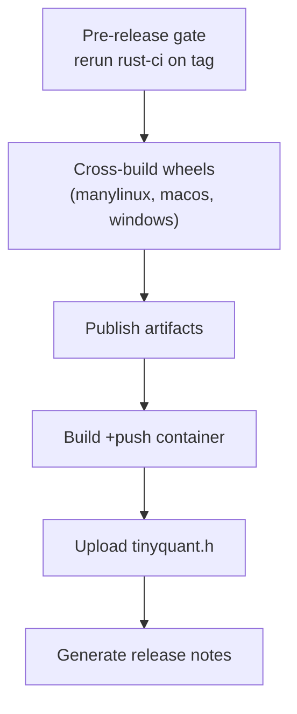

# Rust Port — CI/CD

> [!info] Purpose
> Define the GitHub Actions workflows that govern the Rust port —
> what runs on every PR, what runs nightly, what happens on a tag
> push, and where quality gates land.

## Workflow map

```text
.github/workflows/
├── rust-ci.yml              # Per-PR gate for the Rust workspace
├── rust-nightly.yml         # Slower checks: miri, fuzz corpus refresh
├── rust-release.yml         # Tag-triggered crate + wheel + header publish
├── rust-parity.yml          # Weekly rust-vs-python parity report
└── ci.yml                   # Existing Python pipeline (unchanged)
```

The existing Python `ci.yml` is not modified — the Rust workflows are
additive and triggered only by changes to `rust/**`, `docs/design/rust/**`,
or `docs/plans/rust/**`.

## `rust-ci.yml` (per-PR)

### Triggers

```yaml
on:
  pull_request:
    paths:
      - 'rust/**'
      - '.github/workflows/rust-ci.yml'
      - 'docs/design/rust/**'
      - 'docs/plans/rust/**'
  push:
    branches: [main]
    paths:
      - 'rust/**'
      - '.github/workflows/rust-ci.yml'
```

### Stages (fail-fast order)


| Stage | Command | Budget | Blocking |
|---|---|---|---|
| `fmt` | `cargo fmt --all -- --check` | 10s | yes |
| `clippy` | `cargo clippy --workspace --all-targets --all-features -- -D warnings` | 3 min | yes |
| `no_std` | `cargo build -p tinyquant-core --no-default-features --target thumbv7em-none-eabihf` | 2 min | yes |
| `test` | `cargo test --workspace --all-features` | 8 min | yes |
| `docs` | `cargo doc --workspace --all-features --no-deps` | 2 min | yes (warnings as errors) |
| `coverage` | `cargo llvm-cov --workspace --all-features --lcov --output-path lcov.info` then floor check | 10 min | yes |
| `benches` | `cargo xtask bench --check-against main` | 12 min | yes on `main`, advisory on PR |
| `cbindgen` | `cargo build -p tinyquant-sys --release && git diff --exit-code rust/crates/tinyquant-sys/include/` | 2 min | yes |
| `architecture` | `cargo xtask arch-check` | 30s | yes |
| `wheel` | `maturin build --release --strip -m rust/crates/tinyquant-py/Cargo.toml` | 6 min | yes |

Total wall time target: ≤ 25 minutes on a Linux x86_64 GitHub-hosted
runner. Parallel jobs used where safe (clippy and no_std can run in
parallel; test and coverage are merged into one job that runs tests
under llvm-cov).

### OS matrix

| Job | Runner | Purpose |
|---|---|---|
| `linux-x86_64` | `ubuntu-22.04` | Primary gate; AVX2 target features |
| `linux-aarch64` | `ubuntu-22.04-arm` | NEON path validation |
| `macos-arm64` | `macos-14` | Apple Silicon native |
| `windows-x86_64` | `windows-2022` | MSVC target |

All jobs run `fmt`, `clippy`, `test`, `wheel`. Coverage and
benchmarks run only on `linux-x86_64` to keep the runtime budget
small and the comparisons meaningful.

### Secrets and OIDC

- No long-lived tokens for publishing.
- crates.io uses trusted publishing via OIDC (`crates.io` GitHub
  integration).
- PyPI uses OIDC (`pypa/gh-action-pypi-publish@release/v1`).
- GHCR (if we ship a container image) uses `GITHUB_TOKEN` with
  `packages: write`.

## `rust-nightly.yml`

### Triggers

```yaml
on:
  schedule:
    - cron: '0 6 * * *'
  workflow_dispatch:
```

### Jobs

1. **miri** — `cargo miri test --package tinyquant-core`
   (unsafe-block audit, UB detection). 40-minute budget.
2. **fuzz-5m** — runs every target in `tinyquant-fuzz` for 5 minutes.
   Crashes become issues.
3. **sanitizer-asan** — `RUSTFLAGS="-Z sanitizer=address" cargo test
   --workspace`. Catches memory bugs in the `unsafe` SIMD kernels.
4. **sanitizer-tsan** — same with ThreadSanitizer. Validates the
   `SyncPtr` parallel-write path.
5. **benchmark-archive** — runs the full bench suite and commits the
   JSON to a `perf-history` branch for historical tracking.
6. **msrv** — `cargo +1.78.0 check --workspace` to pin the declared
   MSRV and prevent accidental bumps.

Nightly failures page the on-call owner via GitHub issue templates
but do not block mainline merges — they are advisory.

## `rust-release.yml`

### Trigger

```yaml
on:
  push:
    tags:
      - 'rust-v*.*.*'    # e.g. rust-v0.1.0
```

The dedicated tag prefix ensures Rust releases are distinct from the
Python package's versioning. The Python `v0.1.1` tag never triggers a
Rust release.

### Stages



| Step | Action |
|---|---|
| `gate` | Reruns `rust-ci.yml` jobs on the tagged commit to confirm a clean build |
| `build-linux-x86_64` | `maturin build --release --strip --zig --target x86_64-unknown-linux-gnu --manylinux 2_28` |
| `build-linux-aarch64` | `maturin build --release --strip --zig --target aarch64-unknown-linux-gnu --manylinux 2_28` |
| `build-macos-universal` | `maturin build --release --strip --target universal2-apple-darwin` |
| `build-windows-x86_64` | `maturin build --release --strip --target x86_64-pc-windows-msvc` |
| `publish-crates-io` | `cargo publish -p tinyquant-core` then `tinyquant-io` then `tinyquant-bruteforce` then `tinyquant-pgvector` then `tinyquant-sys`. Order matters — upstream deps first. |
| `publish-pypi` | `pypa/gh-action-pypi-publish` with the built wheels (TestPyPI for pre-releases, PyPI for stable) |
| `publish-header` | Attaches `tinyquant.h` to the GitHub release as a downloadable asset |
| `notes` | Generates a markdown release notes file from `CHANGELOG.md` and `git log` since the previous tag |

### Pre-release vs stable

| Tag pattern | Target |
|---|---|
| `rust-v0.*.*-alpha.*` | TestPyPI + `crates.io` with `--allow-dirty` + no container |
| `rust-v0.*.*-beta.*` | TestPyPI + `crates.io` + ghcr.io container |
| `rust-v0.*.*` | PyPI + `crates.io` + ghcr.io + GitHub release |
| `rust-v1.*.*` | Same as above, plus an `abi-stable` tag on the SO |

## `rust-parity.yml`

### Purpose

Runs the full parity suite against the current Python reference once
a week and posts a report to `docs/design/rust/benchmark-results/`.

```yaml
on:
  schedule:
    - cron: '0 12 * * 0'   # Sunday noon UTC
  workflow_dispatch:
```

### Outputs

1. `docs/design/rust/benchmark-results/YYYY-MM-DD-parity.md` — a
   markdown table comparing every bench on the gold corpus.
2. A GitHub issue if any parity assertion fails, tagged
   `parity-regression`.
3. A commit to the `perf-history` branch with the JSON results.

## Quality gates vs advisories

| Gate | PR | main | release |
|---|---|---|---|
| fmt | block | block | block |
| clippy | block | block | block |
| no_std build | block | block | block |
| tests | block | block | block |
| coverage floor | block | block | block |
| cbindgen diff | block | block | block |
| bench budget | advisory | block | block |
| miri | — | advisory | block |
| fuzz 5m | — | advisory | block |
| parity report | — | — | block |

"Block" = merge/publish cannot proceed. "Advisory" = logs a warning
but does not block.

## Caching

- `Swatinem/rust-cache@v2` on every job keyed by `Cargo.lock` and
  workflow file hash.
- `actions/cache` for `~/.cargo/registry/cache` and
  `target/` per OS+feature combo.
- Fixture files are in Git LFS; `actions/checkout` with
  `lfs: true` on every job.

> [!warning] Design-implementation drift caught in Phase 14
> Between Phase 11 (when `rust-ci.yml` first landed) and Phase 14
> (2026-04-10), this section's "`lfs: true` on every job" claim
> was **not** actually reflected in `.github/workflows/rust-ci.yml`:
> the fmt, clippy, test, and no_std-check jobs all invoked
> `actions/checkout@v4` with no `with:` block, so LFS blobs were
> downloaded as 132-byte pointer files and every rotation-fixture
> parity test failed silently with a length assertion. Phase 13's
> CI was red for this reason on every single push to `main`
> (`gh run list --workflow rust-ci.yml --branch main`) and nobody
> noticed because the Phase 13 work was trusted based on local
> runs alone.
>
> Phase 14 fixed the drift in commit `13e888d` and surfaced the
> lesson in
> [[design/rust/phase-14-implementation-notes|Phase 14 Implementation
> Notes]] §L1–L3. When revising this document going forward,
> verify each testable claim against the actual YAML — a claim
> that holds in prose but not in CI is worse than no claim at all,
> because it reads like coverage that does not exist.

Cache savings bring per-PR CI time from ~35 minutes (cold) to ~8
minutes (warm).

## Failure handling playbook

### fmt/clippy failure

Author runs `cargo fmt --all && cargo clippy --fix`, commits, pushes.

### test failure

Author reproduces locally with `cargo test -p <crate> <test_name> -- --exact`.
CI logs include the exact seed used by proptest so property failures
are reproducible.

### coverage drop

Author adds missing tests. If the drop is intentional
(e.g., removed dead code), the floor in `xtask` is updated in the
same PR with a justification in the commit message.

### cbindgen diff

Author commits the updated `tinyquant.h`. Any change to the header
must be accompanied by a `CHANGELOG.md` entry in the
`tinyquant-sys` section.

### bench budget violation

Two options:

1. Fix the regression. The author is expected to identify the commit
   that introduced it and revert or patch.
2. Update the baseline. Requires reviewer sign-off that the new
   budget is warranted.

Neither is faster than the other — there is no "just accept it"
escape hatch.

### parity regression

Highest priority. A parity regression means the Rust port no longer
matches Python's gold-standard behavior. Triage steps:

1. Confirm the regression reproduces locally.
2. Identify whether the drift is in Rust, Python, or a shared
   fixture.
3. If Rust: bisect and fix.
4. If Python: open an issue on the Python side; the Rust port stays
   at the previous Python version until resolved.
5. If fixture: regenerate after human approval.

## Cost budget

GitHub-hosted runners per PR (Linux x86_64 only):

| Stage | Minutes |
|---|---|
| Checkout + LFS | 0.5 |
| Rust cache restore | 0.5 |
| fmt + clippy | 3 |
| no_std build | 2 |
| test + coverage | 10 |
| docs | 2 |
| bench check | 12 |
| cbindgen | 2 |
| architecture | 0.5 |
| wheel | 6 |
| **Total** | **~39 minutes** |

With caching, marginal PR cost is ~10 minutes of runner time. The
nightly and weekly workflows add ~2 hours per week.

## Security posture

- `cargo-deny` runs in CI with `bans`, `licenses`, `advisories`
  checks. Blocks on known CVEs.
- Dependabot enabled for `Cargo.toml` updates.
- All unsafe blocks are audited in the review process; a `grep`
  against `unsafe` blocks without `// SAFETY:` comments fails CI.
- Third-party bindings (`pyo3`, `numpy`, `faer`) pinned to exact
  minor versions in `workspace.dependencies`.

## See also

- [[design/rust/benchmark-harness|Benchmark Harness]]
- [[design/rust/testing-strategy|Testing Strategy]]
- [[design/rust/release-strategy|Release and Versioning]]
- [[CI-plan/README|Existing CI Plan]]
- [[CD-plan/README|Existing CD Plan]]
