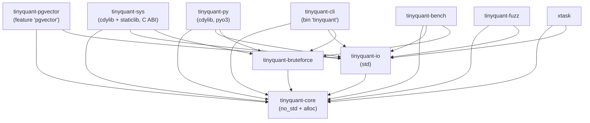

# Rust Port — Crate Topology and Module Structure

> [!info] Purpose
> Map the Rust source tree in detail, pinning every file to a single
> responsibility and preserving the three-layer architecture
> (codec → corpus → backend protocol) as a compile-time constraint.

## Repository layout at the end of the Rust port

```text
TinyQuant/
├── src/                          # Unchanged — Python reference impl
│   └── tinyquant_cpu/
├── rust/                         # New Cargo workspace (added by this port)
│   ├── Cargo.toml                # [workspace] root
│   ├── rust-toolchain.toml       # Pinned stable toolchain + MSRV
│   ├── .cargo/
│   │   └── config.toml           # target-cpu=native opt-in, lints
│   ├── crates/
│   │   ├── tinyquant-core/       # no_std codec + corpus + backend trait
│   │   ├── tinyquant-io/         # std-only serialization, mmap, file IO
│   │   ├── tinyquant-bruteforce/ # BruteForceBackend reference impl
│   │   ├── tinyquant-pgvector/   # pgvector adapter (optional dep)
│   │   ├── tinyquant-sys/        # C ABI façade (cdylib + staticlib + header)
│   │   ├── tinyquant-py/         # pyo3 bindings (importable as tinyquant_rs)
│   │   ├── tinyquant-cli/        # Standalone `tinyquant` binary (multi-arch)
│   │   ├── tinyquant-bench/      # criterion benchmarks (not published)
│   │   └── tinyquant-fuzz/       # libfuzzer-sys targets (not published)
│   └── xtask/                    # Release, parity-check, bench-run tooling
├── docs/
│   ├── design/
│   │   └── rust/                 # This design set
│   └── plans/
│       └── rust/                 # Per-phase implementation plans
└── tests/                        # Existing Python test suite (unchanged)
```

## Crate graph and dependency direction



**Invariants enforced by CI**

1. `tinyquant-core` has **no dependency** on `tinyquant-io`,
   `tinyquant-bruteforce`, or anything below it. Verified by
   `cargo tree -p tinyquant-core --no-default-features`.
2. `tinyquant-io` depends only on `tinyquant-core` plus `std`
   primitives and pure-Rust helpers (`memmap2`, `byteorder` or
   `std::mem` offsets). No BLAS, no Python.
3. `tinyquant-py` and `tinyquant-sys` are the *only* crates allowed to
   produce `cdylib` targets. `tinyquant-cli` is the *only* crate
   allowed to produce a `bin` target (the standalone `tinyquant`
   executable). Verified by `cargo metadata | jq` in CI.
4. `tinyquant-bench`, `tinyquant-fuzz`, and `xtask` are marked
   `publish = false` — crates.io sees seven published crates:
   `tinyquant-core`, `tinyquant-io`, `tinyquant-bruteforce`,
   `tinyquant-pgvector`, `tinyquant-sys`, `tinyquant-py`, and
   `tinyquant-cli`.

## Per-crate responsibility

### `tinyquant-core` (the leaf)

Produces `rlib`. `#![no_std]` with `extern crate alloc;`. No I/O, no
floating-point file parsing, no threads, no allocations outside
`alloc::vec::Vec` and `alloc::sync::Arc`.

```text
tinyquant-core/
├── Cargo.toml
├── src/
│   ├── lib.rs               # Public facade; re-exports everything needed
│   ├── prelude.rs           # `use tinyquant_core::prelude::*;`
│   ├── types.rs             # Type aliases: VectorId, ConfigHash, etc.
│   ├── errors.rs            # All error enums: CodecError, CorpusError, …
│   ├── codec/
│   │   ├── mod.rs
│   │   ├── codec_config.rs  # CodecConfig value object
│   │   ├── codebook.rs      # Codebook value object + train()
│   │   ├── rotation_matrix.rs # RotationMatrix value object
│   │   ├── compressed_vector.rs # CompressedVector in-memory form
│   │   ├── codec.rs         # Codec service (stateless)
│   │   ├── quantize.rs      # scalar_quantize / scalar_dequantize
│   │   ├── residual.rs      # compute_residual / apply_residual (fp16)
│   │   └── rotation_cache.rs # LRU cache shared across calls
│   ├── corpus/
│   │   ├── mod.rs
│   │   ├── compression_policy.rs
│   │   ├── vector_entry.rs
│   │   ├── events.rs
│   │   └── corpus.rs        # Aggregate root
│   └── backend/
│       ├── mod.rs
│       ├── protocol.rs      # SearchBackend trait + SearchResult
│       └── errors.rs
├── tests/
│   ├── codec_config.rs
│   ├── codebook.rs
│   ├── rotation_matrix.rs
│   ├── compressed_vector.rs
│   ├── codec.rs
│   ├── corpus.rs
│   └── backend_protocol.rs
└── benches/                 # Empty — benches live in tinyquant-bench
```

**One public type per file** — this is the hard Python rule translated
literally. `codec_config.rs` exposes `CodecConfig` and nothing else
publicly. Constants like `SUPPORTED_BIT_WIDTHS` are re-exported from
`codec/mod.rs` but **defined** in `codec_config.rs`.

**Cyclomatic complexity** — `clippy::cognitive_complexity` lint
threshold is 7, matching the Python ruff C901 setting. Functions that
exceed it must be split.

**File length soft limit** — 250 lines. Files over 250 lines are
flagged by a custom xtask check and require either a split or an
explicit waiver in the SRP audit.

### `tinyquant-io` (serialization + mmap)

Produces `rlib`. Requires `std`. All I/O, file formats, and
endian-aware byte manipulation live here. Splits the Python
`compressed_vector.py` serialization helpers out of the domain layer.

```text
tinyquant-io/
├── Cargo.toml
├── src/
│   ├── lib.rs
│   ├── errors.rs            # IoError, IoErrorKind
│   ├── compressed_vector/
│   │   ├── mod.rs
│   │   ├── header.rs        # Parse/emit the 71-byte header
│   │   ├── pack.rs          # Bit-pack indices (2/4/8-bit, LSB-first)
│   │   ├── unpack.rs        # Reverse of pack
│   │   ├── residual.rs      # Residual flag + len + payload
│   │   ├── to_bytes.rs      # CompressedVector → Vec<u8>
│   │   └── from_bytes.rs    # &[u8] → CompressedVector (owned)
│   ├── zero_copy/
│   │   ├── mod.rs
│   │   ├── view.rs          # CompressedVectorView<'a> — zero-alloc
│   │   └── cursor.rs        # Iterator over a packed byte stream
│   ├── mmap/
│   │   ├── mod.rs
│   │   └── corpus_file.rs   # Memory-mapped corpus reader
│   └── codec_file/
│       ├── mod.rs
│       ├── writer.rs        # Append-only codec file writer
│       └── reader.rs        # Streaming reader with checksum
└── tests/
    ├── compressed_vector_roundtrip.rs
    ├── compressed_vector_parity.rs  # Parity vs Python fixtures
    ├── zero_copy_view.rs
    ├── mmap_corpus.rs
    └── codec_file_writer_reader.rs
```

### `tinyquant-bruteforce`

Small, reference implementation of the `SearchBackend` trait. This
mirrors Python's `brute_force.py`. Kept as a separate crate so that
`tinyquant-core` can stay free of any compute kernels that need SIMD.

```text
tinyquant-bruteforce/
├── Cargo.toml
├── src/
│   ├── lib.rs
│   ├── backend.rs           # BruteForceBackend
│   ├── similarity.rs        # Cosine similarity kernels (portable + SIMD)
│   └── store.rs             # Owned FP32 store
└── tests/
    ├── backend.rs
    └── similarity.rs
```

### `tinyquant-pgvector`

Anti-corruption layer. Feature-gated on `pgvector`. Uses
`tokio-postgres` or sync `postgres`; we pick the sync variant to
mirror Python's `psycopg` usage and keep the core async-free.

```text
tinyquant-pgvector/
├── Cargo.toml
├── src/
│   ├── lib.rs
│   ├── adapter.rs           # PgvectorAdapter
│   ├── sql.rs               # Parameterized statements, prepared
│   └── wire.rs              # FP32 ↔ pgvector text/binary format
└── tests/
    └── adapter.rs           # Uses testcontainers under `pgvector-test`
```

### `tinyquant-sys`

C ABI façade. Produces `cdylib` and `staticlib`. Generates a C header
via `cbindgen` into `target/include/tinyquant.h`. Lives behind a stable
ABI — the `#[repr(C)]` structs here are the ABI contract and cannot
change without a major-version bump.

```text
tinyquant-sys/
├── Cargo.toml
├── build.rs                 # Runs cbindgen on release builds
├── cbindgen.toml            # Header gen config
├── src/
│   ├── lib.rs               # extern "C" surface
│   ├── handle.rs            # Opaque handles (CodecConfigHandle, …)
│   ├── error.rs             # TinyQuantError enum with stable codes
│   ├── codec_abi.rs         # tq_codec_* functions
│   ├── corpus_abi.rs        # tq_corpus_* functions
│   └── abi_types.rs         # #[repr(C)] CompressedVectorAbi, …
├── include/
│   └── tinyquant.h          # Generated; committed for consumers
└── tests/
    └── abi_smoke.rs         # Exercises the C ABI from Rust itself
```

### `tinyquant-py`

pyo3 + maturin binding. Produces a Python wheel named `tinyquant_rs`.
Exposes a class layout deliberately mirroring
`tinyquant_cpu.codec.*` so downstream code can migrate with a single
import swap.

```text
tinyquant-py/
├── Cargo.toml
├── pyproject.toml           # maturin build config
├── python/
│   └── tinyquant_rs/
│       ├── __init__.py      # Re-exports + version guard
│       └── py.typed
├── src/
│   ├── lib.rs               # #[pymodule] fn tinyquant_rs(...)
│   ├── codec.rs             # #[pyclass] CodecConfig, Codec, Codebook, …
│   ├── corpus.rs            # #[pyclass] Corpus, VectorEntry, …
│   ├── backend.rs           # #[pyclass] BruteForceBackend, SearchResult
│   ├── numpy_bridge.rs      # ndarray ↔ numpy zero-copy where possible
│   └── errors.rs            # Map Rust errors → Python ValueError family
└── tests/
    └── python/
        ├── test_parity.py    # rust vs tinyquant_cpu behavioral parity
        ├── test_interface.py # class shape, methods, dunder behavior
        └── test_numpy.py     # numpy interop
```

### `tinyquant-cli` (published, ships standalone binary)

Produces a single executable named `tinyquant` (or `tinyquant.exe`
on Windows) via `[[bin]]`. Depends on `tinyquant-core`,
`tinyquant-io`, and `tinyquant-bruteforce`, all with default
features enabled so the binary is the full-featured experience
out of the box.

```text
tinyquant-cli/
├── Cargo.toml               # [[bin]] name = "tinyquant"
├── README.md                # user-facing CLI docs
├── build.rs                 # captures git commit + rustc + target env
├── src/
│   ├── main.rs              # clap-derived Cli struct + dispatch
│   ├── io.rs                # CSV / .npy / raw f32 input parsers
│   └── commands/
│       ├── mod.rs
│       ├── info.rs          # `tinyquant info` (ISA, features, version)
│       ├── verify.rs        # `tinyquant verify <file>`
│       ├── codec/
│       │   ├── mod.rs
│       │   ├── train.rs     # `tinyquant codec train`
│       │   ├── compress.rs  # `tinyquant codec compress`
│       │   └── decompress.rs# `tinyquant codec decompress`
│       └── corpus/
│           ├── mod.rs
│           ├── ingest.rs
│           ├── decompress.rs
│           └── search.rs    # brute-force search against a corpus file
└── tests/
    ├── cli_smoke.rs          # assert_cmd end-to-end
    ├── codec_roundtrip.rs    # train → compress → decompress via CLI
    └── fixtures/             # small deterministic inputs
```

The CLI is the first-party operator experience: shell scripts,
CI jobs, and container images consume it directly. Because it
ships as a standalone binary, it has no Python or C runtime
dependency — only the libc the target triple provides, or the
musl-static variant for fully static Linux binaries.

See [[plans/rust/phase-22-pyo3-cabi-release|Phase 22]] for the
cross-compile matrix (Linux x86_64/aarch64 glibc and musl, macOS
x86_64/aarch64, Windows x86_64/i686, FreeBSD x86_64) and the
`rust-release.yml` workflow that publishes archives to GitHub
Releases plus a multi-arch container image to GHCR.

### `tinyquant-bench` (not published)

```text
tinyquant-bench/
├── Cargo.toml
├── benches/
│   ├── codec_compress_single.rs
│   ├── codec_compress_batch.rs
│   ├── codec_decompress_single.rs
│   ├── codec_decompress_batch.rs
│   ├── serialization_roundtrip.rs
│   ├── rotation_matrix_build.rs
│   ├── rotation_matrix_cached.rs
│   ├── codebook_train.rs
│   └── brute_force_search.rs
└── src/
    ├── lib.rs               # Shared fixtures
    ├── fixtures.rs          # Deterministic gold corpus generators
    └── regression.rs        # Reads a JSON baseline; diffs results
```

### `tinyquant-fuzz` (not published)

```text
tinyquant-fuzz/
├── Cargo.toml               # libfuzzer-sys or afl
├── fuzz_targets/
│   ├── compressed_vector_from_bytes.rs
│   ├── header_parser.rs
│   └── bit_unpack.rs
└── corpus/                  # Seed corpus from Python fixtures
```

### `xtask` (not published)

```text
xtask/
├── Cargo.toml
└── src/
    ├── main.rs
    ├── cmd/
    │   ├── parity.rs        # Run parity tests Rust↔Python
    │   ├── bench.rs         # Run benches + compare to baseline
    │   ├── fmt.rs           # cargo fmt --all + markdownlint docs outside docs/
    │   ├── lint.rs          # cargo clippy + cargo deny
    │   ├── release.rs       # Version bump + tag
    │   └── fixtures.rs      # Rebuild parity fixtures from Python
    └── util.rs
```

## Cargo workspace `Cargo.toml` (authoritative shape)

```toml
[workspace]
resolver = "2"
members = [
    "crates/tinyquant-core",
    "crates/tinyquant-io",
    "crates/tinyquant-bruteforce",
    "crates/tinyquant-pgvector",
    "crates/tinyquant-sys",
    "crates/tinyquant-py",
    "crates/tinyquant-cli",
    "crates/tinyquant-bench",
    "crates/tinyquant-fuzz",
    "xtask",
]

[workspace.package]
version = "0.1.0"
edition = "2021"
rust-version = "1.78"        # MSRV; see release-strategy.md
license = "Apache-2.0"
repository = "https://github.com/better-with-models/TinyQuant"
homepage = "https://github.com/better-with-models/TinyQuant"
readme = "README.md"

[workspace.dependencies]
# Public deps pinned at workspace level for consistency
thiserror = "1"
num-traits = { version = "0.2", default-features = false }
half = { version = "2", default-features = false }
bytemuck = { version = "1", features = ["derive"] }
faer = { version = "0.19", default-features = false }
rand = { version = "0.8", default-features = false }
rand_chacha = { version = "0.3", default-features = false }
sha2 = { version = "0.10", default-features = false }
hex = { version = "0.4", default-features = false, features = ["alloc"] }

# std-only
memmap2 = "0.9"
rayon = "1"

# Bindings
pyo3 = { version = "0.22", features = ["extension-module", "abi3-py312"] }
numpy = "0.22"
cbindgen = "0.27"
libfuzzer-sys = "0.4"

# Benchmarks
criterion = { version = "0.5", default-features = false, features = ["rayon"] }

[profile.release]
lto = "fat"
codegen-units = 1
panic = "abort"
strip = "symbols"
debug = 0
incremental = false
overflow-checks = false

[profile.release-with-debug]
inherits = "release"
debug = 2
strip = "none"

[profile.bench]
inherits = "release-with-debug"
```

## Lints and warnings (binding)

`rust/crates/tinyquant-core/src/lib.rs` starts with:

```rust
#![no_std]
#![deny(
    warnings,
    missing_docs,
    unsafe_op_in_unsafe_fn,
    clippy::all,
    clippy::pedantic,
    clippy::nursery,
    clippy::unwrap_used,
    clippy::expect_used,
    clippy::panic,
    clippy::indexing_slicing,
    clippy::cognitive_complexity,
)]
#![allow(
    clippy::module_name_repetitions,      // one-class-per-file rule clashes
    clippy::must_use_candidate,
)]

extern crate alloc;
```

Each crate's `lib.rs` repeats the `deny` block. `unsafe` code is
allowed but every `unsafe` block must be preceded by a `// SAFETY:`
comment; `xtask lint` greps for unsafe blocks without safety comments
and fails the build.

## Mapping back to the Python layer rule

| Python layer | Rust location |
|---|---|
| `tinyquant_cpu.codec` | `tinyquant-core::codec` |
| `tinyquant_cpu.corpus` | `tinyquant-core::corpus` |
| `tinyquant_cpu.backend` (protocol + brute force) | `tinyquant-core::backend` + `tinyquant-bruteforce` |
| `tinyquant_cpu.backend.adapters.pgvector` | `tinyquant-pgvector` |
| `CompressedVector.to_bytes` / `from_bytes` | `tinyquant-io::compressed_vector` |
| Python package entry `tinyquant_cpu` | `tinyquant-py` (exposes as `tinyquant_rs`) |
| (no Python counterpart — new in the Rust port) | `tinyquant-cli` standalone `tinyquant` binary |

The Python one-class-per-file rule is preserved literally in the Rust
file tree: every file name that appears as a Python module has a Rust
counterpart at the same depth, modulo the split of IO into a dedicated
crate.

## See also

- [[design/rust/README|Rust Port Overview]]
- [[design/rust/type-mapping|Type Mapping from Python]]
- [[design/architecture/namespace-and-module-structure|Namespace and Module Structure]]
- [[design/architecture/file-and-complexity-policy|File and Complexity Policy]]
- [[design/architecture/low-coupling|Low Coupling]]
