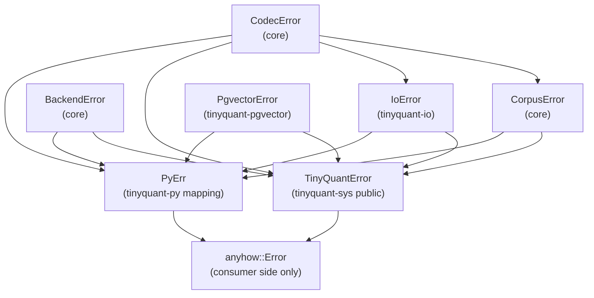

# Rust Port — Error Model

> [!info] Purpose
> Define how errors, panics, and exceptional conditions flow through
> the Rust port. Python raises a small family of `ValueError`
> subclasses; the Rust port must surface the same classes of failure
> through `Result` without losing information at the FFI boundary.

## Taxonomy



Each crate owns a single error type (plus `From` conversions for
composition). No crate uses `anyhow::Error` in its public API. No
crate uses `Box<dyn std::error::Error>` in its public API. Consumers
are free to wrap results in `anyhow` themselves.

## Core error enums (binding contract)

See [[design/rust/type-mapping|Type Mapping]] for the full `CodecError`,
`CorpusError`, and `BackendError` enums. The short version:

### `CodecError`

| Variant | Python counterpart |
|---|---|
| `UnsupportedBitWidth { got }` | `ValueError` |
| `InvalidDimension { got }` | `ValueError` |
| `DimensionMismatch { expected, got }` | `DimensionMismatchError` |
| `CodebookIncompatible { expected, got }` | `CodebookIncompatibleError` |
| `ConfigMismatch { expected, got }` | `ConfigMismatchError` |
| `CodebookEntryCount { expected, got, bit_width }` | `ValueError` |
| `CodebookNotSorted` | `ValueError` (Codebook construction) |
| `CodebookDuplicate { expected, got }` | `ValueError` (in `Codebook.train`) |
| `InsufficientTrainingData { expected }` | `ValueError` (in `Codebook.train`) |
| `IndexOutOfRange { index, bound }` | `ValueError` (in `dequantize`) |
| `LengthMismatch { left, right }` | `ValueError` (internal invariant) |

### `CorpusError`

| Variant | Python counterpart |
|---|---|
| `Codec(CodecError)` | Propagated from codec layer |
| `DuplicateVectorId { id }` | `DuplicateVectorError` |
| `UnknownVectorId { id }` | `KeyError` (Python `dict` semantics) |
| `PolicyImmutable` | `ValueError` (attempt to mutate policy) |

### `BackendError`

| Variant | Python counterpart |
|---|---|
| `Empty` | empty list return, never raised |
| `InvalidTopK` | `ValueError` |
| `Adapter(String)` | Backend-specific exception |

### `IoError` (in `tinyquant-io`)

| Variant | Python counterpart |
|---|---|
| `Truncated` | `ValueError("data too short")` |
| `UnknownVersion { got }` | `ValueError("unknown format version 0xYY")` |
| `InvalidBitWidth { got }` | `ValueError("invalid bit_width N in serialized data")` |
| `InvalidUtf8(Utf8Error)` | Propagates invalid config_hash decoding (not a Python case, but defensive) |
| `Io(std::io::Error)` | `OSError` / `IOError` family |
| `Decode(CodecError)` | whichever codec error the payload triggers |

## Result vs panic discipline

### Panics

The Rust port **panics** only for:

1. Invariants violated by the library itself (an index we just
   validated turned out to be out of range — this is a bug).
2. Unrecoverable allocation failures (OOM under the system allocator).
3. Array accesses inside `debug_assert!` in debug mode.

It does **not** panic for:

- Malformed user input → return `Err`.
- Mismatched dimensions → return `Err`.
- Codebook / config invariants violated at construction → return
  `Err`.

A clippy lint enforces this:

```rust
#![deny(clippy::unwrap_used, clippy::expect_used, clippy::panic)]
```

Every exception must be wrapped in an `Ok`/`Err` by the caller. The
only allowed `expect(...)` usage is in `unsafe` internal helpers
where the message points at a preceding safety check in the same
function.

### Hot path: no allocations, no string formatting

Error enums carry structured fields (`u8`, `u32`, `Arc<str>`), not
pre-formatted `String`s. `thiserror`'s `#[error("...")]` runs only
when `Display` is called, so returning an `Err` on the hot path
allocates at most one `Arc<str>` (for `ConfigMismatch`), not a
formatted message.

The scalar fields are `u8`/`u32`/`u64` integers, which are `Copy` and
never allocate. The `Arc<str>` fields are cheap clones.

## FFI boundary: `tinyquant-sys`

The C ABI cannot carry a Rust enum. The public type is:

```rust
// tinyquant-sys/src/error.rs
#[repr(C)]
#[derive(Clone, Copy, Debug, Eq, PartialEq)]
pub enum TinyQuantErrorKind {
    Ok                        = 0,
    UnsupportedBitWidth       = 1,
    InvalidDimension          = 2,
    DimensionMismatch         = 3,
    CodebookIncompatible      = 4,
    ConfigMismatch            = 5,
    CodebookEntryCount        = 6,
    CodebookNotSorted         = 7,
    CodebookDuplicate         = 8,
    InsufficientTrainingData  = 9,
    IndexOutOfRange           = 10,
    LengthMismatch            = 11,
    DuplicateVectorId         = 12,
    UnknownVectorId           = 13,
    PolicyImmutable           = 14,
    InvalidTopK               = 15,
    BackendAdapter            = 16,
    IoTruncated               = 17,
    IoUnknownVersion          = 18,
    IoInvalidBitWidth         = 19,
    IoInvalidUtf8             = 20,
    IoSystem                  = 21,
    Panic                     = 254,
    Unknown                   = 255,
}

#[repr(C)]
pub struct TinyQuantError {
    pub kind: TinyQuantErrorKind,
    /// Null-terminated, owned by Rust. Consumers must call
    /// `tq_error_free` to release it.
    pub message: *mut core::ffi::c_char,
}
```

Every C ABI function returns `TinyQuantErrorKind` and takes
`*mut TinyQuantError` for detail. Example:

```c
TinyQuantErrorKind tq_codec_compress(
    const CodecConfigHandle* config,
    const CodebookHandle* codebook,
    const float* vector,
    uintptr_t vector_len,
    CompressedVectorHandle** out,
    TinyQuantError* err_out);
```

On success `err_out` is zeroed. On failure `err_out->kind` is set and
`err_out->message` points to a heap-allocated UTF-8 NUL-terminated
string that the caller must free.

**Panic catching**: every `extern "C"` function wraps its body in
`std::panic::catch_unwind`. A panic crossing the boundary becomes
`TinyQuantErrorKind::Panic` with a message capturing the payload. This
prevents undefined behavior on a Rust→C unwind.

## Python boundary: `tinyquant-py`

Errors map into the *existing* `tinyquant_cpu` exception classes so
that downstream code can catch the same types:

```rust
// tinyquant-py/src/errors.rs
use pyo3::exceptions::*;
use pyo3::prelude::*;

create_exception!(tinyquant_rs, DimensionMismatchError, PyValueError);
create_exception!(tinyquant_rs, ConfigMismatchError, PyValueError);
create_exception!(tinyquant_rs, CodebookIncompatibleError, PyValueError);
create_exception!(tinyquant_rs, DuplicateVectorError, PyValueError);

pub fn map_codec_error(e: CodecError) -> PyErr {
    match e {
        CodecError::DimensionMismatch { expected, got } => {
            DimensionMismatchError::new_err(format!(
                "vector length {got} does not match config dimension {expected}"
            ))
        }
        CodecError::ConfigMismatch { expected, got } => {
            ConfigMismatchError::new_err(format!(
                "compressed config_hash {got:?} does not match config hash {expected:?}"
            ))
        }
        CodecError::CodebookIncompatible { expected, got } => {
            CodebookIncompatibleError::new_err(format!(
                "codebook bit_width {got} does not match config bit_width {expected}"
            ))
        }
        _ => PyValueError::new_err(e.to_string()),
    }
}
```

The exception class names match Python exactly. A parity test in
`tinyquant-py/tests/python/test_parity.py` does:

```python
import tinyquant_cpu as py
import tinyquant_rs as rs

# 1. Same error type name
for (py_ex, rs_ex) in [
    (py.codec.DimensionMismatchError, rs.codec.DimensionMismatchError),
    (py.codec.ConfigMismatchError,    rs.codec.ConfigMismatchError),
    (py.codec.CodebookIncompatibleError, rs.codec.CodebookIncompatibleError),
    (py.corpus.DuplicateVectorError,  rs.corpus.DuplicateVectorError),
]:
    assert py_ex.__name__ == rs_ex.__name__
    assert issubclass(rs_ex, ValueError)

# 2. Matching trigger
py_cfg = py.codec.CodecConfig(bit_width=4, seed=42, dimension=768)
rs_cfg = rs.codec.CodecConfig(bit_width=4, seed=42, dimension=768)
with pytest.raises(py.codec.DimensionMismatchError):
    py.codec.compress(np.zeros(100, dtype=np.float32), py_cfg, train_cb_py)
with pytest.raises(rs.codec.DimensionMismatchError):
    rs.codec.compress(np.zeros(100, dtype=np.float32), rs_cfg, train_cb_rs)
```

Every exception class the Python reference exposes gets a matching
parity test that exercises a triggering input.

## `no_std` and `alloc` compatibility

`thiserror` supports `no_std` via the
`thiserror = { version = "1", default-features = false }` route in
recent versions. If the MSRV forces us to stay on `core`-only,
we'll hand-roll `impl fmt::Display` and `impl core::error::Error`
(stable in Rust 1.81+). The design assumes `core::error::Error` is
available (MSRV 1.81).

## Error source chains

Rust's `core::error::Error::source` is implemented to preserve
upstream causes:

```rust
impl core::error::Error for CorpusError {
    fn source(&self) -> Option<&(dyn core::error::Error + 'static)> {
        match self {
            Self::Codec(e) => Some(e),
            _ => None,
        }
    }
}
```

The Python binding walks the chain when building the exception
message so that upstream causes surface in tracebacks.

## Fallible drop discipline

No type in the Rust port has a fallible `Drop` impl. Resources that
can fail to release (e.g., file handles, DB connections) are held by
the caller, not owned by codec types. `Corpus::drop` is infallible
and simply releases the `Arc`s.

## See also

- [[design/rust/type-mapping|Type Mapping from Python]]
- [[design/rust/ffi-and-bindings|FFI and Bindings]]
- [[design/rust/testing-strategy|Testing Strategy]]
