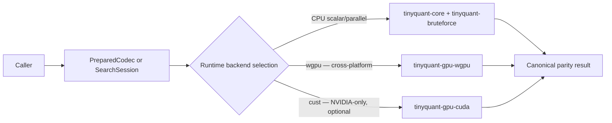
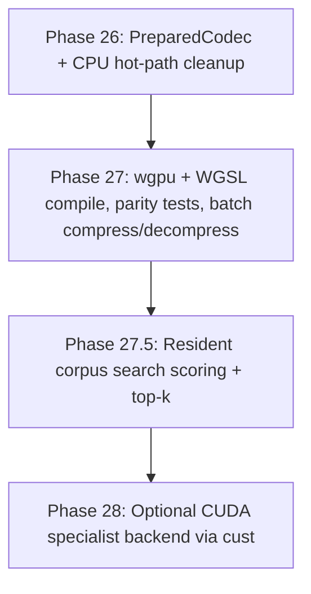

# Rust Port — GPU Acceleration Design

> [!info] Purpose
> Define the architecture for optional GPU acceleration of TinyQuant's
> batch compression, decompression, and search scoring paths. This document
> is the single authoritative source for GPU-related design decisions; every
> subsequent phase plan that touches GPU should reference it rather than
> re-deriving the rationale.

> [!important] Phase sequencing
> GPU acceleration is a **Phase 26+** initiative. Phases 11–25 deliver the
> CPU-baseline Rust port; GPU work begins only after that baseline is green
> and benchmarked. The prerequisite inside Phase 26 is the `PreparedCodec`
> abstraction, which benefits both the CPU hot path and makes GPU integration
> tractable — it must land before any GPU backend is wired.

## Core invariants (non-negotiable)

1. **`tinyquant-core` stays `no_std` and CPU-only.** No GPU imports,
   no driver handles, no async machinery, no `wgpu`/CUDA types in the
   core crate. This is the same contract as today — GPU code is additive,
   not an invasive edit.
2. **CPU parity is the semantic truth source.** `Codec::compress` is the
   oracle; GPU backends must produce output identical to it (within the
   1-ULP f64 tolerance already documented for the rotation step) or fail
   their parity gate.
3. **GPU is threshold-gated.** A single-vector call never touches the GPU.
   GPU offload activates only above a configurable batch-size threshold and
   only when adapter detection succeeds.
4. **Compile-time optional.** A build without the GPU crate must produce
   identical correctness and release behaviour to today. Nothing in the
   existing crates changes at the API level.

## Design motivation

The current codec path reconstructs `RotationMatrix` inside every `compress`
and `decompress_into` call via `RotationMatrix::from_config`. For large `dim`
this means a `faer` QR decomposition on every call, even though the rotation
for a given `(seed, dim)` pair is mathematically fixed. This is the
highest-leverage CPU issue before GPU work begins, because:

- Any GPU win risks being erased by repeated setup if the rotation is
  recomputed on each batch.
- The `PreparedCodec` object that caches the rotation also naturally owns
  GPU-resident copies of the codebook and rotation matrix, making it the
  right insertion point for a GPU backend.

The fix (Phase 26 prerequisite) is a `PreparedCodec` value that owns
precomputed, reusable state. See §PreparedCodec design below.

## PreparedCodec design

```rust
// tinyquant-core/src/codec/prepared.rs (Phase 26)

/// An owned, precomputed codec session.
///
/// Validates config, builds the rotation matrix once, and holds
/// both the CPU `RotationMatrix` and (when the `gpu` feature is active
/// and a device is available) opaque device-resident copies that GPU
/// backends can promote to on first use.
pub struct PreparedCodec {
    pub config: CodecConfig,
    pub codebook: Codebook,
    /// Pre-built rotation matrix (CPU copy always present).
    pub rotation: RotationMatrix,
    /// Opaque GPU state; `None` unless a GPU backend has been attached.
    /// Erased type so tinyquant-core stays free of GPU imports.
    gpu_state: Option<Box<dyn core::any::Any + Send + Sync>>,
}

impl PreparedCodec {
    /// Build from config and pre-trained codebook. Rotation is built once
    /// and cached for the lifetime of this object.
    pub fn new(config: CodecConfig, codebook: Codebook) -> Result<Self, CodecError> {
        let rotation = RotationMatrix::build(config.seed(), config.dim())?;
        Ok(Self { config, codebook, rotation, gpu_state: None })
    }

    /// Borrow the CPU rotation for use in `Codec::compress`.
    pub fn rotation(&self) -> &RotationMatrix { &self.rotation }
}
```

`Codec::compress_prepared` and `Codec::decompress_prepared_into` are new
entry points that take `&PreparedCodec` instead of deriving the rotation
from scratch. The existing `compress` / `decompress_into` entry points
remain unchanged for backward compatibility — they build a temporary
`PreparedCodec` internally.

## Architecture: new crates above `tinyquant-core`



### `tinyquant-gpu-wgpu` (Phase 27)

New std-only crate. Depends on `tinyquant-core` and `wgpu`. Does **not**
modify `tinyquant-core`.

**MSRV**: 1.87 (current `wgpu` requirement). Documented separately from
the workspace MSRV of 1.81. See §MSRV isolation.

```text
tinyquant-gpu-wgpu/
├── Cargo.toml          # MSRV = "1.87", publish = false initially
├── src/
│   ├── lib.rs          # Re-exports WgpuBackend, WgpuContext
│   ├── context.rs      # WgpuContext: Instance → Adapter → Device + Queue
│   ├── backend.rs      # impl ComputeBackend for WgpuBackend
│   ├── prepared.rs     # GPU promotion of PreparedCodec state
│   ├── pipelines/
│   │   ├── mod.rs
│   │   ├── rotate.rs   # Build + cache the rotate/inverse-rotate pipeline
│   │   ├── quantize.rs # Build + cache the quantize/dequantize pipeline
│   │   └── search.rs   # Build + cache the cosine_topk pipeline
│   └── shaders/
│       ├── rotate.wgsl
│       ├── quantize.wgsl
│       ├── dequantize.wgsl
│       └── cosine_topk.wgsl
└── tests/
    ├── parity_compress.rs   # CPU vs wgpu output parity
    ├── parity_search.rs
    └── context_probe.rs     # Adapter detection, graceful absent-GPU path
```

### `tinyquant-gpu-cuda` (Phase 28, optional)

NVIDIA-specialist fast path via `cust`. Strictly optional — operationally
separate from the cross-platform wgpu path. Linux/Windows only.

```text
tinyquant-gpu-cuda/
├── Cargo.toml          # MSRV per cust requirements; publish = false initially
├── src/
│   ├── lib.rs
│   ├── context.rs      # cust::quick_init, context and module management
│   ├── backend.rs      # impl ComputeBackend for CudaBackend
│   └── kernels/        # PTX or fatbins for quantize, rotate, cosine
└── tests/
    └── parity.rs
```

## `ComputeBackend` trait

Defined in `tinyquant-gpu-wgpu/src/lib.rs` (or a shared
`tinyquant-gpu-common` if/when both GPU crates exist):

```rust
use tinyquant_core::{codec::{CompressedVector, CodecError}, backend::SearchResult};

pub trait ComputeBackend {
    /// Human-readable backend name for logging and diagnostics.
    fn name(&self) -> &'static str;

    /// Compress `rows` FP32 vectors of dimension `cols` on the GPU.
    /// `prepared` must have been promoted to device-resident state by
    /// calling `prepare_for_device` on this backend first.
    fn compress_batch(
        &mut self,
        input: &[f32],
        rows: usize,
        cols: usize,
        prepared: &PreparedCodec,
    ) -> Result<Vec<CompressedVector>, TinyQuantGpuError>;

    fn decompress_batch_into(
        &mut self,
        compressed: &[CompressedVector],
        prepared: &PreparedCodec,
        out: &mut [f32],
    ) -> Result<(), TinyQuantGpuError>;

    /// Score `query` against `rows` corpus vectors of dimension `cols`
    /// and return the top-k by cosine similarity.
    fn cosine_topk(
        &mut self,
        query: &[f32],
        corpus: &[f32],
        rows: usize,
        cols: usize,
        top_k: usize,
    ) -> Result<Vec<SearchResult>, TinyQuantGpuError>;

    /// Upload `PreparedCodec` buffers to device memory. Idempotent.
    fn prepare_for_device(&mut self, prepared: &mut PreparedCodec) -> Result<(), TinyQuantGpuError>;

    /// True if the backend has a usable compute adapter available.
    fn is_available(&self) -> bool;
}
```

The CPU path (`Codec` + `BruteForceBackend`) remains the canonical
implementation and is used as the test oracle for every GPU parity gate.

## WGSL kernel plan

Three first kernels cover the entire codec + search surface:

### Kernel 1 — batched rotate / inverse-rotate

Matrix–vector product `rotated[n, d] = input[n, d] @ R.T[d, d]`.
At GPU batch scale this is a GEMM operation; the rotation matrix is
uploaded once and stays device-resident across many calls.

```wgsl
// shaders/rotate.wgsl
struct Dims { rows: u32, cols: u32 }

@group(0) @binding(0) var<uniform> dims: Dims;
@group(0) @binding(1) var<storage, read>       rotation: array<f32>;  // cols×cols
@group(0) @binding(2) var<storage, read>       input: array<f32>;     // rows×cols
@group(0) @binding(3) var<storage, read_write> output: array<f32>;    // rows×cols

@compute @workgroup_size(16, 16)
fn main(@builtin(global_invocation_id) gid: vec3<u32>) {
    let row = gid.y;
    let col = gid.x;
    if (row >= dims.rows || col >= dims.cols) { return; }
    var acc: f32 = 0.0;
    for (var k: u32 = 0u; k < dims.cols; k++) {
        acc += input[row * dims.cols + k] * rotation[k * dims.cols + col];
    }
    output[row * dims.cols + col] = acc;
}
```

> [!note] WGSL uses f32; rotation matrix is stored f64 in the CPU path.
> The GPU path casts to f32 on upload. The parity gate asserts that
> GPU-rotated vectors agree with CPU-rotated vectors to within the same
> 1-ULP tolerance already documented for the batch rotation path.

### Kernel 2 — batched quantize / dequantize / residual

Dequantize is an index-to-entry lookup — embarrassingly parallel:

```wgsl
// shaders/dequantize.wgsl
@group(0) @binding(0) var<storage, read>       entries: array<f32>;  // codebook
@group(0) @binding(1) var<storage, read>       indices: array<u32>;  // packed
@group(0) @binding(2) var<storage, read_write> out: array<f32>;

@compute @workgroup_size(256)
fn main(@builtin(global_invocation_id) gid: vec3<u32>) {
    let i = gid.x;
    if (i < arrayLength(&indices)) {
        out[i] = entries[indices[i]];
    }
}
```

Quantize (nearest-entry search) requires a linear scan over the codebook
per element — for 4-bit (16 entries) this is 16 comparisons per thread,
which is cheap on GPU with no branch divergence.

### Kernel 3 — search score + block-local top-k

Cosine similarity of a query against every corpus row, followed by
a block-local partial sort to extract top-k candidates. The corpus stays
device-resident across queries; only the query vector is uploaded per call.
A two-phase approach (block top-k + host merge) avoids a full device-wide
sort.

## `WgpuContext` setup

```rust
// tinyquant-gpu-wgpu/src/context.rs
use wgpu::util::DeviceExt;

pub struct WgpuContext {
    pub device: wgpu::Device,
    pub queue: wgpu::Queue,
    pub adapter_info: wgpu::AdapterInfo,
}

impl WgpuContext {
    pub async fn new() -> Result<Self, TinyQuantGpuError> {
        let instance = wgpu::Instance::new(&wgpu::InstanceDescriptor {
            backends: wgpu::Backends::all(),
            ..Default::default()
        });

        let adapter = instance
            .request_adapter(&wgpu::RequestAdapterOptions::default())
            .await
            .ok_or(TinyQuantGpuError::NoAdapter)?;

        let adapter_info = adapter.get_info();
        let (device, queue) = adapter
            .request_device(&wgpu::DeviceDescriptor::default())
            .await
            .map_err(TinyQuantGpuError::DeviceRequest)?;

        Ok(Self { device, queue, adapter_info })
    }

    pub fn build_compute_pipeline(
        &self,
        label: &str,
        wgsl: &str,
        entry_point: &str,
    ) -> wgpu::ComputePipeline {
        let shader = self.device.create_shader_module(wgpu::ShaderModuleDescriptor {
            label: Some(label),
            source: wgpu::ShaderSource::Wgsl(wgsl.into()),
        });
        self.device.create_compute_pipeline(&wgpu::ComputePipelineDescriptor {
            label: Some(label),
            layout: None,
            module: &shader,
            entry_point: Some(entry_point),
            compilation_options: Default::default(),
            cache: None,
        })
    }
}
```

## Runtime backend selection

Selection order at session construction time:

1. **User override** — explicit `BackendPreference` passed to `SearchSession::new`.
2. **Auto-probe** — check adapter availability, feature limits, and batch
   size threshold.
3. **CPU fallback** — if adapter absent, limits insufficient, or batch
   below threshold, execute on CPU without error.

```rust
pub enum BackendPreference {
    /// Let the session choose the best available backend.
    Auto,
    /// Force CPU regardless of GPU availability.
    ForceCpu,
    /// Use wgpu if available, error if not.
    RequireWgpu,
    /// Use CUDA if available, error if not (Phase 28).
    RequireCuda,
}

/// Minimum batch size below which GPU offload is not attempted.
/// Tuned in Phase 27 via benchmarks; provisional default is 512 rows.
pub const GPU_BATCH_THRESHOLD: usize = 512;
```

## Memory strategy

| Resource | When uploaded | Lifetime | Strategy |
|---|---|---|---|
| Rotation matrix (`dim × dim` f32) | On `prepare_for_device` | Session lifetime | Resident; never re-uploaded |
| Codebook (`2^bw` f32 entries) | On `prepare_for_device` | Session lifetime | Resident; never re-uploaded |
| Input batch (rows × cols f32) | Per call | Call duration | Staging buffer, mapped/unmapped |
| Output batch | Per call | Call duration | Staging buffer, readback |
| Corpus vectors (for search) | On corpus load | Session lifetime if query volume warrants it | Resident; fallback to CPU if too small |

> [!warning] Round-tripping intermediate tensors to host memory between
> kernels (rotate → quantize → residual) erases the GPU benefit. The
> implementation should chain the three kernels in a single command buffer
> submission with no host readback between stages.

## Synchronization model (Phase 27 target)

Keep it simple for the first release:

- One `CommandEncoder` per logical batch.
- Three compute passes in sequence (rotate → quantize → residual).
- One `Queue::submit` per batch.
- One `Buffer::map_async` + poll for readback.
- No overlapping submissions until profiling proves it necessary.

`wgpu` primitives: `Queue`, `CommandEncoder`, `ComputePass`,
`Queue::submit`, `Buffer::map_async`, `device.poll`.

## MSRV isolation strategy

| Crate | MSRV | Rationale |
|---|---|---|
| `tinyquant-core`, all current crates | 1.81 | Existing workspace policy |
| `tinyquant-gpu-wgpu` | 1.87 | Current `wgpu` requirement |
| `tinyquant-gpu-cuda` | TBD by `cust` | NVIDIA-specific; separate CI leg |

The GPU crates are **not** added to the `[workspace]` `rust-version` field.
Instead they carry their own `package.rust-version` override and are excluded
from the MSRV check job that runs `cargo +1.81.0 check --workspace`. A
separate CI leg validates them at their own MSRV.

This avoids forcing the entire workspace to 1.87 before GPU work is
ready to ship; the CPU-baseline crates remain at 1.81.

## Shader language choice

| Use case | Choice | Rationale |
|---|---|---|
| Cross-platform GPU (wgpu path) | WGSL | Default wgpu input; single source targets Metal/Vulkan/D3D12 |
| Vulkan-native path (future `ash`) | SPIR-V | Only if wgpu proves insufficient |
| NVIDIA CUDA (cust path) | PTX or fatbins | Only in `tinyquant-gpu-cuda` |
| Metal native (future) | MSL via `objc2-metal` | Only as Apple tuning on top of wgpu |

WGSL is authored by humans; `naga` can validate WGSL at build time and
translate between shading languages. Build-time validation in CI uses
`wgpu`'s shader compilation path (adapter-less, compilation errors only).

## Crate choice rationale

| Crate | Verdict | Reasoning |
|---|---|---|
| `wgpu` + WGSL | **Best default** | Cross-platform (Metal/Vulkan/D3D12); safe Rust API; single WGSL source |
| `cust` + CUDA | **Optional specialist** | Best NVIDIA control; CUDA Driver API mapping matches session model |
| `ash` + Vulkan | Hold for now | Viable if wgpu proves insufficient; very low-level |
| `vulkano` | Hold for now | Safe Vulkan wrapper; Vulkan-only footprint |
| `objc2-metal` | Apple tuning only | Correct modern Apple binding; not a portable foundation |
| `ocl` + OpenCL | Not recommended | Standards footprint; less natural fit for new Rust GPU work |
| `metal-rs` | **Do not use** | Deprecated; recommends `objc2-metal` for new work |
| `accel` | **Do not use** | Linux-only CUDA; too narrow for a macOS/Linux/Windows library |
| `gfx-hal` | **Do not use** | Effectively deprecated; maintainer points to `wgpu-hal` |

## CI strategy

Three layers — do not collapse them:

### Layer 1: CPU matrix (unchanged)

Today's `rust-ci.yml` jobs run exactly as before. The GPU crates are not
in their dependency graph.

### Layer 2: GPU compile + shader validation (no device required)

Runs on standard GitHub-hosted runners. Validates:

- `cargo build -p tinyquant-gpu-wgpu` at MSRV 1.87
- `wgpu` adapter-less shader compilation for all WGSL sources
- `cargo clippy -p tinyquant-gpu-wgpu` at the GPU MSRV

No physical GPU needed — `wgpu`'s `ShaderModuleDescriptor` compilation
produces errors for invalid WGSL without a device.

### Layer 3: Runtime GPU smoke + performance (self-hosted or GPU runner)

Runs on runners with physical GPU adapters. Validates:

- Adapter detection succeeds (`is_available()` returns true)
- CPU vs GPU parity for a canonical set of (dim, bw, batch_size) tuples
- Throughput benchmarks tracked separately for:
  - Host → device transfer latency
  - Kernel-only execution time
  - Host readback latency
  - End-to-end wall time

Benchmark regressions in either transfer or kernel-only time fail the job.
These jobs are advisory on PRs and required on main.

## Security model for GPU kernels

GPU kernels are treated as unsafe code:

- Validate all dimension and buffer-size inputs **on the host** before
  dispatching to the device.
- Never forward unverified user-supplied shader source.
- Enable `wgpu` validation layers in debug/test builds.
- Keep a strict API boundary: `ComputeBackend` methods are safe Rust;
  all GPU-unsafe calls are inside the backend implementation behind
  documented SAFETY comments.

## Distribution prerequisites

| Backend | User prerequisite | Ship strategy |
|---|---|---|
| `wgpu` on Windows | `dxcompiler.dll` unless `static-dxc` | Enable `static-dxc` feature in Cargo.toml |
| `wgpu` on Linux/macOS | System Vulkan loader / Metal (macOS) | Platform provides; document in README |
| CUDA | NVIDIA driver + CUDA runtime | User requirement; documented in `tinyquant-gpu-cuda/README.md` |

GPU acceleration must **never** be a prerequisite for the library to function
— the CPU path is always available and always correct. GPU installation
problems never become library-availability problems.

## Rollout phases



### Phase 26 deliverables

- `PreparedCodec` in `tinyquant-core` (owns config, codebook, rotation).
- `Codec::compress_prepared` and `Codec::decompress_prepared_into` entry points.
- Benchmark showing rotation cache warm-hit latency ≤ 40 ns (already
  targeted in [[design/rust/goals-and-non-goals|Goals and Non-Goals]]).
- No new GPU crate yet — this phase is CPU cleanup.

### Phase 27 deliverables

- `tinyquant-gpu-wgpu` crate skeleton.
- `WgpuContext`: adapter detection + graceful `NoAdapter` path.
- `ComputeBackend` trait.
- WGSL kernels: rotate, dequantize (simplest first), quantize, residual.
- Parity gate: CPU vs wgpu output for all canonical (dim, bw) pairs.
- Layer 2 CI job: compile + shader validation on GitHub-hosted runners.
- Layer 3 CI leg: runtime smoke on self-hosted GPU runner (advisory on PR).

### Phase 28 deliverables (contingent on measurement)

- `tinyquant-gpu-cuda` crate.
- `cust`-based `CudaBackend` implementing `ComputeBackend`.
- PTX kernels for quantize, dequantize, cosine similarity.
- Parity gate matching Phase 27.

## See also

- [[design/rust/goals-and-non-goals|Goals and Non-Goals]]
- [[design/rust/crate-topology|Crate Topology]]
- [[design/rust/parallelism|Parallelism and Concurrency]]
- [[design/rust/feature-flags|Feature Flags and Optional Dependencies]]
- [[design/rust/risks-and-mitigations|Risks and Mitigations]]
- [[design/rust/testing-strategy|Testing Strategy]]
- [[design/rust/benchmark-harness|Benchmark Harness]]
- [[research/GPU research|GPU Acceleration Research Report]]
