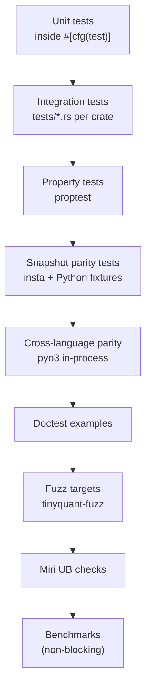

# Rust Port — Testing Strategy

> [!info] Purpose
> Describe every flavor of test in the Rust port, what it proves, how
> it's named, and what CI gates it triggers. TDD discipline from
> [[design/architecture/test-driven-development|TDD]] applies here
> unchanged: every unit of production code enters through a failing
> test.

## Test taxonomy



Every level except benchmarks is a blocking CI gate.

## Unit tests (`#[cfg(test)]`)

One module per source file (mirroring Python's per-file test style).
Test functions follow the pattern
`<thing>_<condition>_<expected>` and live in a `tests` sub-module at
the bottom of each source file:

```rust
// tinyquant-core/src/codec/codec_config.rs
#[cfg(test)]
mod tests {
    use super::*;

    #[test]
    fn new_valid_bit_widths_succeed() {
        for bw in [2u8, 4, 8] {
            assert!(CodecConfig::new(bw, 42, 768, true).is_ok());
        }
    }

    #[test]
    fn new_unsupported_bit_width_fails() {
        let err = CodecConfig::new(3, 42, 768, true).unwrap_err();
        assert!(matches!(err, CodecError::UnsupportedBitWidth { got: 3 }));
    }

    #[test]
    fn new_zero_dimension_fails() {
        let err = CodecConfig::new(4, 0, 0, true).unwrap_err();
        assert!(matches!(err, CodecError::InvalidDimension { got: 0 }));
    }

    #[test]
    fn num_codebook_entries_is_two_to_bit_width() {
        for (bw, expected) in [(2u8, 4u32), (4, 16), (8, 256)] {
            let c = CodecConfig::new(bw, 0, 64, true).unwrap();
            assert_eq!(c.num_codebook_entries(), expected);
        }
    }

    #[test]
    fn config_hash_matches_python_fixture_bw4_seed42_dim768_res_on() {
        let c = CodecConfig::new(4, 42, 768, true).unwrap();
        assert_eq!(
            c.config_hash().as_ref(),
            include_str!("../../tests/fixtures/config_hash_bw4_s42_d768_rtrue.txt").trim(),
        );
    }

    #[test]
    fn equal_configs_are_equal() { /* … */ }
    #[test]
    fn equal_configs_have_same_hash() { /* … */ }
    #[test]
    fn different_configs_are_not_equal() { /* … */ }
}
```

Every Python test in `tests/codec/test_codec_config.py` has a direct
counterpart Rust test; the name mapping is tracked in
`rust/crates/tinyquant-core/tests/python_test_mapping.md` and is a
maintenance contract — deleting a Python test requires deleting the
Rust counterpart, and vice versa.

### Strict exhaustive coverage rule

Unit tests are the canonical documentation for each public function.
Coverage floor for each crate:

| Crate | Line coverage floor | Branch floor |
|---|---|---|
| `tinyquant-core` | 95% | 90% |
| `tinyquant-io` | 92% | 85% |
| `tinyquant-bruteforce` | 90% | 80% |
| `tinyquant-pgvector` | 80% (integration-heavy) | n/a |
| `tinyquant-sys` | 85% | 75% |
| `tinyquant-py` | 80% (wrappers) | n/a |

Measured via `cargo llvm-cov`. CI runs the coverage job on every PR
and fails if any crate drops below its floor.

## Integration tests (`tests/*.rs`)

Cross-module tests that exercise multiple types together. Mirrors
Python's `tests/integration/` directory.

Examples:

```text
tinyquant-core/tests/
├── codec_config_hash_parity.rs   # All 120 canonical triples
├── codec_roundtrip.rs            # Compress→decompress fidelity
├── codebook_train_deterministic.rs
├── codec_batch_matches_serial.rs
├── corpus_insert_flow.rs
├── corpus_policy_enforcement.rs
└── backend_protocol_conformance.rs
```

Each file begins with a doc comment explaining what behavior it
verifies:

```rust
//! Integration: codec round-trip fidelity across all supported bit
//! widths and residual modes. Asserts Pearson ρ floor and max
//! reconstruction error against the Python gold corpus values.
```

## Property tests (`proptest`)

Property tests live in `tests/properties.rs` per crate and cover
invariants that a finite unit test list can't exhaust.

```rust
// tinyquant-core/tests/properties.rs
use proptest::prelude::*;
use tinyquant_core::prelude::*;

proptest! {
    #![proptest_config(ProptestConfig::with_cases(256))]

    #[test]
    fn rotation_preserves_norm(seed in 0u64..1_000_000, dim in (64usize..=1024).prop_filter("even", |d| d % 4 == 0)) {
        let config = CodecConfig::new(4, seed, dim as u32, true).unwrap();
        let rot = RotationMatrix::from_config(&config);
        let mut input = vec![0f32; dim];
        for (i, v) in input.iter_mut().enumerate() {
            *v = ((seed.wrapping_add(i as u64)) as f32) * 1e-3;
        }
        let mut rotated = vec![0f32; dim];
        rot.apply_into(&input, &mut rotated).unwrap();
        let norm_a: f32 = input.iter().map(|x| x * x).sum::<f32>().sqrt();
        let norm_b: f32 = rotated.iter().map(|x| x * x).sum::<f32>().sqrt();
        prop_assert!((norm_a - norm_b).abs() / norm_a.max(1e-6) < 1e-4);
    }

    #[test]
    fn compress_decompress_bounded_error(
        seed in 0u64..1_000_000,
        dim in prop::sample::select(vec![64usize, 128, 256, 512, 768]),
    ) {
        let config = CodecConfig::new(4, seed, dim as u32, true).unwrap();
        // synthesize training and input
        // ... (elided for brevity)
        // prop_assert!(mse < bound)
    }

    #[test]
    fn serialization_roundtrip_identity(
        dim in 1u32..=2048,
        bit_width in prop::sample::select(vec![2u8, 4, 8]),
        residual_on in any::<bool>(),
    ) {
        let indices = vec![0u8; dim as usize];
        let residual = if residual_on { Some(vec![0u8; dim as usize * 2].into_boxed_slice()) } else { None };
        let cv = CompressedVector::new(
            indices.into_boxed_slice(),
            residual,
            Arc::from("deadbeef"),
            dim,
            bit_width,
        ).unwrap();
        let bytes = tinyquant_io::to_bytes(&cv);
        let cv2 = tinyquant_io::from_bytes(&bytes).unwrap();
        prop_assert_eq!(cv.indices(), cv2.indices());
        prop_assert_eq!(cv.bit_width(), cv2.bit_width());
        prop_assert_eq!(cv.dimension(), cv2.dimension());
    }
}
```

Property test failure cases are **minimized** by proptest and
persisted in `proptest-regressions/*.txt`, which is committed. When a
proptest failure is diagnosed and fixed, the minimized regression
case stays as a permanent unit test.

> [!warning] `proptest` is currently blocked by MSRV 1.81 (Phase 14)
> Phase 14 attempted to add `proptest = "1"` to
> `tinyquant-core/[dev-dependencies]` and hit a hard build failure:
> the modern proptest transitive dep tree pulls `getrandom 0.4.2`,
> which requires Cargo's `edition2024` feature (stable only from Rust
> 1.85). The workspace MSRV is pinned to 1.81 by `rust-toolchain.toml`
> and the `rust-version` field in `rust/Cargo.toml`, and Phase 12
> already bumped us once (1.78 → 1.81). We do not want to move it
> again just to add a test-framework dependency.
>
> **Interim pattern** (used by Phase 14's
> `quantize_indices_always_in_codebook_across_random_inputs` test):
> replace the `proptest!` block with a deterministic loop seeded from
> `rand_chacha::ChaCha20Rng::seed_from_u64(N)` — `rand_chacha` is
> already a `tinyquant-core` runtime dep, so the substitute adds
> nothing to the graph. Draw batch sizes and input values from the
> stream, call the function under test in a plain Rust `for` loop,
> and assert the invariant with `assert!`. The failure mode is less
> ergonomic than proptest (no automatic shrinking) but it still
> reproduces deterministically because the seed is fixed.
>
> ```rust
> // tinyquant-core/tests/codebook.rs (excerpt)
> use rand_chacha::rand_core::{RngCore, SeedableRng};
> use rand_chacha::ChaCha20Rng;
>
> #[test]
> fn quantize_indices_always_in_codebook_across_random_inputs() {
>     let entries: Vec<f32> = (0..16).map(|i| i as f32).collect();
>     let cb = Codebook::new(entries.into_boxed_slice(), 4).unwrap();
>     let mut rng = ChaCha20Rng::seed_from_u64(1337);
>     for _ in 0..256 {
>         let len = 1 + (rng.next_u32() as usize % 512);
>         let values: Vec<f32> = (0..len)
>             .map(|_| next_finite_f32(&mut rng))
>             .collect();
>         let mut idx = vec![0u8; len];
>         cb.quantize_into(&values, &mut idx).unwrap();
>         assert!(idx.iter().all(|&i| i < 16));
>     }
> }
> ```
>
> **Re-entry path.** Revisit this decision when the workspace MSRV
> eventually bumps past 1.85, or when `proptest` publishes a release
> whose dep tree builds cleanly on stable 1.81 again. At that point
> the deterministic loops should be *expanded* with a proptest
> wrapper rather than replaced, so the existing coverage stays as a
> permanent regression floor.

## Snapshot parity tests

These assert that the Rust implementation produces byte-identical
output to a stored Python fixture. Run through `insta`:

```rust
// tinyquant-core/tests/snapshot_hash.rs
use insta::assert_snapshot;

#[test]
fn config_hash_snapshot_bw4_seed42_dim768_rtrue() {
    let c = CodecConfig::new(4, 42, 768, true).unwrap();
    assert_snapshot!("config_hash_bw4_seed42_dim768_rtrue", c.config_hash().as_ref());
}
```

Snapshot files live at
`tinyquant-core/tests/snapshots/snapshot_hash__config_hash_bw4_seed42_dim768_rtrue.snap`
and are generated by running `xtask fixtures refresh`, which drives
both the Python reference and the Rust path and asserts they agree
before writing the `.snap` file. If the files ever disagree,
`xtask fixtures refresh` refuses to update them.

## Cross-language parity tests (`tinyquant-py`)

The hard parity gate. These tests run a live `tinyquant_cpu` Python
interpreter via `pyo3`'s `Python::with_gil` and compare every hot
function's output against the Rust implementation.

```rust
// tinyquant-py/tests/rust/test_parity.rs
#[test]
fn compressed_vector_bytes_parity_across_100_random_vectors() {
    pyo3::prepare_freethreaded_python();
    Python::with_gil(|py| {
        let py_mod = py.import_bound("tinyquant_cpu").unwrap();
        let numpy  = py.import_bound("numpy").unwrap();
        // ... build 100 vectors, run both codecs, assert to_bytes equality
    });
}
```

These tests require `tinyquant_cpu` installed in the test environment,
so they run in a dedicated CI job that sets up a virtualenv.

## Doctest examples

Every public function in `tinyquant-core` has a doctest that compiles
and runs. This serves double duty as documentation and as a quick
sanity check.

```rust
/// Compress an FP32 vector.
///
/// # Example
///
/// ```
/// use tinyquant_core::prelude::*;
/// # let training: Vec<f32> = (0..64*100).map(|i| (i as f32).sin()).collect();
/// let config = CodecConfig::new(4, 42, 64, true).unwrap();
/// let codebook = Codebook::train(&training, 100, 64, &config).unwrap();
/// let vector: Vec<f32> = (0..64).map(|i| (i as f32).cos()).collect();
/// let cv = Codec::new().compress(&vector, &config, &codebook).unwrap();
/// assert_eq!(cv.dimension(), 64);
/// ```
pub fn compress(/* … */) { /* … */ }
```

Doctests run as part of `cargo test --doc`. The coverage floor does
not count doctests, but they must all pass.

## Fuzz targets

`tinyquant-fuzz` ships libfuzzer targets for every untrusted-input
boundary:

| Target | Entry point | Invariants |
|---|---|---|
| `compressed_vector_from_bytes` | `from_bytes(data)` | Never panics; always returns `Ok` or `Err(IoError)` |
| `header_parser` | internal header-parse function | Same |
| `bit_unpack` | `unpack_indices` | Never reads OOB; indices are `< 2^bit_width` |
| `corpus_file_reader_parse` | Level-2 file parser | Never panics; mismatched counts → `Err` |

Each target runs for 5 minutes in PR CI and 1 hour in the nightly
workflow. Crashes reproduce deterministically and become
regression-test fixtures.

## Miri (undefined behavior checks)

`cargo miri test --package tinyquant-core` runs on PR. Miri catches:

- Out-of-bounds accesses
- Use-after-free (not possible in safe Rust, but the codec has a
  few `unsafe` blocks for SIMD dispatch and parallel batch writes)
- Uninitialized reads
- Type confusion

The `MaybeUninit` usage in the parallel batch write path is the
primary unsafe target. Miri must approve it.

Miri is slower than normal tests (~50× on SIMD-heavy code) so we run
only `tinyquant-core`, not the full workspace, under Miri. The
`tinyquant-io` and `tinyquant-bruteforce` crates run Miri in a
nightly job.

## Architectural tests

Mirrors Python's `tests/architecture/` directory. Enforces crate
graph invariants at build time:

```rust
// tinyquant-core/tests/architecture.rs
#[test]
fn tinyquant_core_does_not_depend_on_tinyquant_io() {
    // Read Cargo.lock; assert tinyquant-core's transitive dep set
    // does not contain tinyquant-io.
    let lockfile = include_str!("../../../../Cargo.lock");
    assert!(!lockfile.contains("tinyquant-io"), "core should not depend on io");
}

#[test]
fn no_std_build_succeeds() {
    // Shell out to `cargo build -p tinyquant-core --no-default-features --target thumbv7em-none-eabihf`
    // via xtask test --no-std. This is run in CI only on a matrix job.
}
```

## Python test parity tracking

The file `tinyquant-core/tests/python_test_mapping.md` maps every
Python test in `tests/` to its Rust counterpart:

```markdown
| Python test | Rust test | Status |
|---|---|---|
| `tests/codec/test_codec_config.py::test_valid_config_creates_successfully` | `tinyquant-core::codec::codec_config::tests::new_valid_bit_widths_succeed` | ✅ |
| `tests/codec/test_codec_config.py::test_unsupported_bit_width_raises` | `tinyquant-core::codec::codec_config::tests::new_unsupported_bit_width_fails` | ✅ |
...
```

A linter script (`xtask check-test-mapping`) parses both test suites,
diffs them against the mapping file, and fails if:

- A Python test exists without a Rust counterpart (and no explicit
  `SKIP` entry).
- A Rust test exists that claims to map to a nonexistent Python test.

The mapping file is regenerated by `xtask test-mapping refresh` with
human review.

## Test data policy

- Deterministic seeds only. No `rand::thread_rng` in tests.
- Fixture files are committed; tests never download over the network.
- Floating-point comparisons use explicit tolerance; no
  `assert_eq!(f32, f32)` on computed values.
- No `sleep`, `Instant::now`, or wall-clock-dependent assertions.

## Reference as oracle

> [!info] Since Phase 23
> The pure-Python implementation lives under
> `tests/reference/tinyquant_py_reference/`, not under `src/`. It is a
> test-only differential oracle for the Rust core and the Phase 24
> fat wheel — it is never installed by end users. See
> [[entities/python-reference-implementation|Python Reference Implementation]]
> and [[plans/rust/phase-23-python-reference-demotion|Phase 23]].

Every parity gate in the Rust port anchors to this reference:

- **Fixture generation.** `scripts/generate_rust_fixtures.py` imports
  `tinyquant_py_reference` to emit `config_hashes.json`, the codebook
  fixtures, the quantize fixtures, and the residual fixtures consumed
  by the Rust tests under `rust/crates/tinyquant-core/tests/fixtures/`.
  Re-running the generator after a Python-side change is the
  authoritative way to refresh Rust fixtures; there is no independent
  Rust source of truth.
- **Cross-language parity (pyo3).** The `tests/parity/` suite —
  introduced in Phase 23 alongside the rename — runs under
  `pytest -m parity`. It exposes a session-scoped `ref` fixture
  (always the reference) and an `rs` fixture (the Rust-backed
  `tinyquant_cpu` fat wheel once Phase 24 installs it). Self-parity
  tests are live in Phase 23; cross-impl tests skip with message
  `Rust-backed tinyquant_cpu not installed` until Phase 24 flips the
  fixture on.
- **Behavior freeze.** The reference's public surface is pinned to the
  `v0.1.1` PyPI behavior. Any byte-level or numerics-level change is
  a contract break against the Rust core and is coordinated across
  both implementations in lockstep.

The reference is **not** measured as part of the Rust coverage gates.
It has its own coverage floor — `--cov=tinyquant_py_reference
--cov-fail-under=90` — enforced by the Python CI chunks, and its
source is explicitly excluded from any wheel built from this tree via
`[tool.hatch.build.targets.wheel].packages = []` and the
`build-package-does-not-leak-reference` CI guard.

## Test ordering and isolation

- Tests within a file run in parallel by default.
- Tests that touch the `RotationCache` use a test-local cache
  (cache is passed as an argument in test APIs, not global) to avoid
  cross-test state leakage.
- No `#[should_panic]` — all errors go through `Result`.

## See also

- [[design/architecture/test-driven-development|Test-Driven Development]]
- [[design/rust/numerical-semantics|Numerical Semantics]]
- [[design/rust/error-model|Error Model]]
- [[design/rust/ci-cd|CI/CD]]
