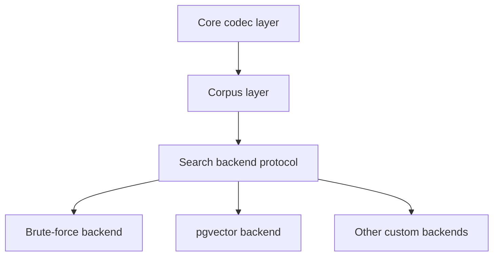

# Storage Codec Architecture

> [!info] Design summary
> The current research describes TinyQuant as a three-layer library with a
> clear boundary between compression and search.

## Layer model

## Core codec layer

This layer owns:

- codebook generation
- vector rotation and quantization
- optional residual correction
- compressed vector serialization

It should be deterministic and testable independent of any storage engine.

## Corpus layer

This layer groups compressed vectors into a reusable container abstraction with
batch operations, persistence helpers, and metadata association.

## Search backend layer

This layer is a protocol boundary, not a built-in ANN engine. Backends consume
decompressed FP32 vectors and decide how to rank or index them.

## Main operational implication

The write path can pay compression cost. The read path should avoid
on-demand decompression in latency-critical production flows by using
materialized decompressed representations where appropriate.

## Scope guidance

TinyQuant's initial scope should stay close to the codec and corpus layers. The
backend protocol belongs in the public design, but production-grade search
implementations can remain external integrations.

## Upstream method alignment

The architecture described here should be read alongside the upstream method
lineage:

- [[random-preconditioning-without-normalization-overhead]]
- [[two-stage-quantization-and-residual-correction]]
- [[storage-codec-vs-search-backend-separation]]

## See also

- [[TinyQuant]]
- [[TurboQuant]]
- [[storage-codec-vs-search-backend-separation]]
- [[tinyquant-library-research]]
- [[tinyquant-better-router-integration]]
