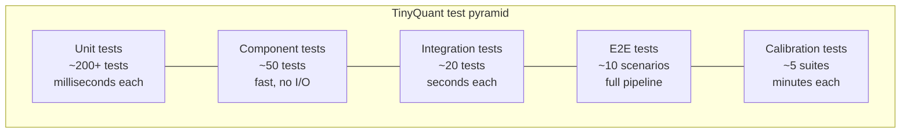

# Quality Assurance

> [!info] Purpose
> Test specifications, integration strategy, and verification/validation plans
> for TinyQuant. This is the QA counterpart to the design documentation —
> every design decision in [[design/architecture/README|Architecture]] and
> every behavior in [[design/behavior-layer/README|Behavior Layer]] has
> corresponding QA coverage defined here.

## Structure

| Directory | Contents | Scope |
|-----------|----------|-------|
| [[qa/unit-tests/README\|unit-tests/]] | Test specs per class and module | Individual class invariants, method contracts, edge cases |
| [[qa/e2e-tests/README\|e2e-tests/]] | Full pipeline scenarios | Compress → store → decompress → search round trips |
| [[qa/integration-plan/README\|integration-plan/]] | Cross-boundary and external system tests | Package interfaces, serialization, backend adapters |
| [[qa/verification-plan/README\|verification-plan/]] | "Did we build it right?" | Architecture enforcement, linting, typing, coverage gates |
| [[qa/validation-plan/README\|validation-plan/]] | "Did we build the right thing?" | Score fidelity, research baseline comparison, acceptance criteria |

## Test pyramid

> [!tip] Most tests should be at the bottom
> The unit and component layers run in the inner TDD loop. Integration and
> above run in CI. Calibration tests run on release gates.

## Relationship to other docs

| QA area | Draws from |
|---------|-----------|
| Unit tests | [[classes/README\|Class Specifications]] — one test file per class |
| E2E tests | [[design/behavior-layer/README\|Behavior Layer]] — Given/When/Then scenarios |
| Integration plan | [[design/domain-layer/context-map\|Context Map]] — bounded context boundaries |
| Verification plan | [[design/architecture/README\|Architecture]] — all enforceable policies |
| Validation plan | [[design/behavior-layer/score-fidelity\|Score Fidelity]] — research quality baselines |

## Tooling

| Tool | Role | Reference |
|------|------|-----------|
| `pytest` | Test runner | [[design/architecture/test-driven-development\|TDD]] |
| `pytest-cov` | Coverage gating | [[design/architecture/linting-and-tooling\|Linting and Tooling]] |
| `hypothesis` | Property-based testing | Codec determinism, round-trip invariants |
| `mypy` | Static type verification | [[design/architecture/type-safety\|Type Safety]] |
| `ruff` | Lint + format verification | [[design/architecture/linting-and-tooling\|Linting and Tooling]] |

## See also

- [[design/architecture/test-driven-development|Test-Driven Development]]
- [[design/architecture/linting-and-tooling|Linting and Tooling]]
- [[design/behavior-layer/README|Behavior Layer]]
- [[classes/README|Class Specifications]]
