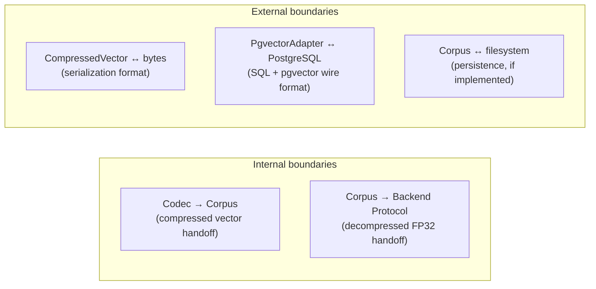

# Integration Plan

> [!info] Purpose
> Strategy for testing the boundaries between TinyQuant's bounded contexts
> and between TinyQuant and external systems. Integration tests verify that
> modules compose correctly — they fill the gap between unit tests (one class)
> and E2E tests (full pipeline).

## Boundary map



## Internal boundary tests

### IB-01: Codec → Corpus vector handoff

**Test file:** `tests/integration/test_codec_corpus.py`

| Test | Verifies |
|------|----------|
| `test_codec_output_accepted_by_corpus` | A `CompressedVector` from `Codec.compress()` is accepted by `Corpus.insert()` |
| `test_codec_config_hash_matches_corpus` | The config hash propagated from codec to corpus is consistent |
| `test_corpus_decompress_uses_same_codec` | `Corpus.decompress()` produces the same result as calling `Codec.decompress()` directly |
| `test_batch_compress_integrates_with_batch_insert` | `Codec.compress_batch()` output feeds `Corpus.insert_batch()` correctly |

### IB-02: Corpus → Backend Protocol handoff

**Test file:** `tests/integration/test_corpus_backend.py`

| Test | Verifies |
|------|----------|
| `test_decompress_all_produces_valid_backend_input` | Output of `decompress_all()` is accepted by `BruteForceBackend.ingest()` |
| `test_decompressed_vectors_have_correct_dimension` | All vectors match the expected dimension |
| `test_backend_search_after_corpus_decompress` | A search returns results after ingesting decompressed corpus vectors |
| `test_vector_ids_preserved_through_handoff` | IDs from corpus map correctly to backend search results |

## External boundary tests

### EB-01: CompressedVector serialization

**Test file:** `tests/integration/test_serialization.py`

| Test | Verifies |
|------|----------|
| `test_serialize_deserialize_round_trip` | `from_bytes(to_bytes(cv))` produces identical `CompressedVector` |
| `test_serialization_format_version` | Version byte is present and correct |
| `test_deserialization_rejects_wrong_version` | Unknown version byte → clear error |
| `test_deserialization_rejects_truncated_data` | Incomplete bytes → clear error |
| `test_deserialization_rejects_corrupted_hash` | Tampered config hash → detectable |
| `test_large_dimension_serialization` | dim=3072 round-trips correctly |
| `test_residual_survives_serialization` | Residual data preserved through bytes round trip |

### EB-02: PgvectorAdapter → PostgreSQL

**Test file:** `tests/integration/test_pgvector.py`

> [!warning] Requires infrastructure
> These tests require a running PostgreSQL instance with pgvector extension.
> Gated by `PGVECTOR_TEST_DSN` environment variable.

| Test | Verifies |
|------|----------|
| `test_ingest_writes_to_database` | Vectors appear in the target table |
| `test_search_returns_ranked_results` | SQL query produces ordered `SearchResult` objects |
| `test_dimension_preserved_through_wire_format` | Vector length survives NumPy → pgvector → NumPy |
| `test_remove_deletes_from_database` | Removed vectors absent from subsequent queries |
| `test_parameterized_queries_no_injection` | SQL injection attempts are safely parameterized |
| `test_connection_factory_is_called` | Adapter uses the injected factory, not a hardcoded connection |

### EB-03: Corpus persistence (future)

**Test file:** `tests/integration/test_persistence.py`

> [!note] Deferred
> Corpus persistence is not in the initial scope. These test cases are
> documented for when file-based or database-backed persistence is added.

| Test | Verifies |
|------|----------|
| `test_save_and_load_corpus` | Saved corpus loads with identical config, codebook, and vectors |
| `test_load_rejects_corrupted_file` | Tampered persistence file → clear error |
| `test_load_rejects_version_mismatch` | Incompatible persistence format → clear error |

## Test infrastructure

### Fixtures

| Fixture | Scope | Purpose |
|---------|-------|---------|
| `codec_config_4bit` | session | Standard 4-bit config for integration tests |
| `trained_codebook` | session | Codebook trained from synthetic data |
| `sample_corpus` | function | Pre-populated corpus with 100 vectors |
| `brute_force_backend` | function | Fresh BruteForceBackend instance |
| `pgvector_connection` | session | PostgreSQL connection (skipped if DSN not set) |

### Marks

```python
import pytest

pgvector = pytest.mark.skipif(
    not os.environ.get("PGVECTOR_TEST_DSN"),
    reason="PGVECTOR_TEST_DSN not set",
)
```

## Execution

| Aspect | Policy |
|--------|--------|
| **Runner** | `pytest tests/integration/` |
| **Frequency** | Every CI run (pgvector tests conditional) |
| **Timeout** | 2 minutes max for internal; 5 minutes for external |
| **Isolation** | Each test gets fresh instances; no shared mutable state |

## See also

- [[qa/README|Quality Assurance]]
- [[qa/unit-tests/README|Unit Tests]]
- [[qa/e2e-tests/README|End-to-End Tests]]
- [[design/domain-layer/context-map|Context Map]]
- [[design/architecture/low-coupling|Low Coupling]]
