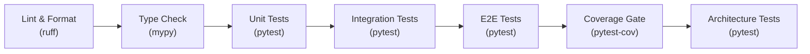

# Verification Plan

> [!info] Purpose
> **"Did we build it right?"** — systematic checks that TinyQuant's
> implementation conforms to its design specifications, architecture policies,
> and quality standards.

## Verification dimensions

### V-01: Architecture conformance

**Verifies:** [[design/architecture/README|Architecture Design Considerations]]

| Check | Method | Gate |
|-------|--------|------|
| No import cycles between packages | Architecture test + `ruff` import rules | CI blocker |
| Codec package has no corpus/backend imports | `test_codec_does_not_import_corpus` | CI blocker |
| Corpus package has no backend imports | `test_corpus_does_not_import_backend` | CI blocker |
| Backend package does not import codec internals | Architecture test | CI blocker |
| All cross-package imports use `__init__.py` exports | `ruff` + `no_implicit_reexport` in mypy | CI blocker |

**Test file:** `tests/architecture/test_dependency_direction.py`

### V-02: Type safety

**Verifies:** [[design/architecture/type-safety|Type Safety]]

| Check | Method | Gate |
|-------|--------|------|
| mypy strict mode passes with zero errors | `mypy --strict .` | CI blocker |
| No bare `# type: ignore` without bracket code | grep + CI check | CI blocker |
| All public functions have complete annotations | `ruff` rule `ANN` | CI blocker |
| Protocol compliance (backends satisfy SearchBackend) | mypy structural check | CI blocker |

### V-03: Linting and formatting

**Verifies:** [[design/architecture/linting-and-tooling|Linting and Tooling]]

| Check | Method | Gate |
|-------|--------|------|
| `ruff check .` passes with zero warnings | ruff | CI blocker |
| `ruff format --check .` passes | ruff formatter | CI blocker |
| No bare `# noqa` without explanation | grep + CI check | CI blocker |
| Markdown outside `docs/` passes markdownlint | markdownlint-cli2 | CI blocker |

### V-04: Complexity limits

**Verifies:** [[design/architecture/file-and-complexity-policy|File and Complexity Policy]]

| Check | Method | Gate |
|-------|--------|------|
| No function with CC > 7 | `ruff` rule `C901` with `max-complexity = 7` | CI blocker |
| One public class per file | Manual review + naming convention check | PR review |
| No file exceeds 300 lines | Monitoring script | PR warning |

### V-05: Docstring coverage

**Verifies:** [[design/architecture/docstring-policy|Docstring Policy]]

| Check | Method | Gate |
|-------|--------|------|
| All public symbols have docstrings | `ruff` rule `D` (pydocstyle) | CI blocker |
| Docstrings use Google-style sections | `ruff` pydocstyle convention setting | CI blocker |
| First line is imperative summary | PR review | PR review |
| Args/Returns/Raises match signature | PR review + Sphinx build | Release gate |

### V-06: Test coverage

**Verifies:** [[design/architecture/test-driven-development|TDD]] and
[[design/architecture/linting-and-tooling|Linting and Tooling]]

| Check | Method | Gate |
|-------|--------|------|
| Codec coverage >= 95% | `pytest-cov` | CI blocker |
| Corpus coverage >= 90% | `pytest-cov` | CI blocker |
| Backend coverage >= 80% | `pytest-cov` | CI blocker |
| Overall coverage >= 90% | `pytest-cov` | CI blocker |
| No `# pragma: no cover` without justification | grep + CI check | CI blocker |

### V-07: Invariant preservation

**Verifies:** [[design/domain-layer/aggregates-and-entities|Aggregates and Entities]]

| Invariant | Verification method |
|-----------|-------------------|
| CodecConfig immutability | Unit test: frozen dataclass rejects assignment |
| Codebook entry count = `2^bit_width` | Unit test + property-based test |
| RotationMatrix orthogonality | Unit test: `R @ R.T ≈ I` |
| Corpus config frozen at creation | Unit test: config immutable after construction |
| Corpus policy immutable after insert | Unit test: policy change on non-empty corpus fails |
| CompressedVector config_hash matches origin | Unit test + integration test |
| Codec determinism | Property-based test: same input → same output |

### V-08: Serialization compatibility

| Check | Method | Gate |
|-------|--------|------|
| `to_bytes` / `from_bytes` round trip | Integration test | CI blocker |
| Version byte present in all serialized data | Unit test | CI blocker |
| Incompatible versions rejected with clear error | Unit test | CI blocker |

## Verification schedule

| When | What runs |
|------|----------|
| **Every commit (pre-commit hook)** | ruff check, ruff format, mypy, markdownlint |
| **Every CI run** | All of the above + pytest (unit, component, integration, e2e) + coverage gates |
| **Every PR** | All of the above + architecture tests + manual review checklist |
| **Every release** | All of the above + calibration tests + Sphinx doc build |

## CI pipeline structure

All stages are sequential — failure at any stage stops the pipeline.

## See also

- [[qa/README|Quality Assurance]]
- [[qa/validation-plan/README|Validation Plan]]
- [[design/architecture/README|Architecture Design Considerations]]
- [[design/architecture/linting-and-tooling|Linting and Tooling]]
