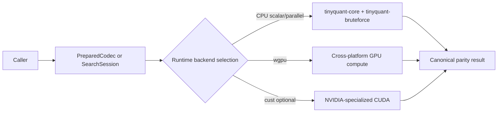
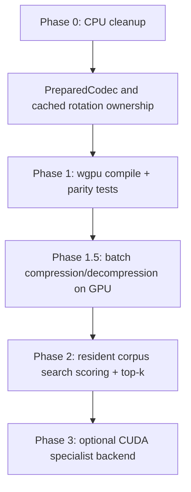

# TinyQuant GPU Acceleration Report

## Executive summary

The current Rust workspace for TinyQuant is intentionally CPU-first: `tinyquant-core` is described as a **CPU-only**, `no_std` leaf crate; the workspace is organized so that compute-heavy code lives in the codec and brute-force crates, while I/O, bindings, CLI, and release tooling sit above it. The core compression path is `rotate → quantize → optional residual`, and the brute-force backend is an `O(n·d)` linear scan over cosine similarity. Those are the right places to target for optional GPU acceleration. Just as important, the current “SIMD” path is mostly a dispatch framework: the AVX2 wrappers explicitly delegate to the scalar kernels today, so the codebase still has substantial headroom before it reaches a mature CPU ceiling. citeturn2view3turn7view0turn4view0turn5view0turn5view3

For this codebase, the best initial GPU strategy is **not** to put GPU code into `tinyquant-core`. Instead, add a new **std-only optional crate** such as `tinyquant-gpu-wgpu` or `tinyquant-accelerate`, sitting above `tinyquant-core`, preserving the existing `no_std`/CPU contracts and making runtime selection explicit. The primary backend should be **`wgpu` with WGSL compute shaders**, because it gives one Rust API across Metal on macOS, Vulkan on Linux, and D3D12 on Windows; it also accepts WGSL, SPIR-V, and GLSL inputs and handles backend translation internally. A second, opt-in backend for NVIDIA-heavy deployments can use **`cust`** for CUDA, but it should be strictly optional because it is vendor-specific and operationally different from the cross-platform path. citeturn7view0turn11view0turn11view2turn12view0turn16view1

There is one integration risk that stands out immediately: the TinyQuant workspace and CI are pinned to **Rust 1.81**, while the current `wgpu` docs advertise **MSRV 1.87**. If you want the current `wgpu`, you will likely need either a workspace-wide MSRV raise or a separately versioned GPU crate with a higher MSRV and clearly documented feature gating. That single constraint probably matters more to schedule and maintenance than any shader choice. citeturn0view0turn6view1turn12view0

My recommendation is therefore:

1. **Before any GPU work**, fix the highest-leverage CPU design issue: avoid repeated rotation-matrix rebuilds in hot paths by introducing a reusable session/object that owns the precomputed rotation and codebook, because the current codec path constructs a `RotationMatrix` from config inside `compress` and `decompress_into`.  
2. **Phase in `wgpu` first** for batched compression/decompression and batched search scoring. Use CPU as the canonical implementation and GPU as a size-thresholded accelerator.  
3. **Add CUDA later, if warranted**, as a Linux/Windows/NVIDIA specialist plugin via `cust`.  
4. **Do not start new work on `gfx-hal` or `metal-rs`**; `metal` is deprecated in favor of `objc2-metal`, and the `gfx-rs` maintainer has described `gfx-hal` as effectively deprecated. citeturn4view0turn4view1turn15view0turn17view0turn21search6

## Codebase inventory and hotspot analysis

The Rust design docs describe a layered workspace: `tinyquant-core` is the leaf crate, `tinyquant-io` handles serialization and mmap, `tinyquant-bruteforce` is the reference search backend, and bindings/CLI/release automation live above that boundary. That layering is valuable for GPU work because it already suggests the right insertion point: a new optional accelerator crate should depend on `tinyquant-core`, not modify its `no_std` contract. citeturn7view0turn2view3

The current codec service makes the main compression and decompression path explicit. Compression does three things in order: build/apply a rotation matrix, quantize against the codebook, and optionally compute a residual. Decompression reverses that: dequantize, optionally apply the residual, then inverse-rotate. In the current implementation, `Codec::compress` and `Codec::decompress_into` both call `RotationMatrix::from_config`, and `RotationMatrix::build` fills a `dim * dim` buffer, performs a `faer` QR decomposition, applies sign correction, and stores the result as an `Arc<[f64]>`. For large embedding dimensions, that rotation step is the most structurally expensive part of the pipeline, and right now it is not visibly cached inside the hot codec entry points. citeturn4view0turn4view1turn7view0

The quantization path is also a candidate hotspot, but with a different shape. `Codebook::quantize_into` and `dequantize_into` are thin entry points over either scalar kernels or the `simd_api` dispatch layer. The codebook stores `2^bit_width` sorted `f32` entries and trains them by sorting promoted `f64` samples and performing uniform-quantile interpolation. Operationally, quantization is a dense, embarrassingly parallel transform over many values, which is GPU-friendly; however, the present SIMD implementation has not yet reached true intrinsic kernels, so the correct sequencing is “fix repeated rotation construction, then compare GPU against scalar/parallel CPU, not against an already-maxed-out vectorized CPU backend.” citeturn4view2turn5view0turn5view1

Batch compression already has a useful abstraction boundary: `compress_batch_with` can run serially or through a custom parallel driver, and the batch module documents a byte-identical determinism contract across thread counts because each row is processed independently and there is no shared reduction. That is exactly the sort of semantic contract a GPU backend should preserve. GPU work should therefore target **row-batched kernels** first, not single-vector calls, because TinyQuant already models safe parallelism at the batch level. citeturn4view0turn5view2

The search side is equally clear. The brute-force backend advertises itself as a linear-scan backend with `O(n·d)` query cost, computing cosine similarity against every stored vector. That means the main search acceleration opportunity is **batched dot products / norm reductions plus top-k selection**, especially when the corpus is large enough that data stays resident on the device across many queries. citeturn5view3

Two architectural implications follow from this inventory.

The first is that TinyQuant needs a long-lived **prepared execution object** before it needs a shader. Something like `PreparedCodec` or `AcceleratedCodec` should own prevalidated config, codebook buffers, a precomputed rotation matrix or GPU copy of it, staging buffers, and the selected backend. Without that, any GPU win risks being erased by repeated setup and data marshaling on the CPU. This is an inference from the current code structure, especially the repeated `RotationMatrix::from_config` calls in the codec surface. citeturn4view0turn4view1

The second is that GPU offload should remain **optional and threshold-gated**. TinyQuant’s current ecosystem still cares about `no_std`, deterministic CPU parity, Python bindings, Windows mmap tests, and a broad release matrix. That argues for an accelerator that can disappear entirely at compile time and can gracefully decline work at runtime when adapter detection, limits, or problem size make CPU execution cheaper or safer. citeturn6view1turn8view0



## Cross-platform GPU API and crate landscape

The relevant API landscape comes from four main vendors/ecosystems: the entity["organization","Khronos Group","standards consortium"] for Vulkan and OpenCL, entity["company","Apple","consumer electronics company"] for Metal, entity["company","Microsoft","software company"] for D3D12, and entity["company","NVIDIA","gpu company"] for CUDA. Khronos positions Vulkan as a cross-platform standard and explicitly lists platform support including Windows, Linux, Android, and macOS via portability layers. Apple describes Metal as a low-overhead graphics-and-compute API tightly integrated with Apple silicon and backed by strong profiling and validation tooling. Microsoft’s D3D12 guide presents Direct3D 12 as the API for taking advantage of the graphics **and computing** capabilities of Direct3D 12-compatible GPUs on Windows. Khronos presents OpenCL as an open, royalty-free, cross-platform standard for heterogeneous parallel programming, while NVIDIA positions CUDA as a development environment for high-performance GPU-accelerated applications and documents a full Driver API with contexts, modules, memory management, streams, events, and execution control. WebGPU, meanwhile, is explicitly designed to support efficient GPU computation and to map onto D3D12, Metal, and Vulkan. citeturn9view0turn10view0turn10view1turn10view2turn10view4turn19search0turn19search3turn18search1

On the Rust side, the highest-leverage cross-platform crate is `wgpu`. Its docs describe it as a **cross-platform, safe, pure-Rust graphics API** that runs natively on Vulkan, Metal, D3D12, and OpenGL, and is based on the WebGPU standard; the main entry point is `Instance`, from which you obtain `Adapter`, `Device`, and `Surface`. Its shader support is especially relevant for TinyQuant: it accepts WGSL, SPIR-V, and GLSL, and translates those to the backend requirements; its backend features include `dx12`, `metal`, `vulkan`, and optional `vulkan-portability` on Apple platforms, and it documents a `static-dxc` option for shipping DX12 shader compilation without an external `dxcompiler.dll`. citeturn11view0turn11view2turn12view0

For direct Vulkan access, `ash` is the low-level choice. Its docs show the raw construction path—`Entry`, `vk::ApplicationInfo`, `vk::InstanceCreateInfo`, and `create_instance`—and describe both compile-time linking and runtime loading of the Vulkan loader. `vulkano`, by contrast, explicitly describes itself as a **safe and rich Rust wrapper around the Vulkan API**, starting from `VulkanLibrary` and `Instance`. The trade-off is the usual one: `ash` gives maximal control and minimal abstraction overhead, while `vulkano` buys safety and ergonomics at the cost of another layer to understand and live with. citeturn13view0turn14view1

For Metal on Apple platforms, the old `metal-rs` path has materially changed: the `metal` crate documentation now marks the crate as **deprecated** and recommends `objc2` plus `objc2-metal` for new development. The newer `objc2-metal` docs describe the crate as bindings to the Metal framework, recommend enabling Apple’s validation tooling, and explicitly call out safety considerations around shaders, synchronization, memory management, and untyped `MTLBuffer`s. That matters because it means a new TinyQuant Apple-only backend should not start from `metal-rs` anymore unless you are constrained by existing code. citeturn15view0turn17view0

For vendor-specific compute, `cust` is the best fit among the listed crates. Its docs describe it as a **safe, fast, user-friendly wrapper around the CUDA Driver API**, with modules for context handling, memory, modules, streams, events, low-level interop, and an asynchronous `launch!` kernel macro. That maps well onto TinyQuant’s likely CUDA needs: persistent device allocations for codebooks/rotations, stream-based overlapped transfer/compute, and explicit module loading from PTX or fatbins. By contrast, `accel` is very explicitly CUDA-based and documents itself as working only on Linux for now, which makes it a poor default choice for a macOS/Linux/Windows library. citeturn16view1turn15view1

For OpenCL, `ocl` is a real option but a weaker strategic fit. Its docs present it as a Rust implementation of the OpenCL API, exposing `Buffer`, `Context`, `Device`, `Event`, and queueing abstractions, while the Khronos OpenCL page emphasizes broad cross-platform deployment. That combination means OpenCL remains viable where installed runtimes are part of the target fleet, but for a new TinyQuant acceleration layer it is a less natural fit than `wgpu` because it does not align as cleanly with modern Rust-native shader and portability workflows. citeturn10view4turn16view0

For shader translation, `naga` and `spirv_cross` are the main names in your survey. `naga` documents itself as a tool that can translate source code written in one shading language to another, with a concrete example of parsing WGSL and validating the resulting module. `spirv_cross` is described by its repository as a safe Rust wrapper around SPIRV-Cross for compiling SPIR-V to targets such as HLSL and MSL. In practice, if you adopt `wgpu`, you usually get enough shader translation machinery already; reaching for `naga` directly makes sense when you want explicit build-time validation or custom translation tooling, while `spirv_cross` is more attractive in Vulkan-centric pipelines that standardize on SPIR-V. citeturn15view2turn20search0

Finally, I would not place new TinyQuant work on `gfx-hal`. Its crate docs describe it as a low-level graphics abstraction used by higher-level libraries, but a maintainer later stated that it is “effectively deprecated” and pointed to `wgpu-hal` as the closest successor. For a greenfield accelerator layer, that is enough to rule it out. citeturn16view2turn21search6

## Integration architecture and recommended approaches

The most important best practice for TinyQuant is to separate **semantic ownership** from **execution ownership**. `tinyquant-core` should remain the semantic source of truth: configuration validation, codebook training, deterministic CPU parity, serialized formats, and public error contracts should stay there. GPU code should live in a new crate that implements a narrow execution trait over prepared buffers and batch-oriented kernels. That preserves the current workspace layering and avoids contaminating the `no_std` core with platform loaders, driver handles, or async machinery. citeturn7view0turn2view3

A clean shape looks like this:

```rust
pub trait ComputeBackend {
    fn name(&self) -> &'static str;

    fn compress_batch(
        &mut self,
        input: &[f32],
        rows: usize,
        cols: usize,
        prepared: &PreparedCodec,
    ) -> Result<Vec<CompressedVector>, TinyQuantGpuError>;

    fn decompress_batch_into(
        &mut self,
        compressed: &[CompressedVector],
        prepared: &PreparedCodec,
        out: &mut [f32],
    ) -> Result<(), TinyQuantGpuError>;

    fn cosine_topk(
        &mut self,
        query: &[f32],
        corpus: &[f32],
        rows: usize,
        cols: usize,
        top_k: usize,
    ) -> Result<Vec<SearchResult>, TinyQuantGpuError>;
}
```

`PreparedCodec` should own the expensive, reusable state: validated `CodecConfig`, `Codebook`, the rotation matrix, packed device buffers, and backend-specific pipeline objects. In this design, the CPU path becomes just another backend implementation and remains the canonical test oracle. That shape is consistent with TinyQuant’s existing separation between codec, I/O, search backend, and bindings. citeturn7view0turn4view0

The primary recommended backend is **`wgpu` + WGSL**. It has the right portability profile, the safest mainstream Rust API, and the least per-platform shader plumbing because a single WGSL kernel can target Metal, Vulkan, and D3D12 through the same host-side Rust code. For TinyQuant, that argues for three first kernels:

- **batched rotate / inverse-rotate**, which is effectively matrix–vector or matrix–matrix work;
- **batched quantize / dequantize / residual**, which is dense elementwise or small-table lookup work;
- **search score + block-local top-k**, where the corpus stays on-device and queries stream in. citeturn11view0turn11view2turn12view0

The second recommended backend is **`cust` for CUDA**, but only as a specialized fast path where deployments are overwhelmingly NVIDIA-based and the extra operational cost is justified. CUDA’s device/context/module/stream model maps well onto TinyQuant’s long-lived session idea and gives you direct access to PTX/fatbin workflows, but it is not the right portability foundation for a library that must still behave well on macOS and generic Windows/Linux machines. citeturn16view1turn19search0turn19search3

A third path—**platform-native backends** using `ash` on Vulkan-capable systems and `objc2-metal` on Apple—is defensible if, after measurement, `wgpu` proves insufficient for memory layout control, bindless patterns, or specialized synchronization. I would treat that as a phase-two or phase-three optimization, not the starting point. `ash` is powerful but very low-level; `objc2-metal` is the correct modern Apple binding, but it is Apple-only and exposes more unsafety directly. citeturn13view0turn17view0

The table below summarizes the practical trade-offs.

| Approach | Platform fit | Maturity / control | Ergonomics | Maintenance burden | TinyQuant verdict |
|---|---|---:|---:|---:|---|
| `wgpu` + WGSL | macOS + Linux + Windows through Metal/Vulkan/D3D12 | High maturity, medium-low control | Best | Lowest | **Best default** for first optional GPU layer. citeturn11view0turn11view2turn12view0 |
| `ash` + Vulkan | Linux + Windows; macOS via portability layers | Highest control | Low | High | Good only if `wgpu` becomes a ceiling. citeturn9view0turn13view0 |
| `vulkano` | Same Vulkan footprint as above | High, safer wrapper | Medium | Medium-high | Better than raw Vulkan for a small team, but still Vulkan-only. citeturn14view1 |
| `objc2-metal` | Apple platforms only | Highest Apple-native control | Medium | Medium | Use for Apple-specific tuning, not as the sole library backend. citeturn17view0turn10view1 |
| `cust` + CUDA | NVIDIA-centric deployments | Highest NVIDIA control/perf | Medium | High | Excellent optional specialist backend. citeturn16view1turn19search3 |
| `ocl` + OpenCL | Broad standards footprint | Moderate | Medium-low | Medium-high | Viable in constrained fleets, not first choice for TinyQuant. citeturn10view4turn16view0 |
| `metal-rs` | Apple only | Legacy | Medium | Not advisable | **Do not start new work here**; crate is deprecated. citeturn15view0 |
| `accel` | CUDA/Linux-focused | Narrow | Medium | High | Too narrow for a macOS/Linux/Windows library. citeturn15view1 |
| `gfx-hal` | Historically cross-platform | Legacy | Low | High | **Do not start new work here**. citeturn21search6turn16view2 |

## Shader languages, runtime selection, memory strategy, and build tooling

For TinyQuant, the simplest shader-language story is **WGSL first**. `wgpu` documents WGSL as the default input language and also accepts SPIR-V and GLSL, while `naga` can parse and validate WGSL and translate between shading languages. That gives you the cleanest source workflow: write kernels once in WGSL, validate them in CI, and let the backend machinery handle translation to Metal/Vulkan/D3D12 requirements. citeturn11view2turn15view2

Use **SPIR-V** only when you adopt a Vulkan-first path such as `ash` or `vulkano`, or when you explicitly want a portable intermediate for an offline pipeline. Use **PTX or fatbins** only for the CUDA-specialist path. Keep **MSL** and **HLSL** as backend outputs or backend-native escape hatches—not as the shared authoring language for the first TinyQuant GPU layer. That recommendation follows from the portability shape of `wgpu`, the translation role of `naga`, and the module model documented by CUDA and SPIRV-Cross. citeturn11view2turn15view2turn20search0turn19search7

Runtime selection should be explicit and deterministic. A sensible order is: user override, persisted preference, auto-probe, CPU fallback. Auto-probe should check backend availability, adapter limits, supported features, and a problem-size threshold. If the adapter is absent, if the required workgroup/storage-buffer limits are insufficient, or if the batch is too small, the request should run on CPU immediately. For TinyQuant specifically, GPU acceleration should begin at the **prepared batch/session level**, not at every single-vector call. That is an implementation recommendation grounded in the current cost structure of the codec and search paths. citeturn4view0turn5view3turn12view0

Memory strategy is where most real wins or losses will come from.

For **compression/decompression**, upload the rotation matrix and codebook once, keep them resident, and stream only input/output batches. Do not round-trip intermediate tensors to the host unless you are crossing a public API boundary. For **search**, keep the corpus resident on the device if query volume is high enough; otherwise, fall back to CPU rather than paying repeated uploads for a one-off query. In both cases, batch aggressively so that command submission and synchronization overhead is amortized. These are best-practice inferences from TinyQuant’s current batching model and the queue/stream semantics exposed by `wgpu` and CUDA. citeturn5view2turn12view3turn16view1

Synchronization should stay simple in the first release. Prefer one command buffer / stream submission per logical batch, one staging/readback point, and clear ownership rules for host-visible buffers. On `wgpu`, the key primitives are the `Queue`, `CommandEncoder`, `Queue::submit`, and buffer mapping/polling; on CUDA they are contexts, modules, streams, events, memory allocation, and kernel launches. Resist the urge to micro-schedule multiple fine-grained kernels until profiling proves it is necessary. citeturn12view2turn12view3turn16view1turn19search3

Two build-system warnings deserve emphasis.

The first is the **MSRV mismatch**: TinyQuant’s workspace is on Rust 1.81 and CI is pinned there, but current `wgpu` documents MSRV 1.87. The cleanest answer is a new optional GPU crate with a separately documented MSRV and CI leg, rather than forcing the entire CPU core to move on day one. citeturn0view0turn6view1turn12view0

The second is **distribution of compilers/loaders**. With `wgpu` on Windows, you may need to ship `dxcompiler.dll` unless you enable `static-dxc`. With Vulkan, you rely on the platform Vulkan loader/ICD stack, and on Apple platforms portability mode is a distinct concern. With CUDA, users need CUDA-capable hardware and the relevant installed driver/development libraries. Those operational details belong in TinyQuant’s release notes and installer checks the moment GPU acceleration becomes user-visible. citeturn11view2turn9view0turn16view1turn19search0

## Minimal integration examples

The examples below are intentionally small and focus on the exact API surfaces I recommend.

The cross-platform path should use `wgpu::Instance`, `Adapter`, `Device`, `Queue`, shader modules, bind groups, and compute pipelines. `wgpu` documents those as the core entry points and shader inputs; it also supports WGSL natively and cross-backend translation. citeturn12view0turn11view2

```rust
use wgpu::util::DeviceExt;

pub struct WgpuContext {
    pub device: wgpu::Device,
    pub queue: wgpu::Queue,
}

impl WgpuContext {
    pub async fn new() -> anyhow::Result<Self> {
        let instance = wgpu::Instance::new(&wgpu::InstanceDescriptor {
            backends: wgpu::Backends::all(),
            ..Default::default()
        });

        let adapter = instance
            .request_adapter(&wgpu::RequestAdapterOptions::default())
            .await?;

        let (device, queue) = adapter
            .request_device(&wgpu::DeviceDescriptor::default())
            .await?;

        Ok(Self { device, queue })
    }

    pub fn build_quantize_pipeline(&self, wgsl: &str) -> wgpu::ComputePipeline {
        let shader = self.device.create_shader_module(wgpu::ShaderModuleDescriptor {
            label: Some("tinyquant.quantize"),
            source: wgpu::ShaderSource::Wgsl(wgsl.into()),
        });

        self.device.create_compute_pipeline(&wgpu::ComputePipelineDescriptor {
            label: Some("tinyquant.quantize.pipeline"),
            layout: None,
            module: &shader,
            entry_point: Some("main"),
            compilation_options: Default::default(),
            cache: None,
        })
    }
}
```

A minimal WGSL kernel for batched dequantization or a lookup-style quantizer starts from storage buffers and workgroup-parallel element processing:

```wgsl
@group(0) @binding(0) var<storage, read> entries: array<f32>;
@group(0) @binding(1) var<storage, read> indices: array<u32>;
@group(0) @binding(2) var<storage, read_write> out_values: array<f32>;

@compute @workgroup_size(256)
fn main(@builtin(global_invocation_id) gid: vec3<u32>) {
    let i = gid.x;
    if (i < arrayLength(&indices)) {
        out_values[i] = entries[indices[i]];
    }
}
```

For an NVIDIA-only fast path, the exact CUDA-oriented Rust APIs to build around are `cust::quick_init`, `Module::from_ptx`, `Stream`, `DeviceBuffer`, and `launch!`. `cust` documents those abstractions directly in its crate surface. citeturn16view1

```rust
use cust::prelude::*;

pub fn saxpy_like_example(a: f32, x: &[f32], y: &mut [f32]) -> cust::error::CudaResult<()> {
    let _ctx = cust::quick_init()?;

    let ptx = r#"
    .version 7.0
    .target sm_50
    .address_size 64
    // ... PTX omitted for brevity ...
    "#;

    let module = Module::from_ptx(ptx, &[])?;
    let stream = Stream::new(StreamFlags::DEFAULT, None)?;

    let d_x = DeviceBuffer::from_slice(x)?;
    let d_y = DeviceBuffer::from_slice(y)?;
    let func = module.get_function("saxpy")?;

    let n = x.len() as i32;
    let block = 256u32;
    let grid = (x.len() as u32).div_ceil(block);

    unsafe {
        launch!(func<<<grid, block, 0, stream>>>(
            a,
            d_x.as_device_ptr(),
            d_y.as_device_ptr(),
            n
        ))?;
    }

    stream.synchronize()?;
    d_y.copy_to(y)?;
    Ok(())
}
```

If you ever need to go lower-level on Vulkan, the exact `ash` APIs to start from are `Entry::load`, `vk::ApplicationInfo`, `vk::InstanceCreateInfo`, and `create_instance`. Those are the right first primitives for a future native-Vulkan backend, but I would not make them TinyQuant’s first GPU abstraction. citeturn13view0

```rust
use ash::{vk, Entry};

pub fn init_vulkan() -> anyhow::Result<ash::Instance> {
    let entry = unsafe { Entry::load()? };

    let app_info = vk::ApplicationInfo::default()
        .api_version(vk::make_api_version(0, 1, 3, 0));

    let create_info = vk::InstanceCreateInfo::default()
        .application_info(&app_info);

    let instance = unsafe { entry.create_instance(&create_info, None)? };
    Ok(instance)
}
```

## Testing, CI, security, licensing, and distribution

TinyQuant already has unusually strong parity instincts: deterministic batch behavior, SIMD parity jobs, no-std builds, Windows mmap tests, Miri jobs, benchmark validation, and a release workflow with SBOM generation, cosign signing, provenance attestations, and `cargo-audit`/`cargo-vet` gates. GPU work should extend that culture rather than bypass it. In practice that means differential tests against the CPU path, fixture-backed parity tests across bit widths and dimensions, adapter-loss/error-path tests, and benchmark thresholds that separately track **host↔device transfer** and **kernel-only** time. citeturn5view2turn6view1turn8view0

For CI, I recommend three layers.

First, keep today’s CPU matrix unchanged as the contract baseline. Second, add **GPU compile-and-shader-validation jobs** on macOS, Linux, and Windows that do not require physical devices; for the `wgpu` path, this is where WGSL parsing/validation and host-side pipeline construction tests should run. Third, add **runtime GPU smoke and performance jobs** only on self-hosted or guaranteed-GPU runners. The current TinyQuant release matrix already spans Linux, macOS, Windows, musl, and packaging jobs, so the organizational pattern for this is already present. citeturn8view0turn6view1turn15view2

A practical rollout looks like this:



Security-wise, treat GPU kernels as unsafe code. `objc2-metal` is explicit that Metal allows arbitrary GPU code execution and that GPU-side memory-safety issues matter; Apple also recommends Metal API and shader validation tooling. Similarly, WebGPU is designed with explicit validation and security constraints around sending GPU commands from the web platform. The right TinyQuant policy is therefore: validate dimensions and buffer sizes on the host before dispatch, never trust unverified user-provided shaders, enable validation in debug/test builds, and keep a strict separation between public safe APIs and internal unsafe backend plumbing. citeturn17view0turn10view1turn18search1

On licensing and distribution, most of the crates in this survey are permissively licensed, but the operational story differs by backend. `ash`, `vulkano`, and `wgpu` use permissive Rust licensing; `objc2-metal` is also permissive; `metal` is deprecated; and `spirv_cross` wraps an external translator ecosystem. What matters more in practice is shipping burden: Metal rides the platform frameworks on Apple systems; Vulkan depends on the installed loader/driver stack; CUDA depends on the NVIDIA driver/toolkit environment; `wgpu` on Windows may need external DXC unless you use `static-dxc`. TinyQuant should document these backend-specific prerequisites clearly and keep CPU mode first-class so installation problems never become library-availability problems. citeturn13view0turn14view1turn15view0turn17view0turn11view2turn19search0

## Final recommendation

The technically strongest and lowest-regret plan for TinyQuant is:

- keep `tinyquant-core` CPU-only and `no_std`;
- introduce a new std-only accelerator crate;
- create a `PreparedCodec`/`SearchSession` object that owns precomputed rotation/codebook/device buffers;
- ship **`wgpu` + WGSL** as the first optional backend for macOS/Linux/Windows;
- add **`cust`** later only if measurements justify an NVIDIA-specific fast path;
- reject `gfx-hal`, avoid new work on `metal-rs`, and use `ash` or `objc2-metal` only if `wgpu` demonstrably becomes the bottleneck or abstraction ceiling. citeturn7view0turn12view0turn11view2turn16view1turn15view0turn21search6

The single highest-priority prerequisite is to reconcile TinyQuant’s current **Rust 1.81** baseline with the current **`wgpu` MSRV 1.87**. If you solve that deliberately—either by raising MSRV or isolating GPU support into a higher-MSRV optional crate—the rest of the architecture falls into place cleanly. If you do not solve it deliberately, every other GPU decision will be downstream of that mismatch. citeturn0view0turn6view1turn12view0

In short: **start with cross-platform `wgpu`, preserve CPU determinism as the truth source, optimize around persistent prepared state, and only specialize further after you have batch-level measurements.** That path best matches TinyQuant’s current architecture, release practices, and portability goals. citeturn4view0turn5view2turn8view0turn11view0