# Implementation Roadmap

> [!info] Purpose
> Phased implementation plan for TinyQuant. Each phase is scoped to be
> completable by an AI agent in a single working turn, following TDD and the
> architecture policies defined in [[design/architecture/README|Architecture]].
>
> Phases 1–10 shipped the Python reference implementation.
> Phases 11–22 deliver an ultra-high-performance Rust port designed to
> match that reference behavior byte-for-byte while buying a 10–30×
> speedup on the hot paths.

## Phase overview

```mermaid
gantt
    title TinyQuant Implementation Phases
    dateFormat X
    axisFormat %s
    section Python Foundation
        Phase 1 - Project Scaffolding       :done, p1, 0, 1
    section Python Codec
        Phase 2 - Codec Value Objects       :done, p2, after p1, 1
        Phase 3 - Codec Service             :done, p3, after p2, 1
    section Python Corpus
        Phase 4 - Corpus Layer              :done, p4, after p3, 1
    section Python Backend
        Phase 5 - Backend Layer             :done, p5, after p4, 1
    section Python Integration
        Phase 6 - Serialization             :done, p6, after p5, 1
        Phase 7 - Architecture & E2E Tests  :done, p7, after p6, 1
    section Python Delivery
        Phase 8 - CI/CD Workflows           :done, p8, after p7, 1
        Phase 9 - Pgvector Adapter          :done, p9, after p8, 1
        Phase 10 - Calibration & Release    :done, p10, after p9, 1
    section Rust Foundation
        Phase 11 - Rust Workspace Scaffold  :done, p11, after p10, 1
        Phase 12 - Shared Types & Errors    :done, p12, after p11, 1
    section Rust Codec
        Phase 13 - Rotation & Numerics      :p13, after p12, 1
        Phase 14 - Codebook & Quantize      :p14, after p13, 1
        Phase 15 - Codec Service & Residual :p15, after p14, 1
    section Rust IO
        Phase 16 - Serialization & Parity   :p16, after p15, 1
        Phase 17 - Zero-copy & Mmap         :p17, after p16, 1
    section Rust Corpus & Backend
        Phase 18 - Corpus Aggregate         :p18, after p17, 1
        Phase 19 - Brute-force & Pgvector   :p19, after p18, 1
    section Rust SIMD & Parallelism
        Phase 20 - SIMD Kernels             :p20, after p19, 1
        Phase 21 - Rayon Batch Paths        :p21, after p20, 1
    section Rust Test Hardening
        Phase 21.5 - Rust Test Gap Remediation :p215, after p21, 1
    section Rust Bindings & Delivery
        Phase 22 - Pyo3, C ABI, Release     :p22, after p215, 1
    section JS Test Hardening
        Phase 25.5 - JS Test Gap Remediation :done, p255, after p22, 1
    section Rust GPU
        Phase 26 - PreparedCodec + Calibration Gates :done, p26, after p255, 1
        Phase 27 - wgpu + WGSL Kernels      :done, p27, after p26, 1
        Phase 27.5 - Resident Corpus Search :done, p275, after p27, 1
        Phase 28 - wgpu Pipeline Caching    :active, p28, after p275, 1
        Phase 29 - CUDA via cust (optional) :p29, after p28, 1
```

## Phase summary

### Python phases (complete)

| Phase | Name | Status | Tests | Depends on | Details |
|-------|------|--------|-------|-----------|---------|
| 1 | Project Scaffolding | **complete** | 1 | — | [[plans/phase-01-scaffolding\|Plan]] |
| 2 | Codec Value Objects | **complete** | 54 | Phase 1 | [[plans/phase-02-codec-value-objects\|Plan]] |
| 3 | Codec Service | **complete** | 31 | Phase 2 | [[plans/phase-03-codec-service\|Plan]] |
| 4 | Corpus Layer | **complete** | 59 | Phase 3 | [[plans/phase-04-corpus-layer\|Plan]] |
| 5 | Backend Layer | **complete** | 16 | Phase 4 | [[plans/phase-05-backend-layer\|Plan]] |
| 6 | Serialization | **complete** | 11 | Phase 5 | [[plans/phase-06-serialization\|Plan]] |
| 7 | Architecture & E2E Tests | **complete** | 23 | Phase 6 | [[plans/phase-07-architecture-e2e-tests\|Plan]] |
| 8 | CI/CD Workflows | **complete** | — | Phase 7 | [[plans/phase-08-ci-cd-workflows\|Plan]] |
| 9 | Pgvector Adapter | **complete** | 6 | Phase 8 | [[plans/phase-09-pgvector-adapter\|Plan]] |
| 10 | Calibration & Release | **complete** | 15 | Phase 9 | [[plans/phase-10-calibration-release\|Plan]] |
| 11 | Rust Workspace Scaffold | **complete** | workspace, xtask | Phase 10 | [[plans/rust/phase-11-rust-workspace-scaffold\|Plan]] |

> [!success] Python progress
> **10 of 10 Python phases complete** — 214 tests (208 passed, 6 skipped),
> ruff + mypy --strict clean, 90.95% coverage. Version 0.1.1 released.

### Rust phases (in progress)

| Phase | Name | Status | Crates | Depends on | Details |
|-------|------|--------|--------|-----------|---------|
| 11 | Rust Workspace Scaffold | **complete** | workspace, xtask | Phase 10 | [[plans/rust/phase-11-rust-workspace-scaffold\|Plan]] |
| 12 | Shared Types & Errors | **complete** | tinyquant-core (types, errors) | Phase 11 | [[plans/rust/phase-12-shared-types-and-errors\|Plan]] |
| 13 | Rotation Matrix & Numerics | **complete** | tinyquant-core (rotation_matrix, rotation_cache) | Phase 12 | [[plans/rust/phase-13-rotation-numerics\|Plan]] |
| 14 | Codebook & Quantize Kernels | **complete** | tinyquant-core (codebook, quantize) | Phase 13 | [[plans/rust/phase-14-codebook-quantize\|Plan]] |
| 15 | Codec Service & Residual | **complete** | tinyquant-core (codec, residual, compressed_vector) | Phase 14 | [[plans/rust/phase-15-codec-service-residual\|Plan]] |
| 16 | Serialization & Python Parity | **planned** | tinyquant-io (compressed_vector/*) | Phase 15 | [[plans/rust/phase-16-serialization-parity\|Plan]] |
| 17 | Zero-copy & Mmap | **planned** | tinyquant-io (zero_copy, mmap, codec_file) | Phase 16 | [[plans/rust/phase-17-zero-copy-mmap\|Plan]] |
| 18 | Corpus Aggregate & Events | **planned** | tinyquant-core (corpus) | Phase 17 | [[plans/rust/phase-18-corpus-aggregate\|Plan]] |
| 19 | Brute-force & Pgvector Backends | **planned** | tinyquant-bruteforce, tinyquant-pgvector | Phase 18 | [[plans/rust/phase-19-brute-force-pgvector\|Plan]] |
| 20 | SIMD Kernels & Dispatch | **planned** | tinyquant-core (codec/kernels), tinyquant-bruteforce | Phase 19 | [[plans/rust/phase-20-simd-kernels\|Plan]] |
| 21 | Rayon Batch Paths & Benches | **planned** | tinyquant-core, tinyquant-bench | Phase 20 | [[plans/rust/phase-21-rayon-batch-benches\|Plan]] |
| 21.5 | Rust Test Gap Remediation | **planned** | tinyquant-core, tinyquant-io, tinyquant-bruteforce | Phase 21 | [[plans/rust/phase-21.5-rust-test-gap-remediation\|Plan]] |
| 22 | Pyo3, C ABI, and Release | **complete** | tinyquant-py, tinyquant-sys | Phase 21.5 | [[plans/rust/phase-22-pyo3-cabi-release\|Plan]] |
| 23 | Python Reference Demotion | **complete** | tests/reference/tinyquant_py_reference, tests/parity | Phase 22 | [[plans/rust/phase-23-python-reference-demotion\|Plan]] |
| 24 | Python Fat Wheel (official) | **complete** | tinyquant-py (fat wheel, PyPI) | Phase 22 | [[plans/rust/phase-24-python-fat-wheel-official\|Plan]] |
| 25 | TypeScript / npm Package | **complete** | tinyquant-js, javascript/@tinyquant/core | Phase 24 | [[plans/rust/phase-25-typescript-npm-package\|Plan]] |
| 25.5 | JS Test Gap Remediation | **complete** | javascript/@tinyquant/core/tests | Phase 25 | [[plans/rust/phase-25.5-js-test-gap-remediation\|Plan]] |
| 26 | PreparedCodec + Calibration Gates | **complete** | tinyquant-core (prepared_codec), tinyquant-bench (calibration) | Phase 25.5 | [[plans/rust/phase-26-preparedcodec-calibration\|Plan]] |
| 27 | wgpu + WGSL Kernels | **complete** | tinyquant-gpu-wgpu | Phase 26 | [[plans/rust/phase-27-wgpu-wgsl-kernels\|Plan]] |
| 27.5 | Resident Corpus GPU Search | **complete** | tinyquant-gpu-wgpu (cosine_topk kernel) | Phase 27 | [[plans/rust/phase-27.5-resident-corpus-search\|Plan]] |
| 28 | wgpu Pipeline Caching & Residual | **active** | tinyquant-gpu-wgpu | Phase 27.5 | [[plans/rust/phase-28-wgpu-pipeline-caching\|Plan]] |
| 29 | Optional CUDA Backend | **planned** | tinyquant-gpu-cuda | Phase 28 | [[plans/rust/phase-29-cuda-backend\|Plan]] |

## Gap remediation plan

Every gap in [[requirements/testing-gaps|testing-gaps.md]] is assigned to a
phase below. The phase is responsible for adding the tests that close the gap
and removing the `Gap:` entry (or updating it to `Gap: None.`) in the relevant
requirement block.

| Gap | Description | Priority | Closing phase |
|---|---|---|---|
| GAP-BACK-004 | Batch error isolation (partial-success) | P0 | **Phase 21.5** |
| GAP-BACK-005 | Query vector passthrough behavioral | P0 | **Phase 21.5** |
| GAP-QUAL-004 | Top-10 neighbor overlap (Rust `#[ignore]`) | P0 | **Phase 26** |
| GAP-COMP-006 | Dimension mismatch rejection (Rust e2e) | P1 | **Phase 21.5** |
| GAP-COMP-007 | Config hash embedded in CV (Rust e2e) | P1 | **Phase 21.5** |
| GAP-DECOMP-003 | Config mismatch at decompress (Rust e2e) | P1 | **Phase 21.5** |
| GAP-CORP-002 | CodecConfig frozen at Corpus level (Rust) | P1 | **Phase 21.5** |
| GAP-CORP-007 | Policy immutability (Rust confirmation) | P1 | **Phase 21.5** |
| GAP-BACK-003 | pgvector dimensionality (offline unit test) | P1 | **Phase 21.5** |
| GAP-JS-004 | Corpus policy invariants via N-API boundary | P1 | **Phase 25.5** |
| GAP-COMP-004 | Residual length in compress (Rust integration) | P2 | **Phase 21.5** |
| GAP-DECOMP-004 | Residual improves MSE (Rust non-ignored) | P2 | **Phase 26** |
| GAP-CORP-001 | Corpus ID uniqueness | P2 | **Phase 21.5** |
| GAP-CORP-006 | FP16 precision bound | P2 | **Phase 21.5** |
| GAP-SER-003 | Zero-copy heap measurement (dhat assert) | P2 | **Phase 21.5** |
| GAP-QUAL-001–003,005,007,008 | Rust calibration gates `#[ignore]` | P2 | **Phase 26** |
| GAP-JS-002 | Round-trip test dim=128 only (add dim=768) | P2 | **Phase 25.5** |
| GAP-JS-006 | musl Linux binary not bundled | P2 | **Phase 25.5** |
| GAP-JS-007 | Sub-path ESM exports not tested | P2 | **Phase 25.5** |
| GAP-JS-008 | No CI package-size gate | P2 | **Phase 25.5** |
| GAP-JS-009 | Version check release-only, not PRs | P2 | **Phase 25.5** |
| GAP-JS-010 | No-subprocess loader check wiring | P2 | **Phase 25.5** |
| GAP-BACK-001 | FP32 boundary architectural test | P3 | **Phase 21.5** |
| GAP-GPU-001 | cargo tree grep for GPU deps | P3 | **Phase 27** |
| GAP-GPU-002–007 | GPU crates not yet implemented | P3 | **Phases 27–29** |

### Phase 21.5 — Rust Test Gap Remediation

Gates Phase 22 (release). Scope: add integration tests to close all P0 and P1
Rust gaps plus the P2 and P3 Rust gaps that do not require the gold corpus.

**P0 closures:**
- `corpus_aggregate.rs`: inject one corrupt `VectorEntry` into a batch of 10;
  verify 9 FP32 vectors delivered and corrupt `vector_id` in error report
  (GAP-BACK-004).
- `corpus_search.rs` (or `backend_trait.rs`): wrap `BruteForceBackend` in a spy
  adapter; assert query vector element-wise equals original at backend interface
  (GAP-BACK-005).

**P1 closures** (all in `tinyquant-core/tests/codec_service.rs` unless noted):
- `compress_dimension_mismatch_returns_error_and_no_output` (GAP-COMP-006)
- `compress_embeds_config_hash_in_output` (GAP-COMP-007)
- `decompress_config_mismatch_returns_error_and_no_output` (GAP-DECOMP-003)
- `corpus_config_is_frozen_after_creation` in `corpus_aggregate.rs` (GAP-CORP-002)
- `policy_change_on_populated_corpus_is_rejected` in `corpus_aggregate.rs` (GAP-CORP-007)
- `pgvector_adapter_preserves_dimension` unit test without live DB (GAP-BACK-003)

**P2 closures:**
- `compress_with_residual_sets_correct_payload_length` in `codec_service.rs` (GAP-COMP-004)
- `each_corpus_gets_unique_id` in `corpus_aggregate.rs` (GAP-CORP-001)
- `fp16_policy_precision_within_bound` in `compression_policy.rs` (GAP-CORP-006)
- dhat-heap assertion `peak_heap_delta ≤ 4096 bytes per 1 000 vectors` in
  `zero_copy.rs` (GAP-SER-003)

**P3 closure:**
- Architecture test asserting `SearchBackend` trait methods accept no
  `CompressedVector` parameter (GAP-BACK-001)

### Phase 25.5 — JS Test Gap Remediation

Can run in parallel with Phase 26 (no shared dependency). Scope: extend the
`javascript/@tinyquant/core/tests/` suite and CI configuration.

- `round-trip.test.ts`: add `it()` block for dim=768, N=1 000, seed 0xdeadbeef
  (GAP-JS-002)
- `corpus.test.ts`: add cross-config rejection, policy immutability, and FP16
  precision tests through the N-API boundary (GAP-JS-004)
- `js-ci.yml`: add musl cross-compilation targets to napi build matrix
  (GAP-JS-006)
- `esm-subpath-smoke.test.ts`: new file verifying `/codec`, `/corpus`,
  `/backend` sub-path exports resolve (GAP-JS-007)
- `js-ci.yml`: add `npm pack --dry-run` size-gate step (GAP-JS-008)
- `scripts/check_version_consistency.sh`: extract verify-version logic; call on
  PRs touching `package.json` or `Cargo.toml` (GAP-JS-009)
- `js-ci.yml`: confirm or add `check_no_exec.sh` step against `dist/`
  (GAP-JS-010)

### Phase 26 — PreparedCodec + Calibration Gates

Extends the existing PreparedCodec work with calibration gate restoration.

- Remove `#[ignore]` from Rust Pearson ρ tests once residual encoder meets
  Plan thresholds; gates FR-QUAL-001–003, FR-QUAL-005, FR-QUAL-007,
  FR-QUAL-008 (GAP-QUAL-001–003,005,007,008)
- Add `residual_on_has_lower_mse_than_residual_off` (non-ignored, dim=64
  fixture, < 100 ms) (GAP-DECOMP-004)
- Add `jaccard_top10_overlap_4bit` `#[ignore]` calibration test; promote
  once gold corpus fixture is in CI (GAP-QUAL-004)

### Phase 27 — wgpu + WGSL Kernels

- Add `xtask gpu-isolation-check`: `cargo tree -p tinyquant-core` grep for
  GPU crate names; wire as CI gate on PRs touching `tinyquant-gpu-*`
  (GAP-GPU-001)
- Implement FR-GPU-002–006 with tests under the 3-layer GPU testing strategy
  (GAP-GPU-002–006)

### Phase 28 — wgpu Pipeline Caching & Residual

- Cache `rotate_pipeline`, `quantize_pipeline`, and `dequantize_pipeline` in
  `WgpuBackend`; remove per-call WGSL shader recompilation (TODO(phase-28) in
  `backend.rs`).
- Wire residual encode/decode GPU passes behind `residual_enabled()` gate;
  remove `ResidualNotSupported` error for residual-enabled configs.

### Phase 29 — Optional CUDA Backend

- Implement FR-GPU-007 CUDA stub compile-check CI job; add
  `CudaBackend::is_available()` always-false stub test (GAP-GPU-007)

---

## Design constraints per phase

Every phase must:

1. **Start with failing tests** — TDD red-green-refactor (unchanged).
2. **Pass all existing tests** — no regressions, Python or Rust.
3. **Pass lint and type checks** — ruff + mypy for Python, clippy + fmt
   for Rust, markdownlint outside `docs/`.
4. **Maintain coverage floors** — for touched packages
   (see [[design/rust/testing-strategy|Testing Strategy]] for Rust floors).
5. **Update public API surface carefully** — Python `__init__.py` exports
   and Rust `lib.rs` / `prelude` in lockstep.
6. **Be self-contained** — a phase that fails leaves the repo in a working
   state from the previous phase.
7. **Preserve byte-level parity** with the Python reference wherever the
   [[design/rust/numerical-semantics|Numerical Semantics]] document
   mandates it.

## Completion criteria

### Python stream (complete)

- All 10 Python phases implemented and merged ✅
- CI pipeline green on every commit ✅
- `v0.1.1` published ✅
- Calibration tests pass against synthetic data ✅
- All BDD scenarios from [[design/behavior-layer/README|Behavior Layer]] have automated coverage ✅

### Rust stream (target)

- All 12 Rust phases implemented and merged
- `rust-ci.yml`, `rust-nightly.yml`, and `rust-release.yml` workflows green
- `rust-parity.yml` green for ≥ 7 consecutive days before `rust-v0.1.0`
- Every performance goal in
  [[design/rust/goals-and-non-goals|Goals and Non-Goals]] met or
  flagged as a tracked risk with a mitigation landing before the next
  release
- `rust-v0.1.0` published to crates.io and PyPI (`tinyquant-rs` wheel)
- C header `rust/crates/tinyquant-sys/include/tinyquant.h` attached to
  the GitHub release
- `COMPATIBILITY.md` at the repo root lists the supported
  `(tinyquant_cpu, tinyquant_rs)` version pairs and any documented drift

## Rust design artifacts

All Rust design documents live under `docs/design/rust/`:

- [[design/rust/README|Overview]]
- [[design/rust/goals-and-non-goals|Goals and Non-Goals]]
- [[design/rust/crate-topology|Crate Topology and Module Structure]]
- [[design/rust/type-mapping|Type Mapping from Python]]
- [[design/rust/numerical-semantics|Numerical Semantics and Determinism]]
- [[design/rust/memory-layout|Memory Layout and Allocation Strategy]]
- [[design/rust/simd-strategy|SIMD Strategy]]
- [[design/rust/parallelism|Parallelism and Concurrency]]
- [[design/rust/error-model|Error Model]]
- [[design/rust/serialization-format|Serialization Format]]
- [[design/rust/ffi-and-bindings|FFI and Bindings]]
- [[design/rust/benchmark-harness|Benchmark Harness and Performance Budgets]]
- [[design/rust/testing-strategy|Testing Strategy]]
- [[design/rust/ci-cd|CI/CD]]
- [[design/rust/feature-flags|Feature Flags and Optional Dependencies]]
- [[design/rust/release-strategy|Release and Versioning]]
- [[design/rust/risks-and-mitigations|Risks and Mitigations]]
- [[design/rust/gpu-acceleration|GPU Acceleration Design]]

## See also

- [[plans/phase-01-scaffolding|Phase 1: Project Scaffolding]]
- [[plans/rust/phase-11-rust-workspace-scaffold|Phase 11: Rust Workspace Scaffold]]
- [[design/architecture/README|Architecture Design Considerations]]
- [[design/behavior-layer/README|Behavior Layer]]
- [[design/rust/README|Rust Port Design Overview]]
- [[classes/README|Class Specifications]]
- [[qa/README|Quality Assurance]]
- [[CI-plan/README|CI Plan]]
- [[CD-plan/README|CD Plan]]
