# Implementation Roadmap

> [!info] Purpose
> Phased implementation plan for TinyQuant. Each phase is scoped to be
> completable by an AI agent in a single working turn, following TDD and the
> architecture policies defined in [[design/architecture/README|Architecture]].

## Phase overview

```mermaid
gantt
    title TinyQuant Implementation Phases
    dateFormat X
    axisFormat %s
    section Foundation
        Phase 1 - Project Scaffolding       :done, p1, 0, 1
    section Codec
        Phase 2 - Codec Value Objects       :done, p2, after p1, 1
        Phase 3 - Codec Service             :done, p3, after p2, 1
    section Corpus
        Phase 4 - Corpus Layer              :done, p4, after p3, 1
    section Backend
        Phase 5 - Backend Layer             :done, p5, after p4, 1
    section Integration
        Phase 6 - Serialization             :done, p6, after p5, 1
        Phase 7 - Architecture & E2E Tests  :done, p7, after p6, 1
    section Delivery
        Phase 8 - CI/CD Workflows           :done, p8, after p7, 1
        Phase 9 - Pgvector Adapter          :done, p9, after p8, 1
        Phase 10 - Calibration & Release    :done, p10, after p9, 1
```

## Phase summary

| Phase | Name | Status | Tests | Depends on | Details |
|-------|------|--------|-------|-----------|---------|
| 1 | Project Scaffolding | **complete** | 1 | — | [[plans/phase-01-scaffolding\|Plan]] |
| 2 | Codec Value Objects | **complete** | 54 | Phase 1 | [[plans/phase-02-codec-value-objects\|Plan]] |
| 3 | Codec Service | **complete** | 31 | Phase 2 | [[plans/phase-03-codec-service\|Plan]] |
| 4 | Corpus Layer | **complete** | 59 | Phase 3 | [[plans/phase-04-corpus-layer\|Plan]] |
| 5 | Backend Layer | **complete** | 16 | Phase 4 | [[plans/phase-05-backend-layer\|Plan]] |
| 6 | Serialization | **complete** | 11 | Phase 5 | [[plans/phase-06-serialization\|Plan]] |
| 7 | Architecture & E2E Tests | **complete** | 23 | Phase 6 | [[plans/phase-07-architecture-e2e-tests\|Plan]] |
| 8 | CI/CD Workflows | **complete** | — | Phase 7 | [[plans/phase-08-ci-cd-workflows\|Plan]] |
| 9 | Pgvector Adapter | **complete** | 6 | Phase 8 | [[plans/phase-09-pgvector-adapter\|Plan]] |
| 10 | Calibration & Release | **complete** | 15 | Phase 9 | [[plans/phase-10-calibration-release\|Plan]] |

> [!success] Current progress
> **10 of 10 phases complete** — 214 tests (208 passed, 6 skipped), ruff + mypy --strict clean, 90.95% coverage.
> Version 0.1.0 built and verified. Ready for TestPyPI release.

## Design constraints per phase

Every phase must:

1. **Start with failing tests** — TDD red-green-refactor
2. **Pass all existing tests** — no regressions
3. **Pass ruff + mypy** — lint and type check clean
4. **Maintain coverage floors** — for touched packages
5. **Update `__init__.py` exports** — as new public symbols are added
6. **Be self-contained** — a phase that fails leaves the repo in a working state from the previous phase

## Completion criteria

The roadmap is complete when:

- All 10 phases are implemented and merged
- CI pipeline is green on every commit
- `v0.1.0` is published to TestPyPI
- Calibration tests pass against synthetic data
- All BDD scenarios from [[design/behavior-layer/README|Behavior Layer]] have automated coverage

## See also

- [[plans/phase-01-scaffolding|Phase 1: Project Scaffolding]]
- [[design/architecture/README|Architecture Design Considerations]]
- [[design/behavior-layer/README|Behavior Layer]]
- [[classes/README|Class Specifications]]
- [[qa/README|Quality Assurance]]
- [[CI-plan/README|CI Plan]]
- [[CD-plan/README|CD Plan]]
