# Implementation Roadmap

> [!info] Purpose
> Phased implementation plan for TinyQuant. Each phase is scoped to be
> completable by an AI agent in a single working turn, following TDD and the
> architecture policies defined in [[design/architecture/README|Architecture]].
>
> Phases 1–10 shipped the Python reference implementation.
> Phases 11–22 deliver an ultra-high-performance Rust port designed to
> match that reference behavior byte-for-byte while buying a 10–30×
> speedup on the hot paths.

## Phase overview

```mermaid
gantt
    title TinyQuant Implementation Phases
    dateFormat X
    axisFormat %s
    section Python Foundation
        Phase 1 - Project Scaffolding       :done, p1, 0, 1
    section Python Codec
        Phase 2 - Codec Value Objects       :done, p2, after p1, 1
        Phase 3 - Codec Service             :done, p3, after p2, 1
    section Python Corpus
        Phase 4 - Corpus Layer              :done, p4, after p3, 1
    section Python Backend
        Phase 5 - Backend Layer             :done, p5, after p4, 1
    section Python Integration
        Phase 6 - Serialization             :done, p6, after p5, 1
        Phase 7 - Architecture & E2E Tests  :done, p7, after p6, 1
    section Python Delivery
        Phase 8 - CI/CD Workflows           :done, p8, after p7, 1
        Phase 9 - Pgvector Adapter          :done, p9, after p8, 1
        Phase 10 - Calibration & Release    :done, p10, after p9, 1
    section Rust Foundation
        Phase 11 - Rust Workspace Scaffold  :done, p11, after p10, 1
        Phase 12 - Shared Types & Errors    :done, p12, after p11, 1
    section Rust Codec
        Phase 13 - Rotation & Numerics      :p13, after p12, 1
        Phase 14 - Codebook & Quantize      :p14, after p13, 1
        Phase 15 - Codec Service & Residual :p15, after p14, 1
    section Rust IO
        Phase 16 - Serialization & Parity   :p16, after p15, 1
        Phase 17 - Zero-copy & Mmap         :p17, after p16, 1
    section Rust Corpus & Backend
        Phase 18 - Corpus Aggregate         :p18, after p17, 1
        Phase 19 - Brute-force & Pgvector   :p19, after p18, 1
    section Rust SIMD & Parallelism
        Phase 20 - SIMD Kernels             :p20, after p19, 1
        Phase 21 - Rayon Batch Paths        :p21, after p20, 1
    section Rust Bindings & Delivery
        Phase 22 - Pyo3, C ABI, Release     :p22, after p21, 1
```

## Phase summary

### Python phases (complete)

| Phase | Name | Status | Tests | Depends on | Details |
|-------|------|--------|-------|-----------|---------|
| 1 | Project Scaffolding | **complete** | 1 | — | [[plans/phase-01-scaffolding\|Plan]] |
| 2 | Codec Value Objects | **complete** | 54 | Phase 1 | [[plans/phase-02-codec-value-objects\|Plan]] |
| 3 | Codec Service | **complete** | 31 | Phase 2 | [[plans/phase-03-codec-service\|Plan]] |
| 4 | Corpus Layer | **complete** | 59 | Phase 3 | [[plans/phase-04-corpus-layer\|Plan]] |
| 5 | Backend Layer | **complete** | 16 | Phase 4 | [[plans/phase-05-backend-layer\|Plan]] |
| 6 | Serialization | **complete** | 11 | Phase 5 | [[plans/phase-06-serialization\|Plan]] |
| 7 | Architecture & E2E Tests | **complete** | 23 | Phase 6 | [[plans/phase-07-architecture-e2e-tests\|Plan]] |
| 8 | CI/CD Workflows | **complete** | — | Phase 7 | [[plans/phase-08-ci-cd-workflows\|Plan]] |
| 9 | Pgvector Adapter | **complete** | 6 | Phase 8 | [[plans/phase-09-pgvector-adapter\|Plan]] |
| 10 | Calibration & Release | **complete** | 15 | Phase 9 | [[plans/phase-10-calibration-release\|Plan]] |
| 11 | Rust Workspace Scaffold | **complete** | workspace, xtask | Phase 10 | [[plans/rust/phase-11-rust-workspace-scaffold\|Plan]] |

> [!success] Python progress
> **10 of 10 Python phases complete** — 214 tests (208 passed, 6 skipped),
> ruff + mypy --strict clean, 90.95% coverage. Version 0.1.1 released.

### Rust phases (in progress)

| Phase | Name | Status | Crates | Depends on | Details |
|-------|------|--------|--------|-----------|---------|
| 11 | Rust Workspace Scaffold | **complete** | workspace, xtask | Phase 10 | [[plans/rust/phase-11-rust-workspace-scaffold\|Plan]] |
| 12 | Shared Types & Errors | **complete** | tinyquant-core (types, errors) | Phase 11 | [[plans/rust/phase-12-shared-types-and-errors\|Plan]] |
| 13 | Rotation Matrix & Numerics | **planned** | tinyquant-core (rotation_matrix, rotation_cache) | Phase 12 | [[plans/rust/phase-13-rotation-numerics\|Plan]] |
| 14 | Codebook & Quantize Kernels | **planned** | tinyquant-core (codebook, quantize) | Phase 13 | [[plans/rust/phase-14-codebook-quantize\|Plan]] |
| 15 | Codec Service & Residual | **planned** | tinyquant-core (codec, residual, compressed_vector) | Phase 14 | [[plans/rust/phase-15-codec-service-residual\|Plan]] |
| 16 | Serialization & Python Parity | **planned** | tinyquant-io (compressed_vector/*) | Phase 15 | [[plans/rust/phase-16-serialization-parity\|Plan]] |
| 17 | Zero-copy & Mmap | **planned** | tinyquant-io (zero_copy, mmap, codec_file) | Phase 16 | [[plans/rust/phase-17-zero-copy-mmap\|Plan]] |
| 18 | Corpus Aggregate & Events | **planned** | tinyquant-core (corpus) | Phase 17 | [[plans/rust/phase-18-corpus-aggregate\|Plan]] |
| 19 | Brute-force & Pgvector Backends | **planned** | tinyquant-bruteforce, tinyquant-pgvector | Phase 18 | [[plans/rust/phase-19-brute-force-pgvector\|Plan]] |
| 20 | SIMD Kernels & Dispatch | **planned** | tinyquant-core (codec/kernels), tinyquant-bruteforce | Phase 19 | [[plans/rust/phase-20-simd-kernels\|Plan]] |
| 21 | Rayon Batch Paths & Benches | **planned** | tinyquant-core, tinyquant-bench | Phase 20 | [[plans/rust/phase-21-rayon-batch-benches\|Plan]] |
| 22 | Pyo3, C ABI, and Release | **planned** | tinyquant-py, tinyquant-sys | Phase 21 | [[plans/rust/phase-22-pyo3-cabi-release\|Plan]] |

## Design constraints per phase

Every phase must:

1. **Start with failing tests** — TDD red-green-refactor (unchanged).
2. **Pass all existing tests** — no regressions, Python or Rust.
3. **Pass lint and type checks** — ruff + mypy for Python, clippy + fmt
   for Rust, markdownlint outside `docs/`.
4. **Maintain coverage floors** — for touched packages
   (see [[design/rust/testing-strategy|Testing Strategy]] for Rust floors).
5. **Update public API surface carefully** — Python `__init__.py` exports
   and Rust `lib.rs` / `prelude` in lockstep.
6. **Be self-contained** — a phase that fails leaves the repo in a working
   state from the previous phase.
7. **Preserve byte-level parity** with the Python reference wherever the
   [[design/rust/numerical-semantics|Numerical Semantics]] document
   mandates it.

## Completion criteria

### Python stream (complete)

- All 10 Python phases implemented and merged ✅
- CI pipeline green on every commit ✅
- `v0.1.1` published ✅
- Calibration tests pass against synthetic data ✅
- All BDD scenarios from [[design/behavior-layer/README|Behavior Layer]] have automated coverage ✅

### Rust stream (target)

- All 12 Rust phases implemented and merged
- `rust-ci.yml`, `rust-nightly.yml`, and `rust-release.yml` workflows green
- `rust-parity.yml` green for ≥ 7 consecutive days before `rust-v0.1.0`
- Every performance goal in
  [[design/rust/goals-and-non-goals|Goals and Non-Goals]] met or
  flagged as a tracked risk with a mitigation landing before the next
  release
- `rust-v0.1.0` published to crates.io and PyPI (`tinyquant-rs` wheel)
- C header `rust/crates/tinyquant-sys/include/tinyquant.h` attached to
  the GitHub release
- `COMPATIBILITY.md` at the repo root lists the supported
  `(tinyquant_cpu, tinyquant_rs)` version pairs and any documented drift

## Rust design artifacts

All Rust design documents live under `docs/design/rust/`:

- [[design/rust/README|Overview]]
- [[design/rust/goals-and-non-goals|Goals and Non-Goals]]
- [[design/rust/crate-topology|Crate Topology and Module Structure]]
- [[design/rust/type-mapping|Type Mapping from Python]]
- [[design/rust/numerical-semantics|Numerical Semantics and Determinism]]
- [[design/rust/memory-layout|Memory Layout and Allocation Strategy]]
- [[design/rust/simd-strategy|SIMD Strategy]]
- [[design/rust/parallelism|Parallelism and Concurrency]]
- [[design/rust/error-model|Error Model]]
- [[design/rust/serialization-format|Serialization Format]]
- [[design/rust/ffi-and-bindings|FFI and Bindings]]
- [[design/rust/benchmark-harness|Benchmark Harness and Performance Budgets]]
- [[design/rust/testing-strategy|Testing Strategy]]
- [[design/rust/ci-cd|CI/CD]]
- [[design/rust/feature-flags|Feature Flags and Optional Dependencies]]
- [[design/rust/release-strategy|Release and Versioning]]
- [[design/rust/risks-and-mitigations|Risks and Mitigations]]

## See also

- [[plans/phase-01-scaffolding|Phase 1: Project Scaffolding]]
- [[plans/rust/phase-11-rust-workspace-scaffold|Phase 11: Rust Workspace Scaffold]]
- [[design/architecture/README|Architecture Design Considerations]]
- [[design/behavior-layer/README|Behavior Layer]]
- [[design/rust/README|Rust Port Design Overview]]
- [[classes/README|Class Specifications]]
- [[qa/README|Quality Assurance]]
- [[CI-plan/README|CI Plan]]
- [[CD-plan/README|CD Plan]]
