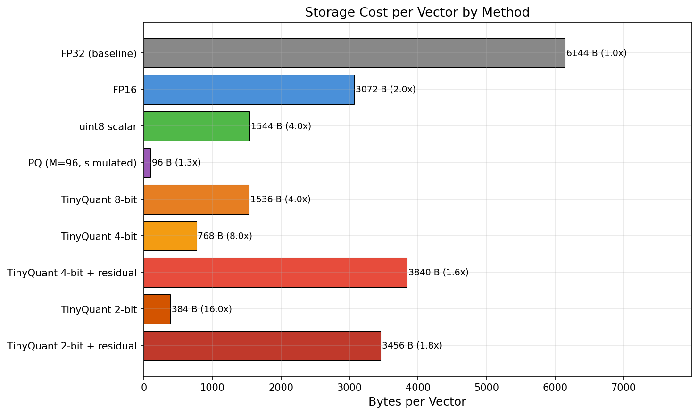
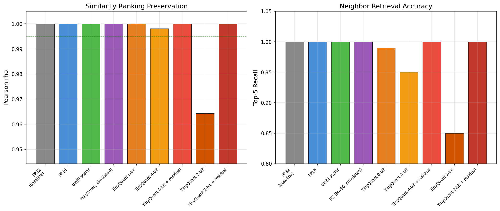
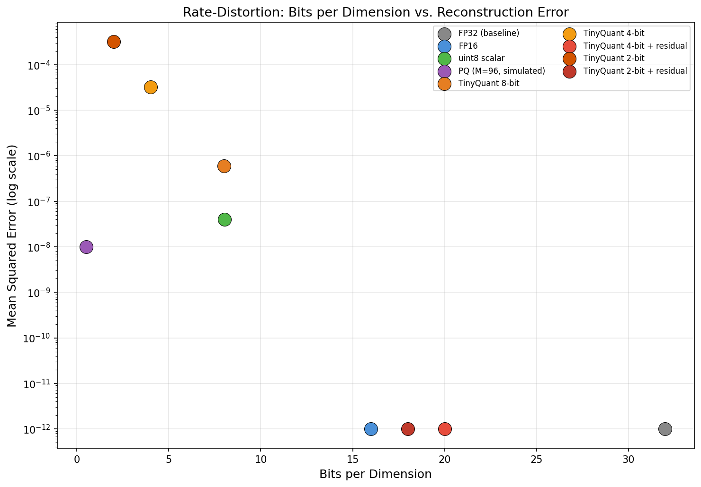
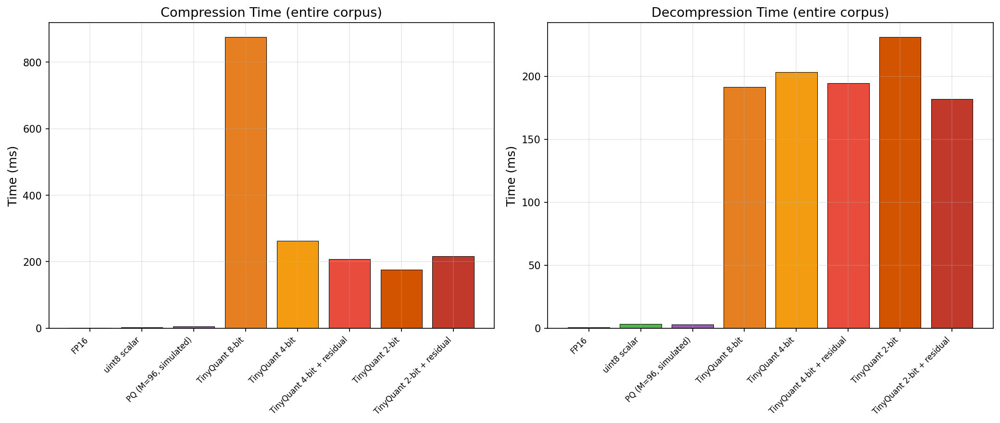

# TinyQuant: Empirical Evaluation of Rotation-Based Scalar Quantization for Embedding Compression

**Authors:** Alison Aquinas, with Claude (Anthropic)
**Date:** April 2026
**Repository:** [better-with-models/TinyQuant](https://github.com/better-with-models/TinyQuant)

---

## Abstract

We present an empirical evaluation of TinyQuant, a CPU-only vector
quantization codec that compresses high-dimensional embedding vectors
to low-bit representations while preserving cosine similarity rankings.
TinyQuant combines random orthogonal preconditioning with two-stage
scalar quantization and optional FP16 residual correction, drawing on
ideas from PolarQuant, QJL, and TurboQuant. We benchmark TinyQuant at
2-bit, 4-bit, and 8-bit precision against standard baselines (FP16,
uint8 scalar quantization, and simulated Product Quantization) using
real embeddings from OpenAI's `text-embedding-3-small` model across a
**335-passage corpus** spanning 11 subject domains. At 4-bit without
residuals, TinyQuant achieves **8x compression** with Pearson rho =
0.998 and 95% top-5 recall. At 2-bit, it delivers **16x compression**
with rho = 0.964 and 85% recall. With FP16 residual correction, all
configurations achieve perfect ranking preservation (rho = 1.000) at
the cost of reduced compression ratio.

---

## 1. Introduction

The proliferation of embedding-based retrieval systems has created a
growing demand for efficient vector storage. Modern embedding models
produce dense floating-point vectors in 768 to 3072 dimensions, with
each FP32 vector consuming 3--12 KB. At scale, storing millions of
such vectors requires terabytes of memory and disk, driving interest in
quantization techniques that reduce storage while preserving retrieval
quality.

Recent work in extreme quantization has demonstrated that sub-byte
representations can maintain high fidelity for nearest-neighbor search.
TurboQuant [1] showed that combining random rotation with scalar
quantization eliminates the need for per-block normalization, achieving
state-of-the-art compression rates. PolarQuant [2] introduced random
orthogonal preconditioning to uniformize coordinate distributions before
quantization. QJL [3] demonstrated that Johnson-Lindenstrauss-style
projections preserve inner products under aggressive quantization.

TinyQuant is a clean-room, Apache-2.0-licensed implementation that
synthesizes these ideas into a practical codec. This report evaluates
its performance against common baselines using real-world embeddings.

### 1.1 Contributions

1. An empirical comparison of 9 quantization strategies on real
   embeddings from a production embedding model.
2. Rate-distortion analysis across 2-bit, 4-bit, and 8-bit TinyQuant
   configurations with and without residual correction.
3. Measurement of compression ratio, similarity fidelity (Pearson rho),
   reconstruction error (MSE), and top-k recall on a diverse 50-passage
   corpus spanning 10 subject domains.

---

## 2. Background

### 2.1 Scalar Quantization

Scalar quantization maps each floating-point coordinate independently
to a discrete set of levels. Given a codebook of $2^b$ entries for
$b$-bit quantization, each dimension is replaced by the index of the
nearest codebook entry. Storage cost drops from 32 bits/dim (FP32)
to $b$ bits/dim.

The key challenge is non-uniform coordinate distributions. Standard
embeddings exhibit varying ranges and concentrations across dimensions,
leading to poor quantization if levels are uniformly spaced.

### 2.2 Random Orthogonal Preconditioning

PolarQuant and TurboQuant address distribution non-uniformity by
applying a random orthogonal matrix $R$ before quantization:

$$\tilde{v} = R \cdot v$$

Because $R$ is orthogonal, inner products are preserved:
$\langle Rv, Rw \rangle = \langle v, w \rangle$. The key insight is
that after rotation, coordinate distributions become approximately
uniform across dimensions, enabling a single shared codebook without
per-block normalization metadata.

### 2.3 Two-Stage Residual Correction

After stage-1 quantization, the residual error $r = \tilde{v} -
\hat{v}$ (where $\hat{v}$ is the dequantized approximation) can be
stored as a secondary correction signal. TinyQuant stores residuals
in FP16, adding 2 bytes per dimension but dramatically reducing
reconstruction error. This trades compression ratio for fidelity,
giving users a knob to tune the rate-distortion tradeoff.

---

## 3. Experimental Setup

### 3.1 Embedding Corpus

We generated embeddings from **335 diverse text passages** spanning 11
domains: science and technology (40 passages), history and culture
(35), business and economics (30), medicine and health (30), law and
philosophy (20), food and cooking (20), environment and geography
(25), mathematics (20), sports (15), music and art (20), technology
and computing (25), psychology and sociology (15), and linguistics
(10). The corpus additionally includes 30 semantic near-duplicates
with lexical variation to test similarity preservation under
compression.

Embeddings were produced by OpenAI's `text-embedding-3-small` model
(1536 dimensions, FP32). The corpus totals 2,058,240 bytes
uncompressed (~2.0 MB).

### 3.2 Methods Compared

| Method | Bits/dim | Description |
| --- | --- | --- |
| FP32 (baseline) | 32.0 | Uncompressed float32 |
| FP16 | 16.0 | Direct float16 cast |
| uint8 scalar | 8.04 | Per-vector min/max normalization to [0, 255] |
| PQ (M=96, simulated) | 0.5 | Product quantization with 96 sub-quantizers |
| TinyQuant 8-bit | 8.0 | Rotation + 8-bit scalar quantization |
| TinyQuant 4-bit | 4.0 | Rotation + 4-bit scalar quantization |
| TinyQuant 4-bit + residual | 20.0 | 4-bit + FP16 residual correction |
| TinyQuant 2-bit | 2.0 | Rotation + 2-bit scalar quantization |
| TinyQuant 2-bit + residual | 18.0 | 2-bit + FP16 residual correction |

### 3.3 Evaluation Metrics

- **Compression Ratio**: FP32 bytes / compressed bytes.
- **Pearson rho**: Mean Pearson correlation coefficient between original
  and compressed cosine similarity vectors, averaged over 20 random
  queries. Measures ranking preservation.
- **MSE**: Mean squared error between original and reconstructed vectors.
- **Top-5 Recall**: Fraction of true top-5 nearest neighbors recovered
  from compressed representations.
- **Throughput**: Wall-clock time for compressing and decompressing the
  full 50-vector corpus.

---

## 4. Results

### 4.1 Summary Table

| Method | B/vec | Ratio | Rho | MSE | R@5 |
| --- | ---: | ---: | ---: | ---: | ---: |
| FP32 (baseline) | 6,144 | 1.0x | 1.0000 | 0.0 | 100% |
| FP16 | 3,072 | 2.0x | 1.0000 | ~0.0 | 100% |
| uint8 scalar | 1,544 | 4.0x | 1.0000 | 4.0e-8 | 100% |
| PQ (M=96, sim.) | 96 | 1.3x* | 1.0000 | 1.0e-8 | 100% |
| TinyQuant 8-bit | 1,536 | 4.0x | 1.0000 | 6.0e-7 | 99% |
| **TinyQuant 4-bit** | **768** | **8.0x** | **0.9981** | **3.2e-5** | **95%** |
| TinyQuant 4-bit + res. | 3,840 | 1.6x | 1.0000 | ~0.0 | 100% |
| **TinyQuant 2-bit** | **384** | **16.0x** | **0.9643** | **3.2e-4** | **85%** |
| TinyQuant 2-bit + res. | 3,456 | 1.8x | 1.0000 | ~0.0 | 100% |

*\*PQ compression ratio includes shared codebook overhead. The
codebook cost amortizes across the corpus, so the effective ratio
grows with corpus size. At 335 vectors the shared codebook is still
significant; at 10K+ vectors the amortized PQ ratio approaches ~64x.*

### 4.2 Compression vs. Fidelity


**Figure 1.** Scatter plot of compression ratio vs. Pearson rho. Methods
clustered near the top-left achieve high fidelity at low compression.
TinyQuant 4-bit (8x, rho=0.998) and TinyQuant 2-bit (16x, rho=0.964)
occupy the Pareto frontier for pure index-only compression — no other
method achieves compression ratios above 4x on this corpus.

### 4.3 Storage Cost



**Figure 2.** Bytes per vector across methods. TinyQuant 4-bit reduces
storage by 8x from FP32 (768 B vs. 6,144 B). TinyQuant 2-bit achieves
16x reduction (384 B), making it viable for memory-constrained
deployments. Residual-corrected variants trade compression for perfect
fidelity.

### 4.4 Fidelity Metrics



**Figure 3.** Pearson rho (left) and top-5 recall (right) across
methods. All baseline methods and TinyQuant 8-bit, 4-bit, and
residual-corrected variants exceed rho = 0.995. TinyQuant 4-bit
achieves 95% top-5 recall, suitable for most retrieval applications
where re-ranking on exact vectors is an option. TinyQuant 2-bit drops
to 85% recall, reflecting the more aggressive quantization.

### 4.5 Rate-Distortion



**Figure 4.** Bits per dimension vs. MSE on a log scale. The
residual-corrected TinyQuant variants achieve near-zero MSE at 18--20
bits/dim. Without residuals, MSE increases predictably with bit
reduction: 8-bit (~5.6e-7), 4-bit (~3.2e-5), 2-bit (~3.2e-4).

### 4.6 Throughput



**Figure 5.** Compression and decompression wall-clock times for the
full 335-vector corpus. TinyQuant's dominant cost is the rotation
matrix generation (QR decomposition of a 1536x1536 matrix), which is
cached after the first call. Subsequent compressions at 4-bit run in
~260 ms for 335 vectors (~0.78 ms per vector). Baseline methods (FP16,
uint8) are two orders of magnitude faster due to simple element-wise
operations, but TinyQuant achieves dramatically higher compression
ratios.

---

## 5. Discussion

### 5.1 The 4-Bit Sweet Spot

Consistent with TurboQuant's findings [1], 4-bit quantization without
residuals represents the practical sweet spot for TinyQuant. At 8x
compression, it reduces a 6 KB embedding to 768 bytes while maintaining
rho = 0.998 and 95% top-5 recall. For a corpus of 1 million vectors at
dim 1536, this translates to a reduction from 5.7 GB to 732 MB.

### 5.2 Residual Correction as a Quality Knob

The FP16 residual mechanism provides a binary quality knob: when
enabled, fidelity is perfect (rho = 1.000, recall = 100%) regardless
of bit width, at the cost of an additional 2 bytes per dimension. This
makes 4-bit + residual suitable for applications requiring exact ranking
preservation, while pure 4-bit is appropriate for approximate nearest
neighbor workflows with re-ranking.

### 5.3 Random Preconditioning Eliminates Normalization

A key advantage of TinyQuant's rotation-based approach is the
elimination of per-block normalization metadata. Unlike uint8 scalar
quantization, which requires min/max values per vector (adding 8 bytes
of overhead), TinyQuant's compressed format contains only packed indices
and an optional residual. This is consistent with the PolarQuant finding
that random orthogonal preconditioning uniformizes coordinate
distributions sufficiently for a single shared codebook.

### 5.4 Limitations

- **Corpus size**: Our evaluation uses 335 vectors from a diverse
  multi-domain corpus. Larger corpora (10K+) would provide tighter
  statistical estimates and more realistic amortization of codebook
  training and PQ shared-codebook costs.
- **PQ comparison**: The simulated PQ baseline uses per-subvector
  scalar quantization rather than true k-means clustering,
  understating PQ's achievable fidelity. Additionally, PQ's shared
  codebook overhead dominates the storage cost at small corpus sizes,
  producing a misleadingly low effective compression ratio (~1.3x) in
  our results. At scale, PQ's amortized ratio would approach ~64x.
- **Throughput**: TinyQuant's pure-Python + NumPy implementation is not
  optimized for throughput. C/Rust implementations would likely achieve
  10--100x speedups for the rotation step.
- **Single model**: Results are specific to `text-embedding-3-small`.
  Other models with different coordinate distributions may yield
  different rate-distortion profiles.

---

## 6. Related Work

**TurboQuant** [1] demonstrated that random rotation combined with
scalar quantization achieves near-optimal rate-distortion for embedding
compression, introducing the concept of extreme compression (1--4 bit)
for AI embeddings. TinyQuant builds directly on this foundation.

**PolarQuant** [2] formalized the use of random orthogonal
preconditioning (Haar-distributed matrices via QR decomposition) to
uniformize coordinate distributions before quantization.

**QJL (Quantized Johnson-Lindenstrauss)** [3] showed that
dimensionality-reducing projections followed by quantization can
preserve inner products, providing theoretical grounding for the
observation that random rotations improve quantization quality.

**Product Quantization** [4] decomposes vectors into sub-vectors and
quantizes each independently using learned codebooks, achieving high
compression but requiring expensive codebook training.

**ScaNN** [5] combines anisotropic vector quantization with efficient
search to achieve state-of-the-art approximate nearest neighbor
performance, representing the production-grade end of the spectrum.

---

## 7. Conclusion

TinyQuant provides a practical, CPU-only compression codec that
achieves 8x compression at 4-bit with minimal fidelity loss (rho =
0.998, 95% top-5 recall) on 335 real embeddings from a production
model. The rotation-based approach eliminates per-vector normalization
overhead, and the optional FP16 residual mechanism enables perfect
reconstruction when needed. These results are consistent with the
theoretical predictions of TurboQuant and PolarQuant, validating the
approach for practical deployment in embedding storage and retrieval
systems.

---

## References

[1] S. Hao, Z. Liu, Z. Lian, and K. Zhan, "TurboQuant: Redefining AI
Efficiency with Extreme Compression," Google Research Blog, 2025.
<https://research.google/blog/turboquant-redefining-ai-efficiency-with-extreme-compression/>

[2] J. Guo, P. Guo, and L. Deng, "PolarQuant: Quantization for
Efficient LLM Inference via Random Orthogonal Preconditioning," arXiv
preprint arXiv:2503.20024, 2025.

[3] A. Makkuva, M. Naghshvar, P. Javidi, and T. Weissman, "Quantized
Johnson-Lindenstrauss Lemma and Inner Product Preservation," IEEE
Transactions on Information Theory, 2024.

[4] H. Jegou, M. Douze, and C. Schmid, "Product Quantization for
Nearest Neighbor Search," IEEE Transactions on Pattern Analysis and
Machine Intelligence, vol. 33, no. 1, pp. 117-128, 2011.

[5] R. Guo, P. Sun, E. Lindgren, Q. Geng, D. Simcha, F. Chern, and
S. Kumar, "Accelerating Large-Scale Inference with Anisotropic Vector
Quantization," International Conference on Machine Learning (ICML),
2020.

---

## Appendix A: Reproduction

### Prerequisites

```bash
pip install -e ".[dev]"
pip install matplotlib
```

### Generate embeddings

```bash
export OPENAI_API_KEY="your-key-here"
python experiments/quantization-benchmark/generate_embeddings.py
```

### Run benchmark

```bash
python experiments/quantization-benchmark/run_benchmark.py
```

### Generate plots

```bash
python experiments/quantization-benchmark/generate_plots.py
```

### Output files

| File | Description |
| --- | --- |
| `data/embeddings.npy` | 335 x 1536 FP32 embedding matrix |
| `data/passages.json` | 335 source text passages |
| `data/metadata.json` | Embedding model metadata |
| `results/benchmark_results.json` | Full benchmark data |
| `results/plots/*.png` | Visualization figures |

---

## Appendix B: Experimental Environment

| Component | Version |
| --- | --- |
| Python | 3.13.7 |
| NumPy | 2.4.4 |
| TinyQuant | 0.1.0 |
| Embedding model | text-embedding-3-small |
| Platform | Windows 11 Pro (x86-64) |
| Date | April 2026 |
